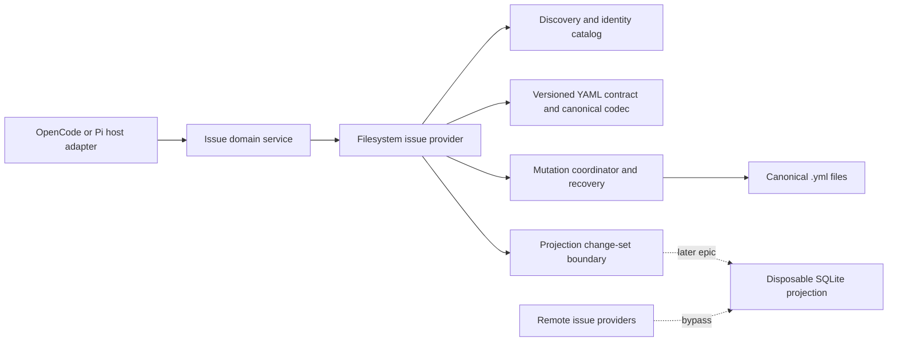
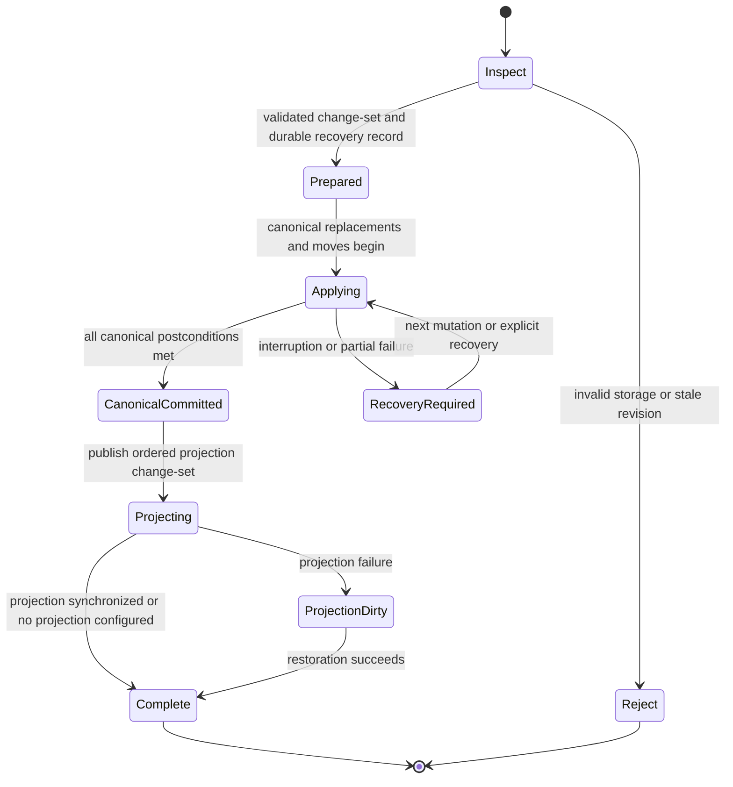

# Canonical YAML Issue Storage

## 1. Purpose

This document defines the high-level design for Initiative 00001, Epic 00004, and Design Story 00005, with the rollout dependency imposed by migration Story 00006. It replaces the filesystem issue provider’s split Markdown/frontmatter and comment-file representation with one authoritative, versioned YAML document per issue.

The design preserves issue identity and user-visible lifecycle behavior while establishing safe canonical persistence and a projection boundary for the later SQLite-cache work. It does not implement the cache or legacy migration.

## 2. Context and Existing Behavior

The existing filesystem provider stores each active issue at `.issues/<id>/issue.md`, stores comments below the issue directory, and archives issue directories. The generic issue service owns ID parsing and allocation, hierarchy, relationships, document links, validation, revisions, comments, and recursive archive. OpenCode and Pi adapters expose those capabilities as tools.

The replacement must retain those domain capabilities while changing their persistence representation. Canonical YAML remains authoritative. Any SQLite projection introduced later is disposable and must not become a second source of truth.

## 3. Goals

- Represent all issue-managed state, including issue comments, in one pure-YAML document.
- Make issue filenames readable, deterministic, safe, and anchored by stable identity.
- Provide deterministic serialization, validation, revisions, and collision handling.
- Make single-issue and multi-issue mutations crash-aware, concurrency-safe, and recoverable.
- Preserve hierarchy, relationships, links, body content, attribution, assignment, custom metadata, and append-only comment history.
- Separate canonical storage concerns from tool-host adapters and future projection drivers.
- Behave predictably on supported Windows, macOS, and Linux filesystems.
- Prevent accidental enablement in repositories that still contain legacy issue storage.

## 4. Non-Goals

- Implementing Story 00006’s legacy migration.
- Silently reading, merging, or converting mixed legacy and YAML storage.
- Implementing SQLite, cache-first queries, cache restoration, or memory indexing.
- Changing remote issue providers or requiring the local projection for them.
- Preserving YAML presentation details such as user-selected quoting, key order, anchors, aliases, tags, or source comments. Issue comments are data in the `comments` collection; YAML source comments are not issue-managed state.
- Defining host-specific tool schemas beyond the stable provider capabilities and result semantics required here.

## 5. Assumptions

- The repository root and filesystem issue-provider configuration are already known before provider operations begin.
- Issue IDs follow the configured prefix plus a decimal sequence and remain immutable after creation.
- UTC RFC 3339 timestamps are the portable time representation.
- The provider has exclusive authority over managed mutations, but users may manually edit canonical files; validation therefore remains non-mutating and comprehensive.
- Same-directory replacement is atomic on supported local filesystems when preconditions are satisfied. No filesystem can provide a truly atomic transaction across multiple independent files, so multi-file atomicity is logical and recovery-backed.
- The implementation will use commercially friendly OSS dependencies already approved for the project where practical. The current `yaml` package is suitable only when configured to enforce this contract’s safe subset and limits.

## 6. Architectural Decisions

| ID  | Decision                                                                                                                                                                  | Rationale                                                                                                                                   |
| --- | ------------------------------------------------------------------------------------------------------------------------------------------------------------------------- | ------------------------------------------------------------------------------------------------------------------------------------------- |
| D1  | Canonical issue files use contract version 1 and `.yml` only.                                                                                                             | An explicit version supports future evolution; one extension removes discovery ambiguity.                                                   |
| D2  | Known contract versions reject unknown top-level fields, while the `metadata` extension mapping preserves unknown permitted custom data.                                  | This catches misspellings without preventing extensibility.                                                                                 |
| D3  | Revisions derive from canonical semantic content and are not persisted as issue fields.                                                                                   | A deterministic token detects state changes without creating self-referential serialization.                                                |
| D4  | All mutations use one project-scoped issue mutation lock.                                                                                                                 | A single lock makes hierarchy, relationship, allocation, rename, archive, and projection ordering coherent and avoids lock-order deadlocks. |
| D5  | Single-file writes use durable same-directory preparation and replacement; multi-file mutations use prepared transaction records and deterministic roll-forward recovery. | This prevents torn canonical files and makes unavoidable cross-file partial states recoverable.                                             |
| D6  | Canonical commits publish one ordered projection change-set after canonical recovery reaches a committed state.                                                           | Future caches can synchronize without owning persistence semantics.                                                                         |
| D7  | Mixed legacy/YAML repositories fail closed.                                                                                                                               | Silent coexistence risks duplicate identities and data loss.                                                                                |
| D8  | Active and archived identity is global. One ID may have exactly one canonical representation across both locations.                                                       | Stable lookup, allocation, validation, and archival require an unambiguous identity.                                                        |
| D9  | Comment operations may append but never update or delete prior comments.                                                                                                  | This preserves the existing immutable-comment intent and an auditable history.                                                              |
| D10 | Non-canonical or invalid documents may be diagnosed but cannot be mutated until corrected.                                                                                | Managed rewrites must not silently erase unsupported YAML presentation or ambiguous data.                                                   |

## 7. System Boundaries

### 7.1 Responsibilities

**Host adapters** translate tool inputs and outputs without owning filenames, YAML, locks, recovery, or projection behavior.

**Issue domain service** owns valid issue types and statuses, hierarchy rules, relationship semantics, comment append rules, document-link policy, and operation-level authorization decisions.

**Filesystem provider** owns discovery, stable-ID resolution, contract decoding, canonical encoding, revision comparison, path policy, mutation coordination, and canonical-to-projection notifications.

**Canonical store** contains authoritative active and archived issue documents. Lock, transaction, and recovery control artifacts are provider state, not canonical issues and are excluded from discovery.

**Projection consumer** receives committed entity change-sets. It cannot write canonical issue state. A projection failure makes the projection dirty and the overall mutation cannot be reported as fully successful until synchronization or restoration completes.

## 8. Versioned Pure-YAML Contract

Each issue file is exactly one YAML document whose root is a mapping. Markdown frontmatter boundaries and trailing free-form Markdown are not used; body text is a YAML scalar. The document contains only the safe, language-neutral YAML subset: mappings with string keys, sequences, strings, booleans, nulls, and finite base-10 numbers. Anchors, aliases, merge keys, explicit/custom tags, duplicate keys, multiple documents, and implementation-specific scalar types are rejected. Every non-finite numeric spelling or decoded value, including positive infinity, negative infinity, and not-a-number, is rejected before schema validation and is never coerced or normalized to another value.

### 8.1 Issue Contract Version 1

| Field         | Requirement                            | Meaning                                                            |
| ------------- | -------------------------------------- | ------------------------------------------------------------------ |
| `version`     | Required integer, exactly `1`          | Persistence contract version.                                      |
| `id`          | Required immutable string              | Stable configured-prefix identity. Must match the filename ID.     |
| `type`        | Required enum                          | `initiative`, `epic`, `story`, `task`, or `bug`.                   |
| `title`       | Required non-empty string              | Human-readable title and slug source.                              |
| `status`      | Required enum                          | `open`, `in_progress`, `done`, or `closed`.                        |
| `created_at`  | Required timestamp                     | Immutable creation time.                                           |
| `updated_at`  | Required timestamp                     | Time of the latest managed state change, including comment append. |
| `created_by`  | Optional non-empty string              | Creator attribution.                                               |
| `assigned_to` | Optional non-empty string              | Current assignee.                                                  |
| `parent`      | Optional issue ID                      | Immediate parent.                                                  |
| `children`    | Optional unique issue-ID sequence      | Immediate children.                                                |
| `depends_on`  | Optional unique issue-ID sequence      | Dependencies.                                                      |
| `blocks`      | Optional unique issue-ID sequence      | Issues blocked by this issue.                                      |
| `blocked_by`  | Optional unique issue-ID sequence      | Inverse blocking references.                                       |
| `relates_to`  | Optional unique issue-ID sequence      | General relationships.                                             |
| `duplicates`  | Optional unique issue-ID sequence      | Symmetric duplicate relationships.                                 |
| `supersedes`  | Optional unique issue-ID sequence      | Directional supersession relationships.                            |
| `documents`   | Optional unique document-link sequence | Validated repository-relative task or design document references.  |
| `metadata`    | Optional mapping                       | Custom extension values not owned by the issue service.            |
| `body`        | Required string                        | Complete body content, including Markdown text where desired.      |
| `comments`    | Required sequence, empty when none     | Ordered, append-only embedded issue comments.                      |

Absence and emptiness are canonicalized consistently: optional scalars and empty optional relationship/link sequences are omitted; `body` and `comments` are always present. Managed fields cannot be shadowed inside `metadata`. Existing custom fields are migrated into `metadata` only by the separate migration; this Epic performs no implicit relocation.

### 8.2 Embedded Comment Contract Version 1

Each comment entry contains a stable comment `id`, `created_at`, `created_by`, and `body`. The parent issue ID is implicit from containment and cannot conflict with the issue. Comment IDs remain stable and unique within the issue, use the existing `<issue-id>-C<zero-padded-sequence>` identity convention, and are never reused.

The list order is creation order and comment ID sequences increase without reuse. Timestamps must be valid but need not be monotonic because clocks can move backward; imported historical comments retain deterministic source order. The comment operation only appends one new entry. General issue update operations treat `comments` as protected and cannot replace, reorder, edit, or remove entries. Any detected alteration is reported by validation and changes the issue revision, but no automated mutation repairs it.

### 8.3 Unknown Fields and Version Evolution

- A supported version with unknown top-level keys is invalid.
- Unknown keys nested below `metadata` are preserved semantically across every supported mutation, subject to the safe YAML value model and resource limits.
- Unknown contract versions are not read as issues and are never rewritten. Diagnostics identify the unsupported version and path.
- A future contract version requires an explicit reader, writer, compatibility policy, and migration path. Readers must not guess or downgrade.
- New optional managed fields require a new contract version unless version 1 explicitly reserved the extension under `metadata`.

## 9. Canonical Serialization and Revision

Canonical serialization is deterministic for equivalent contract values:

- UTF-8 without a byte-order mark, LF line endings, and exactly one final newline. Scalar values, especially bodies and comments, preserve their Unicode content rather than being silently normalized.
- One YAML document and no frontmatter envelope, aliases, tags, directives, or source comments.
- Fixed top-level and comment-field order as listed by this contract.
- `metadata` mapping keys sorted by Unicode code point; nested mapping keys follow the same rule. Keys that collide under the platform-independent comparison policy are rejected.
- Relationship, child, and document collections contain unique values in deterministic lexical order. Comments retain append order.
- Every string, including every mapping key, uses YAML double-quoted style. Printable Unicode scalar values are emitted literally except double quote and backslash, which are emitted with their two-character backslash escapes. U+0008, U+0009, U+000A, U+000C, and U+000D use the canonical short escapes for backspace, tab, line feed, form feed, and carriage return respectively. Every other U+0000–U+001F or U+007F–U+009F code point, plus U+2028 and U+2029, uses an uppercase four-hex-digit Unicode escape. Solidus is not escaped; valid non-BMP scalar values are emitted literally; unpaired surrogates and other non-scalar input are rejected. No alternative plain, single-quoted, or block scalar form is canonical.
- Booleans and null are emitted only as the lowercase plain tokens `true`, `false`, and `null`.
- Finite numbers are compared by mathematical base-10 value and emitted without a leading plus sign, exponent, digit separators, or insignificant zeros. Zero is `0`, including negative zero. A non-zero integer uses an optional minus followed by decimal digits with no leading zero. A non-integer uses that integer-part rule, a decimal point, and the shortest fractional digits that preserve the exact value, with no trailing zero. Inputs whose value cannot be represented as a finite base-10 integer or decimal are rejected rather than rounded, saturated, stringified, or converted to null.
- Contract timestamps represent exact milliseconds. Their canonical string has the RFC 3339 UTC shape `YYYY-MM-DDTHH:mm:ss.sssZ`, with uppercase `T`, exactly three fractional-second digits, and uppercase `Z`; numeric offsets, omitted fractions, other fractional precision, lowercase markers, and leap-second spellings are non-canonical. A decoded timestamp is eligible for canonicalization only if conversion to UTC is exact at millisecond precision; excess precision is rejected rather than rounded or truncated.
- Empty optional fields are omitted according to Section 8.1; no alternate null/empty representation is canonical.

Validation distinguishes malformed, unsafe, schema-invalid, graph-invalid, filename-invalid, and valid-but-non-canonical content. Validation never rewrites. A mutation requires a valid canonical starting document and emits canonical output.

The optimistic revision token is a versioned SHA-256 digest of the complete canonical serialization. It excludes the filesystem path and any projection/control metadata. Consequently every managed field or embedded-comment change produces a new revision; moving an otherwise unchanged file between active and archived locations does not. Callers compare opaque tokens and must not depend on their textual form.

## 10. Naming, Slugs, and Collisions

### 10.1 Paths

- Active: `.issues/<id>-<title-slug>.yml`
- Archived: `.issues/archived/<id>-<title-slug>.yml`

Only immediate regular files matching the exact `.yml` convention are issue candidates. Control artifacts, directories, `.yaml` files, temporary files, and symlinks are not accepted as canonical issues.

### 10.2 Deterministic Slug Policy

The slug is derived solely from the current title using Unicode compatibility decomposition, removal of combining marks, locale-independent lowercase conversion, retention of ASCII letters and digits, replacement of every other character run with one hyphen, and removal of leading/trailing separators. A title producing no usable characters uses the fixed slug `issue`. This intentionally avoids environment-dependent transliteration of non-Latin scripts.

The filename budget is exactly 180 UTF-8 bytes, including the ID, separating hyphen, slug, and `.yml` suffix. The available slug budget is therefore 180 minus the UTF-8 byte lengths of those fixed components. If transformation produces an empty candidate, the candidate becomes `issue`; if that fixed fallback does not fit, the ID/configuration is invalid. Otherwise, the provider retains the candidate’s longest prefix that fits, cutting only between complete UTF-8 code points, and then removes a trailing hyphen; an empty result is invalid and no path is created. Because the slug alphabet is ASCII, each retained code point is one byte, but byte-boundary truncation remains the normative rule. The same input title and ID therefore produce the same bytes on every platform.

The slug excludes path separators, control characters, shell-special ambiguity, trailing dots/spaces, and platform-reserved names. The stable ID prefix means the complete filename does not become a Windows reserved device name. The byte budget leaves repository path headroom on common platforms.

### 10.3 Collision Policy

- Slug equality for different IDs is harmless because IDs lead filenames.
- IDs are allocated against the union of active and archived identities while holding the project mutation lock. Creation uses exclusive destination semantics; an external race causes allocation to retry with a new ID.
- Two filenames resolving to the same ID, including case-folded aliases on case-insensitive filesystems, are a hard ambiguity. Reads and mutations for that ID fail; repository validation reports every conflicting path.
- A title rename fails before changing state if the target exists, case-folds to another entry, is a symlink, or violates path policy. It never overwrites.
- A filename whose ID or slug does not match canonical content is invalid. Stable-ID discovery may identify it for diagnostics but cannot silently rename it.

## 11. Discovery and Stable-ID Resolution

Discovery separately catalogs active and archived roots, validates directory identity and path containment, and builds a global ID-to-location view. Active listing returns only valid active issues; direct lookup may resolve active or archived state only when the operation’s contract permits it. Mutation eligibility is explicit: normal updates target active issues, while already archived roots are reported idempotently by archive behavior.

The catalog detects malformed names, duplicate IDs, active/archive duplicates, case-fold collisions, unsupported extensions, unsafe entries, and legacy layouts. It does not follow symbolic links or recurse outside the two issue roots. Full validation continues after recoverable per-file failures so users receive a consolidated report; operations requiring an unambiguous catalog fail closed.

ID allocation considers every validly named active and archived candidate, even if its content is malformed, so corruption cannot cause identity reuse. Prefix changes that make existing IDs incompatible are configuration errors requiring explicit migration.

## 12. Operation Design Paths

| Operation                 | Canonical transition                                                                                                                                                                                | Concurrency and failure semantics                                                                                                                                                       |
| ------------------------- | --------------------------------------------------------------------------------------------------------------------------------------------------------------------------------------------------- | --------------------------------------------------------------------------------------------------------------------------------------------------------------------------------------- |
| Parse issue ID            | Extract configured-prefix identities from text; no storage mutation.                                                                                                                                | Invalid provider configuration yields no guessed identity.                                                                                                                              |
| Allocate/create           | Validate inputs and referenced entities, reserve the next global ID, create one complete canonical file, and update a parent when applicable.                                                       | Exclusive destination creation; parent plus child is one recoverable multi-file change-set. No issue directory is created.                                                              |
| Get                       | Resolve one unambiguous stable ID and decode its complete canonical entity.                                                                                                                         | Invalid, unsupported, duplicate, or unsafe state returns actionable failure without mutation.                                                                                           |
| List/filter               | Discover active canonical entities and apply status/type filters.                                                                                                                                   | Stable deterministic result order; malformed or ambiguous repository state is surfaced rather than silently merged. The later cache may replace discovery behind the provider boundary. |
| Update                    | Validate expected revision and requested managed-field changes, preserve body, comments, metadata, and untouched fields, then rewrite canonically.                                                  | Stale revision or non-canonical source leaves state unchanged. Title changes include the rename transition. Parent/type changes validate the whole affected hierarchy.                  |
| Transition                | Apply the update path to status only.                                                                                                                                                               | Expected revision is mandatory and stale state is rejected.                                                                                                                             |
| Append comment            | Validate body/author and current issue state, allocate the next comment ID, append one comment, and update the timestamp.                                                                           | Serialized under the project lock; prior comments are immutable and no separate file is created. The result identifies the comment, canonical issue path, and new issue revision.       |
| Relate/unrelate           | Validate both entities, self-reference/cycle rules, and inverse relationship rules; update all affected documents as one change-set.                                                                | Any stale or invalid participant prevents preparation. Recovery completes a prepared change-set; no unreported half-relationship is considered success.                                 |
| Link document             | Validate kind, repository-relative containment, existence, and permitted root, then update the documents collection.                                                                                | Expected current state is checked at the mutation boundary and unrelated fields are preserved.                                                                                          |
| Validate                  | Inspect names, YAML safety, schema, canonical form, comments, global identity, hierarchy, relationships, cycles, and links.                                                                         | Read-only; reports all actionable findings possible within resource limits.                                                                                                             |
| Rename after title change | Canonically rewrite the issue and move it to the newly derived filename while retaining ID.                                                                                                         | One logical transaction; the destination is never overwritten. After success only the new path exists. Crash recovery deterministically completes a prepared rename.                    |
| Recursive archive         | Resolve the requested issue and all active descendants, validate destinations, detach external active parents as required, and move candidate files to the archive root without changing filenames. | One bounded project transaction. Already archived descendants are reported as skipped; unrelated issues remain untouched; every partial outcome is reported or recovered.               |

Hierarchy and relationship references always use IDs, never paths, so rename and archive do not rewrite unrelated references solely because location changed.

## 13. Mutation, Locking, and Recovery Model

### 13.1 Lock Contract

All provider mutations, including ID allocation, acquire one repository-scoped issue mutation lock. The lock has unique ownership metadata, a bounded wait, and an actionable busy result. A lock is not removed merely because it is old; automated stale-lock recovery requires evidence that the recorded owner cannot still be active. Otherwise users receive a safe manual-recovery instruction. Reads do not observe transaction work as committed through the provider because they perform pending recovery or report recovery-required state before returning entities.

### 13.2 Single-Issue Durability

New canonical bytes are fully validated before touching the destination. Preparation occurs in the destination directory with restrictive permissions. File content is made durable before atomic replacement or rename; directory metadata is made durable where the platform supports it. Temporary files are never discoverable as issues and are cleaned after success or diagnosed during recovery.

Create is exclusive and never overwrites. Rewrite preserves the last valid destination until replacement. A title change has one logical commit record spanning content replacement and path rename so interruption cannot be mistaken for a successful operation.

### 13.3 Multi-Issue Transactions

Create-with-parent, parent reassignment, reciprocal relationship changes, and recursive archive are multi-file changes. Before applying them, the provider records a durable, versioned manifest containing operation identity, source and destination paths, before/after revisions, canonical content digests, and intended projection effects. All paths and digests are revalidated during recovery.

Once a prepared manifest exists, recovery rolls forward idempotently to the validated post-state. Rollback is attempted only before irreversible ambiguity and is not promised after arbitrary external edits. If an existing target differs from both expected before and after state, recovery stops, retains evidence, marks the repository recovery-required, and reports exact conflicts. The system never reports a successful mixed result.

Archive manifests have a configured operation bound. Archive returns the ordered sets of archived and already-archived IDs. A process crash may make physical partial moves briefly visible to external filesystem readers, but provider reads and mutations recover or fail explicitly before presenting state.

### 13.4 Optimistic Concurrency

The caller’s expected revision is checked after lock acquisition against freshly decoded canonical state. Every affected entity’s revision is also captured during preparation and rechecked before its first change. A mismatch rejects the entire unprepared operation. Mutation responses return resulting revisions. Comment, relationship, linking, and archive adapters that do not currently expose expected revisions still receive equivalent serialization from the project lock; future tool-contract evolution should expose revisions consistently.

## 14. Security and Resource Limits

The provider treats repository contents as untrusted input.

### 14.1 Path and Filesystem Controls

- Resolve every managed path against the repository root and require containment after normalization.
- Reject absolute paths, traversal segments, alternate separators, NUL/control characters, and unsafe platform names.
- Inspect path components without following symlinks; reject symbolic links, junction-like redirections, and non-regular canonical candidates at discovery and immediately before mutation.
- Create files with owner-only permissions subject to platform support and the user’s policy; never broaden existing repository permissions intentionally.
- Do not execute or interpolate YAML content, titles, metadata, bodies, comments, or filenames in a shell.
- Redact body/comment/metadata content from routine errors and logs; report IDs, paths, field locations, and limit names instead.

### 14.2 YAML Controls

Duplicate keys, aliases, anchors, merge keys, tags, multiple documents, directives, and implicit implementation-specific objects are rejected. Parsing and validation are bounded before materializing excessive structures. Secret scanning is outside this Epic, but diagnostics must not echo potentially sensitive values.

### 14.3 Default Bounds

These version-1 defaults are contract decisions and may be made stricter by project policy, never silently looser beyond documented hard ceilings:

| Resource                                          | Default maximum |
| ------------------------------------------------- | --------------: |
| Canonical issue file                              |          16 MiB |
| Issue body                                        |     2 MiB UTF-8 |
| One comment body                                  |   256 KiB UTF-8 |
| Comments per issue                                |          10,000 |
| One scalar                                        |     2 MiB UTF-8 |
| YAML nesting depth                                |              32 |
| Materialized nodes per document                   |         100,000 |
| Custom metadata keys across all mappings          |          10,000 |
| Discovered active plus archived candidates        |         100,000 |
| Issues in one recursive archive                   |          10,000 |
| Total canonical bytes in one prepared transaction |           1 GiB |
| Filename                                          | 180 UTF-8 bytes |

The first exceeded bound terminates the affected operation with an actionable finding. Validation remains read-only and may report that repository-wide scanning was truncated at a named bound. Limits apply before projection publication.

## 15. Projection Boundary

The filesystem provider exposes four separable capabilities:

1. **Discovery:** enumerate canonical candidates and location state without requiring a cache.
2. **Decode:** turn a versioned canonical document into a host-neutral issue entity plus revision and diagnostics.
3. **Projection:** map a decoded entity to a stable projection record without exposing YAML syntax or host-adapter types.
4. **Mutation change-set:** after canonical commit, publish one ordered batch describing entity upserts, removals, active/archive location changes, resulting revisions, and a transaction identity.

Projection consumers are idempotent by transaction identity and resulting revision. They acknowledge a complete batch, never individual changes as overall success. If no projection is configured, canonical commit completes normally. If a filesystem projection is configured and acknowledgement fails, canonical state remains authoritative, projection state is marked dirty, and the operation reports synchronization failure rather than success. A later cache restoration rebuilds solely from canonical files and activates replacement state only after a complete build.

Remote, MCP, GitHub, command-backed, and other non-filesystem providers neither implement nor call this local projection boundary. Host adapters depend on provider capabilities, not cache drivers.

## 16. Cross-Platform Behavior

- Canonical content always uses UTF-8 and LF, independent of host defaults.
- Name comparison applies exact and platform-relevant case-fold checks so a repository valid on a case-sensitive volume cannot knowingly create a collision on a case-insensitive volume.
- Destination preflight accounts for Windows reserved names, forbidden characters, trailing dots/spaces, and rename behavior when only character case changes.
- Replacement and rename errors caused by sharing violations, antivirus scanners, or open handles are bounded and reported; retries never overwrite an unexpected target.
- POSIX-capable systems flush parent-directory metadata for durability. Windows flushes file contents but cannot promise equivalent directory-flush semantics; this residual crash-durability difference is documented and tested.
- Archive and title rename remain within one filesystem volume because source, staging, and destination are under `.issues`; configurations that violate same-volume assumptions are rejected.
- Permission checks account for POSIX modes and Windows ACL behavior without claiming identical permission semantics.
- Long-path and normalization tests use the filename budget and repository containment rules rather than relying on one platform’s maximum.

## 17. Rollout and Migration Gate

Epic 00004 can be implemented and tested in empty or YAML-native fixtures, but it cannot become the default for an existing repository until Story 00006 is delivered and its migration is explicitly invoked.

Provider startup classifies storage as empty, canonical YAML, legacy, mixed, or invalid:

- **Empty:** canonical YAML creation may begin.
- **Canonical YAML:** normal operation may begin after recovery and validation preflight.
- **Legacy:** canonical operations stop with an actionable requirement to run the separately delivered migration.
- **Mixed:** all canonical mutations stop; users must resolve the mixed state through migration recovery or explicit remediation.
- **Invalid:** operations fail with validation or recovery findings.

No read, write, configuration upgrade, or cache reload implicitly migrates. The future migration must support dry-run, backup, validation-before-retirement, rollback, complete field/comment preservation, and mixed-format diagnostics. Legacy inputs may be retired only after every generated YAML document and global relationship invariant validate. Rollout requires migration Story 00006 to be implemented, tested on representative repositories, documented, and explicitly enabled through a release gate.

## 18. Delivery Sequence

1. Approve the version-1 contract, naming policy, limits, and decisions in this HLD.
2. Establish contract fixtures and non-mutating discovery/validation behavior.
3. Introduce canonical entity decoding, serialization, revision, and stable-ID lookup.
4. Add project locking, durable single-file create/rewrite, and title-driven rename recovery.
5. Add append-only embedded comments and remaining single-issue operations.
6. Add recoverable hierarchy, relationship, and recursive archive change-sets.
7. Expose and verify the projection boundary without implementing SQLite.
8. Complete cross-host and cross-platform adapter verification.
9. Keep production rollout disabled for legacy repositories until Story 00006 is separately designed, implemented, and accepted.

Each stage is independently verifiable and must retain the rollout gate.

## 19. Test Strategy

### 19.1 Contract and Canonicalization

- Golden fixtures for every field, empty/absent policy, multiline bodies, embedded comments, custom metadata, exact string quoting and escaping, finite decimal normalization, rejected non-finite numbers, millisecond UTC timestamps, and deterministic output.
- Repeated parse/serialize stability and equal-value/equal-revision properties.
- Unknown versions and fields, duplicate keys, aliases, tags, multiple documents, invalid scalar types, malformed YAML, and non-canonical valid YAML.
- Fuzz and property-based tests for Unicode scalar strings, control-character escaping, Unicode titles, metadata structures, YAML parser safety, slug determinism, and UTF-8 byte-safe truncation at every filename-budget boundary.

### 19.2 Discovery, Naming, and Validation

- Active, archived, missing, malformed, conflicting, case-folded, mismatched ID/slug, wrong extension, symlink, traversal, broken link, broken hierarchy, relationship cycle, and mixed legacy/YAML fixtures.
- ID allocation across active and archived state, malformed reserved candidates, concurrent creators, prefix variants, empty transliteration, truncation, and platform-reserved names.
- Validation proves no mutation by comparing canonical and control artifacts before and after.

### 19.3 Mutations and Recovery

- Create, get, list/filter, update, transition, comment, relate, unrelate, link, rename, validate, and recursive archive success paths.
- Field-preservation assertions for body, all managed fields, permitted metadata, and prior comments after every operation.
- Stale expected revisions, concurrent comments, allocation races, target collisions, lock contention, lock-owner uncertainty, and external edits.
- Fault injection at every durability boundary for create, rewrite, rename, parent update, reciprocal relationship, and archive.
- Recovery idempotence, digest/path tampering rejection, before/after conflict handling, cleanup, and explicit incomplete-recovery reports.
- Projection acknowledgement success, failure, retry, dirty marking, idempotence, and rebuild handoff.

### 19.4 Platform and Integration

- CI matrix on supported Windows, macOS, and Linux versions and representative case-sensitive/case-insensitive filesystems where available.
- CRLF inputs, Unicode normalization, long paths, case-only title rename, locked/open destination behavior, permission failures, and directory durability differences.
- Contract tests shared by generic-tools, OpenCode, and Pi adapters so host behavior does not diverge.
- Migration-gate integration tests prove legacy and mixed repositories cannot mutate and no implicit conversion occurs.
- Later SQLite-Epic contract tests prove discovery, decode, projection, and notifications remain separable from cache and host adapters.

## 20. Observability and Error Semantics

Errors are categorized as configuration, storage classification, path safety, parse safety, schema, canonical form, resource limit, identity ambiguity, domain invariant, stale revision, lock contention, transaction recovery, filesystem durability, and projection synchronization failures. Results include operation identity where recovery may be needed, affected issue IDs, safe repository-relative paths, and actionable next steps.

Successful multi-issue operations report all affected, skipped, and resulting revision states. A failed operation never uses a generic success response for a partial physical outcome. Routine telemetry contains counts, durations, categories, and transaction identifiers, not body, comment, or custom metadata content.

## 21. Risks and Mitigations

| Risk                                                       | Impact                                                                              | Mitigation / accepted residual risk                                                                                                                               |
| ---------------------------------------------------------- | ----------------------------------------------------------------------------------- | ----------------------------------------------------------------------------------------------------------------------------------------------------------------- |
| Windows and POSIX durability differ.                       | A power loss can expose different rename persistence behavior.                      | Durable file preparation, same-volume operations, recovery manifests, platform tests, and explicit documentation; identical crash semantics cannot be guaranteed. |
| Multi-file operations are not physically atomic.           | External readers can observe partial archive or relationship changes after a crash. | Project lock, prepared manifests, provider recovery-before-read, idempotent roll-forward, and never reporting an unacknowledged mixed state as success.           |
| Manual edits create ambiguity or destroy canonical form.   | Mutations could overwrite unintended state.                                         | Comprehensive non-mutating validation and fail-closed mutation; no automatic repair.                                                                              |
| YAML features enable resource exhaustion or unsafe values. | Availability or security failure.                                                   | Safe subset, parser restrictions, explicit bounds, path controls, and fuzzing.                                                                                    |
| Slug behavior differs by locale or filesystem.             | Unportable paths or collisions.                                                     | Locale-independent rules, byte budget, case-fold collision checks, and cross-platform fixtures.                                                                   |
| Append-only comments make files large.                     | Parse and Git-review costs grow.                                                    | Explicit file/comment/count bounds; future compaction requires a new product decision and contract version.                                                       |
| Projection update fails after canonical commit.            | Cache and canonical state temporarily diverge.                                      | Canonical authority, dirty marker, failed synchronization result, idempotent notification, and full rebuild path.                                                 |
| Legacy rollout occurs too early.                           | Duplicate or lost issue state.                                                      | Mandatory storage classification and Story 00006 release gate.                                                                                                    |
| Custom metadata contains unsupported YAML constructs.      | Existing data cannot round-trip.                                                    | Safe value contract, explicit migration diagnostics, and no silent coercion.                                                                                      |

## 22. Resolved and Open Decisions

The high-level storage choices required for implementation planning are resolved by D1–D10. In particular, contract version, extension behavior, revision basis, global lock scope, roll-forward recovery, filename extension, global ID uniqueness, comment immutability, projection ownership, and migration gating are not left to implementation tasks.

The following operational values may be tuned only through documented implementation review without weakening the contract: lock wait duration, safe retry schedule for transient sharing violations, supported operating-system version matrix, and stricter project-level resource limits. Any proposal to loosen hard limits, permit YAML aliases/tags, preserve arbitrary top-level fields, change slug semantics, or alter recovery direction requires an HLD revision.

## 23. Acceptance-Criteria Traceability

The following source acceptance criteria are preserved verbatim. Sections in parentheses provide their primary design coverage.

### 23.1 Initiative 00001

#### Scenario: Consolidated issue storage

Given a filesystem-backed issue provider
When an issue and its comments are created or changed
Then all issue-managed data is stored in one canonical `<id>-<title-slug>.yml` file
And no comments directory is required.
(Sections 8, 10, and 12)

#### Scenario: Synchronized local persistence

Given a configured filesystem-backed provider
When a harnessctl mutation succeeds
Then the canonical file and SQLite projection represent the same resulting state.
(Section 15; SQLite implementation remains in the later Epic.)

#### Scenario: Cache-first queries

Given a synchronized local cache
When issue or memory tools list, search, filter, validate, or resolve entities
Then they query SQLite before performing filesystem discovery or parsing.
(Preserved as a downstream Initiative criterion; outside Epic 00004, enabled by Section 15.)

#### Scenario: Cache restoration

Given the cache is missing, dirty, corrupt, or explicitly reloaded
When cache restoration runs
Then all configured filesystem providers are rebuilt from canonical files
And the replacement cache becomes active only after a complete successful build.
(Preserved as a downstream Initiative criterion; Section 15 defines canonical authority and rebuild input.)

#### Scenario: Remote provider boundary

Given a provider is not filesystem-backed
When its tools execute
Then the local SQLite cache is neither required nor updated.
(Sections 7 and 15)

### 23.2 Epic 00004

#### Scenario: Create one canonical issue file

Given filesystem issue storage is configured
When a user creates an issue
Then exactly one `.issues/<id>-<title-slug>.yml` canonical issue file is created
And the complete initial issue state validates against the versioned issue contract
And no issue-specific directory is created.
(Sections 8, 10, and 12)

#### Scenario: Keep comments in the issue document

Given an issue already exists
When a user appends a comment
Then the comment is appended to the issue document with stable identity, author, timestamp, and body
And previous comments cannot be overwritten through the comment operation
And no separate comments directory or file is created.
(Sections 8.2 and 12)

#### Scenario: Rename after title change

Given an issue title changes
When the update succeeds
Then the canonical file is atomically renamed using the new deterministic slug
And the old path no longer exists
And issue relationships continue referencing the unchanged ID.
(Sections 10, 12, and 13)

#### Scenario: Preserve all managed state

Given an issue has hierarchy, relationships, links, metadata, body content, and comments
When any supported issue tool reads or updates it
Then unrelated fields and unknown permitted metadata remain intact
And the resulting YAML remains canonical and valid.
(Sections 8, 9, and 12)

#### Scenario: Enforce optimistic concurrency

Given a caller holds an outdated revision
When it attempts a mutation requiring the revision
Then the operation rejects the stale update
And canonical issue state remains unchanged.
(Sections 9 and 13.4)

#### Scenario: Archive an issue tree

Given an issue and active descendants are eligible for archival
When recursive archive succeeds
Then each canonical YAML file moves to `.issues/archived/` with its filename convention preserved
And unrelated active issues remain untouched
And partial failure does not leave an unreported mixed result.
(Sections 10, 12, and 13.3)

#### Scenario: Reject malformed or ambiguous storage

Given malformed YAML, duplicate issue IDs, unsafe filenames, conflicting filenames for one ID, broken hierarchy, or invalid relationships exist
When issue validation runs
Then it reports actionable findings without mutating canonical files.
(Sections 11, 14, 19, and 20)

#### Scenario: Exclude migration

Given legacy Markdown issue storage exists
When this Epic is delivered
Then no legacy file is silently converted
And implementation clearly identifies migration as separately required before rollout to an existing repository.
(Section 17)

### 23.3 Story 00005

#### Scenario: Complete design coverage

Given Epic #00004 and its acceptance criteria
When the HLD is reviewed
Then every issue operation and storage transition has an explicit design path
And unresolved choices, assumptions, and risks are identified.
(Sections 5, 12, 21, and 22)

#### Scenario: Canonical contract

Given the HLD defines issue persistence
When reviewers inspect the contract
Then one YAML document contains all issue-managed state
And canonical serialization, versioning, validation, and unknown-field behavior are unambiguous.
(Sections 8 and 9)

#### Scenario: Safe filesystem mutation

Given create, update, rename, comment, relationship, and archive operations
When the HLD describes failure handling
Then partial-write prevention, concurrency checks, rollback limits, and recovery behavior are testable.
(Sections 12, 13, and 19)

#### Scenario: Cache-ready abstraction

Given the SQLite Epic consumes issue entities
When the issue HLD defines its provider boundary
Then filesystem discovery, canonical decoding, entity projection, and mutation notifications are separable from host adapters and cache drivers.
(Sections 7 and 15)

#### Scenario: Test decomposition readiness

Given the HLD is approved
When implementation planning begins
Then work can be decomposed into ordered, independently verifiable tasks without reopening product-level storage decisions.
(Sections 18, 19, and 22)

### 23.4 Migration Story 00006

#### Scenario: Explicit migration

Given legacy issue storage exists
When canonical YAML storage is introduced
Then no migration occurs implicitly
And users receive an actionable migration requirement.
(Section 17)

#### Scenario: Safe future rollout

Given a future migration implementation
When migration succeeds
Then all issue-managed state and comments are preserved
And canonical YAML validates before legacy state is retired.
(Section 17)
