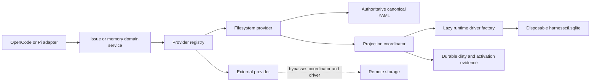
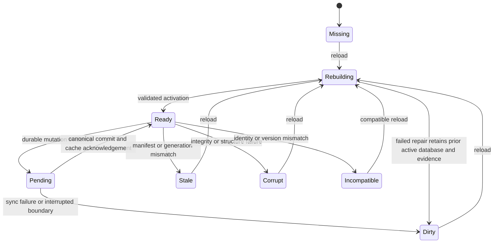
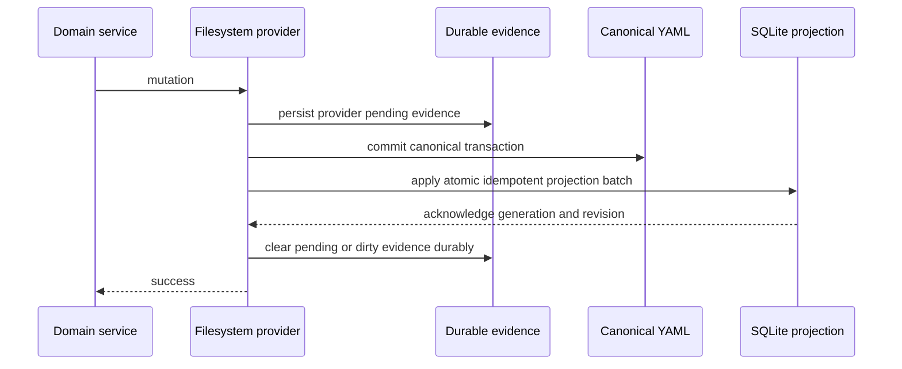

# Generic Local SQLite Projections

## 1. Purpose

This document defines the high-level design for Epic 00014 and Story 00015. It introduces one disposable local SQLite projection for configured filesystem providers, initially canonical YAML issues and repository YAML memory. Canonical files remain the sole authority.

The design defines boundaries, contracts, state, consistency, recovery, portability, and delivery policy. Detailed statement text, adapter-specific types, filesystem procedures, and driver wrappers belong in the LLD.

## 2. Context

The issue subsystem already separates canonical discovery, decoding, projection records, and committed mutation change-sets. Issue mutations can retain transaction and projection-dirty evidence after canonical commit. Repository memory currently scans canonical YAML for most operations and maintains a separate disposable JSON search cache. This design converges both local domains on `.harnessctl/cache/harnessctl.sqlite` without changing their canonical contracts.

Host adapters expose tools, domain services enforce issue and memory rules, filesystem providers own canonical persistence, and the projection subsystem accelerates local reads. External providers remain outside this subsystem.

## 3. Goals

- Provide one generic, KISS projection boundary for local filesystem providers.
- Serve eligible issue and memory lookup, list, search, filter, validation, and hierarchy work cache-first when trust conditions hold.
- Make every successful filesystem mutation write-through: canonical state and SQLite represent the same result before success is returned.
- Preserve durable, provider-scoped dirty evidence across synchronization failures and process crashes.
- Repair missing, stale, dirty, corrupt, or incompatible projections solely from canonical files.
- Support scoped and complete rebuilds without exposing an unvalidated candidate database.
- Select the runtime-compatible Node or Bun SQLite module lazily.
- Produce equivalent schema and behavior on supported Node, Bun, Windows, macOS, and Linux environments.
- Retire the memory JSON cache only after measured behavioral parity.

## 4. Non-Goals

- Making SQLite canonical, shared, remotely synchronized, or user-editable state.
- Migrating legacy issue storage or changing the issue or memory YAML contracts.
- Indexing arbitrary repository content.
- Providing a remote database, cache daemon, MCP cache service, or cross-project cache.
- Caching external, GitHub, command-backed, MCP-backed, or other non-filesystem providers.
- Silently serving partial, stale, or untrusted cache results.

## 5. Assumptions

- Filesystem providers remain the exclusive writers for managed canonical mutations. Unmanaged manual edits require explicit validation or reload before cache trust can be re-established.
- The repository root, provider configuration, and canonical roots are known before local projection use.
- Provider identifiers are stable within a project and unique across registered providers.
- Canonical codecs and domain validation remain authoritative; projection validation cannot make invalid canonical data valid.
- The database, candidates, lock, dirty evidence, and activation manifests reside beneath `.harnessctl/cache` on one local filesystem volume.
- The supported runtimes provide either `bun:sqlite` under Bun or `node:sqlite` under Node. Absence is an actionable capability error, not a reason to substitute an unapproved native dependency.
- SQLite’s file format is shared, while runtime APIs and open-handle replacement behavior differ.
- Commercially friendly OSS and platform capabilities are preferred; no additional server or native service is required.

## 6. Architectural Decisions

| ID  | Decision                                                                                                                                           | Rationale                                                                                      |
| --- | -------------------------------------------------------------------------------------------------------------------------------------------------- | ---------------------------------------------------------------------------------------------- |
| D1  | Canonical YAML is the only authority; SQLite is a disposable projection.                                                                           | Repair remains deterministic and cache loss cannot lose business state.                        |
| D2  | One project database contains provider-isolated projections and manifests.                                                                         | This minimizes operational surfaces while retaining scoped repair.                             |
| D3  | Only `filesystem` providers participate; `external` providers bypass the cache subsystem before driver selection.                                  | Remote behavior must not depend on local SQLite availability.                                  |
| D4  | Provider and driver contracts expose only capabilities required by both initial providers and runtimes.                                            | A KISS boundary reduces accidental framework and runtime coupling.                             |
| D5  | Canonical commit precedes cache synchronization, but durable pending/dirty evidence spans that boundary and is cleared only after acknowledgement. | Cross-resource atomicity is impossible; durable evidence makes every crash window recoverable. |
| D6  | A cache-first read is allowed only for a complete, compatible, synchronized provider generation. Otherwise it fails closed with reload guidance.   | Silent fallback or partial cache data would violate user expectations and obscure corruption.  |
| D7  | Rebuild creates and validates a complete candidate database, closes all handles, and only then activates it.                                       | The active database never becomes a work-in-progress.                                          |
| D8  | A scoped rebuild carries untouched valid providers into the candidate and rebuilds requested providers from canonical state.                       | One database remains complete while avoiding unnecessary canonical scans.                      |
| D9  | Runtime detection checks Bun first and otherwise Node, then lazily loads exactly one built-in module.                                              | Static imports are incompatible across runtimes.                                               |
| D10 | The legacy memory JSON cache is retired through shadow comparison and a reversible release gate.                                                   | Measured parity reduces correctness and rollback risk.                                         |

## 7. System Boundaries

### 7.1 Responsibilities

**Host adapters** expose status and reload tools and translate structured results. They do not choose drivers, inspect SQLite, or weaken trust policy.

**Domain services** enforce issue and memory semantics. They request provider operations and consume provider-neutral entities rather than tables.

**Provider registry** resolves a stable provider by ID and kind. It routes filesystem providers through projection coordination and external providers directly to their backing services.

**Filesystem providers** own canonical discovery, bounded decode, validation, projection mapping, mutation events, and full rebuild input. They never accept SQLite as canonical input.

**Projection coordinator** owns trust decisions, write-through acknowledgement, status, locking, candidate construction, validation, activation, and crash recovery.

**Driver factory and driver** isolate runtime APIs. They do not know issue or memory domain rules.

## 8. KISS Contracts

### 8.1 Provider Contract

| Capability          | Contract                                                                                                                                                              |
| ------------------- | --------------------------------------------------------------------------------------------------------------------------------------------------------------------- |
| Identity            | Stable `id` and `kind`, where kind is exactly `filesystem` or `external`.                                                                                             |
| Canonical discovery | Filesystem providers enumerate bounded canonical candidates and report discovered, skipped, and invalid inputs.                                                       |
| Decode              | A candidate becomes a validated provider-neutral entity, canonical revision, and safe diagnostics.                                                                    |
| Projection          | A decoded entity becomes deterministic entity, relation, search, and manifest rows owned by that provider.                                                            |
| Mutation events     | After canonical commit, one ordered idempotent batch describes upserts, removals, archive/location changes, transaction identity, and resulting revisions.            |
| Full rebuild        | A filesystem provider projects its complete canonical scope into an empty provider partition and returns manifest plus indexed, removed, skipped, and invalid counts. |

Registration rejects duplicate IDs and unsupported kinds. A filesystem provider must implement all six capabilities. An external provider exposes identity and its remote domain operations only: it never receives a cache handle, projection coordinator, dirty marker, or rebuild request.

Projection batches are atomic per provider and idempotent by transaction identity and resulting revision. They contain after-state, never instructions to infer state from old cache rows. A provider cannot clear its own dirty evidence.

### 8.2 Driver Contract

| Capability      | Contract                                                                                                     |
| --------------- | ------------------------------------------------------------------------------------------------------------ |
| Open and close  | Open a path in an explicit read-only or read-write mode; close releases every database and statement handle. |
| Execute         | Execute trusted schema and maintenance statements without domain semantics.                                  |
| Prepare         | Create a statement supporting parameterized `run`, single-row `get`, and multi-row `all`.                    |
| Transaction     | Apply a callback as one commit or rollback unit; nesting behavior is not part of the contract.               |
| Integrity check | Return normalized integrity findings.                                                                        |
| Checkpoint      | Fold pending journal state into the main database before validation or activation.                           |

The driver contract intentionally excludes ORM behavior, migrations as a framework, runtime-specific statement properties, extension loading, user-defined functions, and direct domain objects. The LLD must define normalized scalar and error behavior shared by both drivers.

### 8.3 Lazy Runtime Selection

Driver selection occurs only after a filesystem operation proves SQLite is needed. The factory identifies Bun first; otherwise it identifies Node. It then lazily uses `createRequire` to load only `bun:sqlite` or only `node:sqlite`. There are no static imports of either module and no attempt to load SQLite for external-provider operations.

An unsupported runtime, missing built-in module, or incompatible runtime version returns a structured capability error with a repair or upgrade action. It does not silently scan canonical files for a cache-first operation.

## 9. Database Contract

SQLite schema version 1 uses SQLite’s application identity and schema version metadata in addition to explicit metadata rows. Both drivers read and write the same file, tables, constraints, text encoding, timestamps, and normalized values. Runtime-specific schema variants are prohibited.

### 9.1 Control and Manifest Tables

| Logical table       | Purpose and required data                                                                                                                                            |
| ------------------- | -------------------------------------------------------------------------------------------------------------------------------------------------------------------- |
| `cache_metadata`    | One database identity, schema version, generation, creation time, activation identity, and compatibility floor/ceiling.                                              |
| `provider_manifest` | Provider ID, provider projection version, generation, canonical manifest, state, completion time, transaction watermark, and indexed/removed/skipped/invalid counts. |
| `applied_mutation`  | Provider ID plus mutation transaction identity and resulting watermark, retained according to a bounded idempotency policy.                                          |

Only `ready` provider manifests may exist in an activated database. Dirty and activation evidence is durable filesystem control state outside SQLite so corruption or replacement of the database cannot erase evidence that it is untrustworthy.

### 9.2 Generic Entity Tables

| Logical table          | Purpose and required data                                                                                                                                                           |
| ---------------------- | ----------------------------------------------------------------------------------------------------------------------------------------------------------------------------------- |
| `projection_entity`    | Provider ID, entity kind, stable entity ID, canonical revision, canonical relative path, lifecycle/location state, schema version, timestamps, and complete safe projected payload. |
| `projection_attribute` | Provider-owned scalar attributes needed for exact filter and ordering behavior.                                                                                                     |
| `projection_relation`  | Provider ID, source entity, relation kind, target entity, and deterministic ordinal where order is meaningful.                                                                      |
| `projection_search`    | Provider ID, entity ID, bounded normalized searchable text, and provider search version.                                                                                            |

Provider ID is part of every ownership key. Foreign-key and uniqueness constraints prevent cross-provider relations, duplicate entities, and orphaned provider rows. Complete projected payloads allow direct get operations without reopening canonical files; normalized attributes and relations support bounded filtering, validation candidates, and hierarchy traversal.

### 9.3 Issue Projection

The issue provider projects active and archived issues, canonical revision and path, contract version, type, title, status, timestamps, attribution, assignment, body, metadata, comments, hierarchy, relationships, document links, and location. Relations represent parent/children, dependencies, inverse blocking, general relations, duplicates, supersession, and documents without changing stable issue IDs.

Issue lookup and list/filter use entity and attribute rows. Hierarchy and relationship validation use relation rows to select and traverse candidates. Searchable fields are versioned and bounded. Validation remains a domain operation: SQLite supplies the complete indexed state and candidates, while issue rules determine validity.

### 9.4 Memory Projection

The memory provider projects records and tombstones, schema version, ULID, memory and record types, organization/project/topic scope, summary, details, source metadata, creation metadata, confidence, status, supersedes links, tags, tombstone target and reason, active/superseded/deleted derivation, and canonical relative path/revision.

Memory get, list, scoped filtering, active-state selection, supersession validation, and bounded search use SQLite. Search preserves current case-folded term semantics, deterministic ordering, result-count bounds, and serialized-size bounds. Secret-screening remains a canonical write and export responsibility; routine projection diagnostics never expose projected content.

## 10. Consistency and Trust State Machine

Provider-visible states are `missing`, `ready`, `pending`, `dirty`, `stale`, `corrupt`, `incompatible`, and `rebuilding`. Database-wide state is the most restrictive provider or file state relevant to the requested scope.

### 10.1 Cache-First Trust Policy

A local provider read may trust SQLite only when all of these conditions hold:

- the database exists and has the expected SQLite and harnessctl identity;
- schema and provider projection versions are compatible;
- the provider manifest exists, is complete, and belongs to the active database generation;
- durable pending/dirty evidence is absent for that provider;
- the provider’s canonical manifest and transaction watermark agree with durable provider control evidence;
- structural and lightweight health checks succeed; and
- no activation recovery is pending.

When trusted, eligible reads use SQLite without a full canonical scan. When any condition fails, lookup, list, search, filter, validation, and hierarchy operations that require the projection fail with the exact state and actionable `harnessctl_cache_reload` guidance. They never return partial cache data, silently scan canonical state, silently rebuild, or treat SQLite as authority.

Direct canonical mutation preflight and explicit reload may read canonical files. Status is non-destructive and reports evidence; deep integrity or canonical comparison, when requested by the eventual tool contract, is explicit rather than hidden inside an ordinary query.

## 11. Write-Through and Durable Evidence

Before canonical publication can lead to a reported success, the provider transaction durably writes the provider-dirty marker in `pending` state with provider ID, transaction identity, and intended canonical revisions. Thus the marker spans the canonical/cache boundary and is already fail-closed if the process stops. Canonical commit remains first in authority: SQLite is never used to complete or roll back canonical content.

After canonical commit, the coordinator applies the complete mutation batch in one SQLite transaction and verifies resulting revisions and relations. It then durably clears evidence. Only that completed path may return success.

If cache synchronization, acknowledgement, or evidence cleanup fails after canonical commit, the canonical result remains committed. The operation returns a synchronization error, writes or retains durable provider-dirty evidence, and does not claim success. Startup, query, status, and later mutations inspect evidence before trusting SQLite. Duplicate delivery is safe through transaction identity and resulting revisions.

Crash recovery is deterministic:

| Last durable point                                                    | Recovery outcome                                                                                                     |
| --------------------------------------------------------------------- | -------------------------------------------------------------------------------------------------------------------- |
| No pending evidence                                                   | No projection repair is inferred.                                                                                    |
| Pending evidence, canonical revision absent                           | Canonical recovery decides the mutation; the projection remains untrusted until evidence is reconciled.              |
| Pending evidence, canonical revision present, batch absent or partial | Provider is dirty; reload rebuilds it from canonical state.                                                          |
| Batch committed, evidence remains                                     | Provider stays untrusted; reconciliation may verify exact revisions and clear evidence, otherwise reload repairs it. |
| Dirty evidence present                                                | No ordinary query trusts that provider; successful validated reload is the normal repair.                            |

Evidence removal is never based only on age. Malformed or unsafe evidence fails closed and requires explicit repair.

## 12. Query, Status, and Reload Flows

### 12.1 Query

The registry first resolves provider kind. External providers execute remotely and return without invoking the driver factory. Filesystem providers evaluate trust, open the active database read-only, constrain every query by provider ID, apply domain rules and output bounds, close resources, and return structured results.

Cache-first applies wherever the existing operation would otherwise require broad discovery or parsing: issue and memory lookup, list, search, filter, validation, and hierarchy/relationship resolution. A mutation may read canonical entities required for authoritative preconditions and revision checks; its successful after-state is still written through.

### 12.2 `harnessctl_cache_status`

Status accepts scope `all`, `issues`, or `memory` and does not mutate or auto-repair. It reports provider, state, scope, database and provider generation, compatibility, dirty/pending and activation evidence, last successful reload, manifest identity, indexed/removed/skipped/invalid counts, recommended repair action, and a safe cause. Missing external providers are reported as bypassed rather than unhealthy.

### 12.3 `harnessctl_cache_reload`

Reload accepts scope `all`, `issues`, or `memory`. `all` discovers every configured filesystem provider; named scopes select the corresponding configured filesystem provider and never include external providers. The result reports every selected provider and aggregate indexed, removed, skipped, and invalid counts.

Reload follows the snapshot protocol in Section 14: it acquires every configured filesystem-provider mutation lock in stable provider-ID order and acquires the project cache lock last. The instant the cache lock is acquired is the snapshot boundary. Reload then creates a unique candidate database in the cache directory. Requested providers are rebuilt from canonical state frozen at that boundary. Untouched providers are copied from the equally frozen, currently trusted active generation and revalidated in the candidate; if an untouched provider is not valid, scoped reload fails with guidance to include that provider or use `all`.

Candidate validation covers database identity, schema compatibility, integrity, foreign keys, provider completeness, counts, canonical and projection manifests, transaction watermarks, required indexes, and provider-level invariants. Any invalid canonical input makes that provider rebuild fail; invalid entries are counted and diagnosed safely rather than omitted into a partial active projection.

All candidate and active handles and prepared statements are checkpointed as applicable and closed before activation. Candidate build or validation failure deletes or quarantines only candidate artifacts, preserves the prior active database, retains dirty evidence, and returns structured failure.

## 13. Atomic Activation and Platform Semantics

The active path is `.harnessctl/cache/harnessctl.sqlite`. Candidate, previous, lock, and activation-manifest paths are unique or generation-addressed beneath the same symlink-safe cache root. Journal sidecars are part of handle closure and checkpoint validation and must not be left as an untracked generation during activation.

On POSIX systems, a validated closed candidate may replace the active path through same-directory atomic rename, followed by directory durability where supported. The prior generation remains recoverable according to the bounded retention policy.

Windows does not assume replace-over-open-file semantics. Activation uses a durable swap manifest describing active, previous, candidate, generations, and activation stage. Under the cache lock, all handles close; the old active file moves to a recoverable previous path; the candidate moves to active; the new active generation is reopened and verified; then the manifest is completed. Sharing violations use bounded retries and never overwrite an unexpected file.

At startup or before cache use, an incomplete swap is recovered from the manifest and actual generation identities. Recovery either completes activation of the already validated candidate or restores the previous active database. Ambiguous or tampered paths fail closed. A failed activation restores the prior active generation before returning when the platform permits; otherwise status reports recovery-required and no query proceeds. No candidate is reported active before post-swap verification.

## 14. Concurrency, Snapshot, and Locking

There is one global lock order: configured filesystem-provider mutation locks in ascending stable provider ID, followed by the project cache lock. An operation may take a suffix or subset of provider locks, but if it needs more than one it takes them in that same order; any operation needing both canonical and cache protection takes the cache lock last. No operation may acquire a provider lock while holding the cache lock. Cache-only queries, status inspection, and activation recovery never acquire provider locks.

Write-through acquires its one provider mutation lock, prepares and commits canonical state under that lock, then acquires the cache lock to synchronize the active generation. It releases the cache lock before releasing the provider lock. Reload, including scoped reload, first resolves and sorts every configured filesystem provider, not only providers selected for rebuilding. It acquires all of those provider locks in order and then the cache lock. Therefore a reload waiting for a provider never blocks that provider’s writer from reaching the cache lock, and a writer can never wait for a provider lock while holding the cache lock. Competing reloads acquire the same first lock and serialize. These rules eliminate lock-order cycles.

The reload snapshot boundary is the successful acquisition of the cache lock after all provider locks are held. At that instant, selected canonical stores, durable provider evidence, transaction watermarks, and the active cache generation cannot change. Reload records the configuration fingerprint, provider IDs, active generation, provider manifests, and watermarks at the boundary. It revalidates the configuration fingerprint before projection and before activation; any change aborts the reload. Selected providers are discovered and decoded from this frozen canonical snapshot. Untouched providers are copied from the frozen active generation. All provider and cache locks remain held through build, validation, handle closure, and activation, so no mixed-time candidate can be activated.

Cache-first queries acquire only the cache lock and retain it until their active-generation handle and statements close. This prevents activation from replacing a file in use. Status uses the cache lock for database inspection but reads durable evidence conservatively: evidence changing before lock acquisition is reflected in state, while uncertainty fails closed. Activation recovery acquires only the cache lock because it reads no canonical provider state.

Every lock attempt participates in one operation deadline. Failure to acquire the next lock by that deadline releases already-held locks in reverse order, leaves canonical files and the active database unchanged, preserves existing dirty evidence, creates no trusted candidate, and returns a retryable lock-contention result naming the blocked lock and scope without exposing owner secrets. A reload that exceeds its bounded execution deadline after the snapshot closes all candidate handles, discards or quarantines the candidate, preserves the active generation and dirty evidence, releases locks in reverse order, and returns timeout failure. A write-through timeout after canonical commit follows Section 11: it retains provider-dirty evidence and returns synchronization failure rather than lock-contention success.

Locks have unique owner evidence and actionable busy errors. Age alone does not prove abandonment. Recovery removes a lock only with evidence that its owner cannot remain active; otherwise manual guidance is returned. Process interruption during activation is resolved from the durable activation manifest before the cache lock is released or a later query proceeds.

## 15. Security and Privacy

- Resolve managed paths from the repository root; require containment after normalization; reject absolute paths, traversal, alternate unsafe separators, symlinks, junction-like redirections, and non-regular control artifacts.
- Keep cache, candidate, evidence, lock, and manifests private to the current user where supported; do not claim identical POSIX mode and Windows ACL semantics.
- Parse canonical YAML through existing safe, bounded codecs before projection. Reject unsafe or invalid canonical input rather than coercing it.
- Parameterize all projected values. Only trusted, versioned schema statements may be executed; projected content cannot become identifiers or statement text.
- Disable extension loading and unnecessary SQLite capabilities. Do not execute triggers, extensions, or user-supplied database logic from an existing untrusted file.
- Validate SQLite identity before reading domain rows. Corrupt, foreign, or incompatible files are never opened as trusted cache state.
- Preserve provider and operation resource bounds for file count, bytes, rows, relationships, search text, result count, and serialized result size.
- Keep canonical bodies, comments, memory details, metadata, search text, secrets, and SQL values out of routine logs and errors. Report safe IDs, relative paths, categories, counts, and digests where appropriate.
- Continue memory secret screening before canonical commit and export. SQLite does not weaken or replace that policy.

## 16. Observability and Error Semantics

Structured success and error results include provider, state, scope, database and provider generation, indexed, removed, skipped, and invalid counts, repair action, and safe cause. Mutation synchronization failures also include transaction identity and resulting canonical revision where safe. No result includes canonical content or secrets.

Error categories distinguish configuration, runtime capability, lock contention, canonical discovery/decode, projection synchronization, missing, dirty, stale, corrupt, incompatible, integrity, validation, activation, and recovery failures. Errors identify whether canonical state committed and whether retry, reconciliation, scoped reload, or full reload is required.

Operational telemetry may include operation name, provider, scope, state transition, duration, row/count totals, generation, driver/runtime identity, lock wait, rebuild/activation outcome, and safe error category. It excludes query text, entity content, memory search terms, issue bodies/comments, paths outside safe project-relative forms, and secrets.

## 17. Testing Strategy

### 17.1 Contract and Schema

- Shared provider contract suites for discovery, decode, deterministic projection, mutation idempotency, removals, archive/location changes, counts, manifests, and full rebuild.
- Shared driver contract suites for open modes, close semantics, execute, prepared run/get/all, transactions, rollback, scalar normalization, integrity check, checkpoint, errors, and handle release.
- Golden schema fixtures proving Node and Bun can alternately open, read, update, checkpoint, and integrity-check the same file.
- Schema identity, version, compatibility, constraints, provider isolation, complete payload, relations, attributes, search version, and migration-rejection tests.

### 17.2 Consistency and Recovery

- Fault injection at every boundary: evidence preparation, canonical preparation/commit, projection transaction, acknowledgement, evidence clearing, checkpoint, candidate validation, and activation.
- Every crash state proves deterministic ready, dirty, or recovery-required classification and proves canonical authority.
- Successful mutation proves canonical and projected revisions agree before success. Sync failure proves canonical commitment, synchronization error, durable dirty evidence, query refusal, and reload repair.
- Missing, stale, malformed evidence, foreign SQLite, corrupt pages, incompatible versions, failed integrity, mismatched manifests/counts, duplicate transactions, and partial sidecar states.
- Concurrent mutation, query, status, scoped reload, full reload, lock contention, uncertain lock ownership, and process termination tests.

### 17.3 Provider Behavior

- Issue get/list/filter, active/archive location, comments, metadata, documents, all relationships, hierarchy traversal, validation candidates, mutation, removal, and recursive archive parity against canonical behavior.
- Memory get/list/search/filter/validation/export selection, supersession, tombstone activity, tags, topics, bounds, secret redaction, import batches, and ordering parity.
- Invalid canonical inputs never activate as skipped partial state; indexed/removed/skipped/invalid counts are deterministic.
- External issue and memory provider tests prove no driver load, database access, dirty evidence, status failure, or reload participation.

### 17.4 Runtime and Platform

- Supported Node and Bun versions run the same provider and driver contract corpus. Module-load assertions prove only the selected built-in SQLite module loads and no module loads on remote bypass.
- Windows, macOS, and Linux CI exercises clean activation, locked/open files, sharing violations, checkpoint sidecars, permissions, long paths, Unicode paths, same-volume assumptions, interruption at every swap stage, restoration, and generation verification.
- POSIX tests verify replacement and directory durability where supported. Windows tests verify recoverable previous/new swap manifests without assuming open-file replacement.

### 17.5 End-to-End Acceptance

- Tool-adapter tests cover `harnessctl_cache_status` and `harnessctl_cache_reload` for `all`, `issues`, and `memory`, including structured fields and redaction.
- Performance regression tests prove trusted cache-first operations do not perform full canonical discovery or parsing.
- Shadow parity tests compare legacy memory JSON and SQLite candidate IDs, activity, ordering, filtering, search, bounds, and serialized outputs over representative and generated repositories.

## 18. Rollout and Memory JSON Retirement

1. Land driver and schema contracts behind a disabled projection feature gate; no user-visible behavior changes.
2. Enable explicit status and reload for development fixtures while ordinary reads remain canonical.
3. Shadow-build SQLite for issues and memory, compare against canonical results, and retain dirty evidence without making SQLite authoritative.
4. Enable cache-first reads for opted-in repositories only after cross-runtime, cross-platform, crash, and parity gates pass.
5. During one compatibility window, compare memory SQLite behavior with `memory-index.json`; SQLite remains the candidate and discrepancies fail the gate.
6. Stop writing and reading `memory-index.json` only after verified parity, documentation, and release approval. Existing JSON is disposable and may be ignored or removed safely; it is never imported as authority.
7. Make SQLite the default local projection after telemetry and support criteria pass. Rollback disables cache-first reads and preserves canonical YAML; recovery rebuilds projections from canonical sources, never from either cache.

Rollout is independent of legacy issue migration. Repositories containing unsupported legacy or mixed issue storage remain blocked by the canonical issue provider and cannot be made valid through cache reload.

## 19. Risks and Mitigations

| Risk                                                                  | Impact                                         | Mitigation or residual risk                                                                                                                   |
| --------------------------------------------------------------------- | ---------------------------------------------- | --------------------------------------------------------------------------------------------------------------------------------------------- |
| Node and Bun APIs differ.                                             | Divergent behavior or incompatible files.      | Narrow driver contract, shared fixtures, lazy module selection, and alternating-runtime tests.                                                |
| Canonical commit and cache update cannot be one physical transaction. | Temporary divergence after failure or crash.   | Durable pending/dirty evidence, fail-before-success, idempotent batches, and canonical rebuild.                                               |
| Cache-first trust misses unmanaged edits.                             | Stale reads.                                   | Exclusive managed-write assumption, explicit status/deep validation and reload policy, provider manifests, and fail-closed evidence handling. |
| Windows cannot portably replace open databases.                       | Activation failure or temporary path movement. | Close/checkpoint all handles, durable swap manifest, recoverable previous generation, bounded retries, and startup recovery.                  |
| Scoped rebuild combines generations incorrectly.                      | Cross-provider inconsistency.                  | Copy only trusted untouched providers, assign one candidate generation, validate all manifests and counts before activation.                  |
| Corrupt or hostile SQLite is present.                                 | Incorrect results or capability abuse.         | Identity/integrity checks, no extension loading, parameterization, private paths, and rebuild from canonical files.                           |
| Projection stores sensitive canonical content.                        | Disclosure through logs or permissions.        | Private cache permissions, strict redaction, no content telemetry, and existing secret screening.                                             |
| Memory search semantics drift during JSON retirement.                 | Changed user results.                          | Shadow parity corpus, compatibility window, bounds/order checks, and reversible gate.                                                         |
| Large repositories make rebuild costly.                               | Availability or long lock periods.             | Scoped rebuild, explicit bounds/counts, candidate construction, and no hidden rebuild on queries.                                             |

## 20. Delivery Decomposition

1. Approve provider, driver, schema, state, and trust contracts.
2. Establish Node/Bun driver contract tests and shared schema fixtures.
3. Add provider registry, external bypass, durable evidence, status, and structured errors.
4. Add issue projection and write-through integration.
5. Add memory projection and write-through integration while retaining JSON shadow parity.
6. Add complete and scoped candidate rebuild, validation, and POSIX activation.
7. Add Windows swap-manifest activation and crash recovery.
8. Enable cache-first issue and memory reads behind the rollout gate.
9. Complete cross-runtime/platform acceptance and retire the memory JSON cache after parity approval.

Each stage is independently verifiable. No stage may make SQLite authoritative or weaken fail-closed trust.

## 21. Acceptance-Criteria and Constraint Traceability

The following Epic 00014 and Story 00015 criteria and updated design constraints are preserved verbatim. Parenthetical references identify primary coverage.

### 21.1 Epic 00014 Acceptance Criteria

#### Write-through success

Given a filesystem issue or memory mutation
When it reports success
Then canonical files and SQLite represent the same result.
(Sections 6, 11, and 17)

#### Recoverable sync failure

Given canonical commit succeeds but cache sync fails
When the tool responds
Then it returns a synchronization error, durably marks the provider dirty, and reload repairs from canonical files.
(Sections 10–12 and 17)

#### Cache-first query

Given synchronized compatible cache
When lookup/list/search/filter/validation/hierarchy runs
Then candidates and indexed state come from SQLite without a full canonical scan.
(Sections 9, 10, and 12)

#### Atomic reload

Given reload scope `all`, `issues`, or `memory`
When provider indexing and validation succeed
Then a temporary DB is atomically activated and reports indexed/removed/skipped/invalid counts
And failed rebuild leaves prior active DB unchanged.
(Sections 12, 13, and 17)

#### Runtime portability

Given Node or Bun execution
When cache is first needed
Then only that runtime SQLite module loads
And both drivers operate on the same database schema and file.
(Sections 8, 9, and 17)

#### Repair

Given missing, dirty, corrupt, or incompatible cache
When status/reload or a local query handles it
Then state is reported accurately and repair uses canonical files without treating cache as authority.
(Sections 10–13 and 16)

#### Remote bypass

Given external provider storage
When tools execute
Then no local SQLite load/query/mutation is required.
(Sections 7, 8, 12, and 17)

### 21.2 Updated Design Constraints

- Minimal provider contract: `id`, `kind=filesystem|external`, canonical discovery/decode, projection rows, mutation events, and full rebuild. External providers never receive a cache handle. (Sections 7 and 8)
- Minimal driver contract: open/close, exec, prepared run/get/all, transaction, integrity check, and checkpoint. Runtime factory checks Bun first, then Node, and lazily `createRequire`s only `bun:sqlite` or `node:sqlite`. (Section 8)
- A durable provider-dirty marker is written within the canonical mutation transaction boundary before success can be returned. Startup/query/status checks marker before trusting SQLite. (Sections 10 and 11)
- Synchronized compatible cache is mandatory for cache-first reads. Missing/stale/dirty/corrupt/incompatible state fails with actionable reload guidance; it never silently returns partial cache data or treats cache as authority. (Sections 10 and 12)
- Reload holds one project cache lock, builds requested provider scope in a unique temporary database, validates schema/integrity/counts/manifests, closes all handles, then activates. POSIX rename may replace; Windows uses a recoverable previous/new swap manifest because open-file replacement is not portable. (Sections 12–14)
- Scope reload copies untouched valid providers into the candidate DB; `all` discovers every configured filesystem provider. Failure preserves active DB and dirty evidence. (Section 12)
- Managed paths remain project-relative and symlink-safe; SQL is parameterized; bounded canonical parsing precedes indexing; cache files use private permissions where supported. (Section 15)
- Structured results/errors include provider, state, scope, generation, indexed/removed/skipped/invalid counts, repair action, and cause without canonical content or secrets. (Section 16)

### 21.3 Story 00015 Acceptance

- [x] HLD preserves every Epic 00014 criterion.
- [x] Failure/crash states have deterministic recovery.
- [x] Design is implementation-ready for LLD decomposition.

The required decisions on authority, transaction boundaries, driver neutrality, provider registration, external bypass, schema, manifests, dirty markers, compatibility, locking, atomic replacement, issue and memory models, write-through repair, memory JSON retirement, cross-runtime/platform verification, and rollout are resolved in Sections 6–20.
