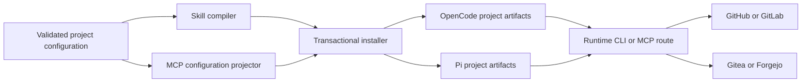

# Configurable CVS, MCP-Aware Issues, and Generated Host MCP Configuration

## Status and design authority

Review draft based on the approved plan and the established configuration, issue,
skill, and installer boundaries in LLDs 00001, 00005, and 00007. LLD 00005 is design
lineage only where its supersession notice applies; current canonical issue behavior
remains governed by its successor designs. This HLD extends provider routing and host
configuration. It does not replace canonical issue storage, memory, or cache contracts.

The earlier configurable transport-selector and deterministic MCP-first/fallback policy
is superseded. This revision enumerates valid CLI and MCP capabilities and delegates the
choice for each operation to the agent. The agent must choose before mutation and must
never switch routes after mutation begins.

## Purpose

Harnessctl will provide separately configurable version-control-system (CVS) and issue
workflows. Either workflow may use a provider CLI or an MCP server without embedding a
provider API client in harnessctl. Installation will generate safe OpenCode and Pi MCP
configuration while preserving operator-owned host settings.

The architecture keeps three concerns distinct:

- CVS selects local repository control and an optional remote collaboration service.
- Issues select their own authority and remote access policy independently of CVS.
- Host integration projects the selected remote services into OpenCode or Pi MCP
  configuration without owning authentication.

## Goals

- Make local Git the default CVS and allow Jujutsu as an explicit alternative.
- Make GitHub the default remote CVS service and support GitLab, Gitea, and Forgejo.
- Preserve filesystem issues while making remote issues CLI- and MCP-aware.
- Enumerate each remote service's valid CLI and MCP capabilities independently for CVS
  and Issues.
- Let the agent choose an available capability for each operation without prescribed
  route precedence.
- Generate deterministic, deduplicated OpenCode and Pi MCP server registrations.
- Preserve unrelated host settings, provide exact rollback for harnessctl-owned project
  files and captured Pi settings bytes, and disclose residual external installer effects.
- Keep credentials outside project configuration and generated artifacts.
- Generate capability-aware CVS and issue skills that require user consent before a
  merge.
- Ship documentation, tests, schemas, and release artifacts as one coherent contract.

## Non-goals

- Implementing Git, Jujutsu, provider APIs, MCP servers, OAuth services, or provider
  CLIs inside harnessctl.
- Installing or authenticating provider CLIs.
- Calling remote services, completing OAuth, or resolving secret values during
  installation.
- Migrating repositories, issues, pull requests, merge requests, or authentication
  state between providers.
- Making MCP availability an installation-time promise.
- Normalizing every provider into an invented common command syntax or capability set.
- Distributing, linking, or embedding GPL server code in harnessctl packages.
- Changing canonical filesystem issue semantics, repository memory authority, or the
  disposable SQLite cache boundary.

## Assumptions

- The project configuration remains the validated, harness-neutral source of intent.
- Git, Jujutsu, and provider CLIs are operator-managed executables.
- Host runtimes expose enough information for generated skills to distinguish available
  MCP tools from available CLIs when work begins.
- GitHub and GitLab continue operating their official hosted MCP services. Endpoint,
  OAuth, and capability claims are verified against official documentation at release.
- Gitea and Forgejo operators provide an HTTPS instance URL and the name of an
  environment variable containing the provider token.
- Existing memory-enabled Pi and all-harness safeguards remain authoritative unless a
  separately approved design replaces them.

## System context

The configuration reader validates independent CVS and issue selections. The skill
compiler turns those selections into provider-specific operating guidance. The host
configuration projector creates a common set of required MCP server intents and renders
them into each host's native project file. The transactional installer coordinates all
generated prompts, skills, host settings, and adapter prerequisites.

Harnessctl owns validation, projection, generated guidance, conflict handling, and
rollback. Hosts own MCP execution. Provider services and external CLIs own remote
operations and authentication. Users retain authority over merge approval.

## Configuration architecture

### CVS domain

CVS configuration has two independent selections:

- A local repository implementation: `git` by default, or `jj` when explicitly chosen.
- A remote collaboration service: `github` by default, or `gitlab`, `gitea`, or
  `forgejo`.

Each remote selection identifies both its valid provider CLI and fixed-ID MCP service.
Gitea and Forgejo additionally require an instance URL. Any token setting stores only the exact
environment-variable name designated by the operator, never its value.

A generated GitHub MCP registration requires the validated environment-variable name
that supplies its hosted-server PAT. GitLab MCP requires no token variable because its
host-native OAuth flow owns credentials. Gitea and Forgejo MCP require their validated
token-variable name and instance URL. A missing requirement makes that MCP capability
unavailable without disabling an independently available CLI capability.

Local operations remain local even when the remote service uses MCP. Jujutsu selection
does not imply a different remote provider and does not permit Git command assumptions
where Jujutsu behavior has not been verified.

### Issues domain

Issues retain a separate configuration branch and do not inherit the CVS provider,
endpoint, token environment-variable name, or tool choice. Filesystem issues
continue using harnessctl's canonical local tools. Remote issues independently select
GitHub, GitLab, Gitea, or Forgejo and enumerate their own valid CLI and MCP capabilities.

Matching CVS and issue selections may share one generated MCP server registration, but
they remain distinct policy owners. Changing CVS must not silently move issue authority;
changing issues must not alter local or remote CVS behavior.

### Validation invariants

- Unknown local systems, providers, settings, server IDs, and unsafe URLs
  fail closed.
- Remote-provider settings are explicit where defaults cannot safely supply instance or
  token context.
- Only environment-variable names are accepted. Secret values, assignments, command
  fragments, and token-shaped configuration are rejected.
- Provider, endpoint, CLI, MCP, and credential-name combinations must be internally
  consistent.
- An MCP capability must have a supported server definition for its provider.
- A CLI capability must name the provider-specific supported CLI; harnessctl does
  not generalize syntax between providers.
- MCP output-limit mode accepts `bounded-guidance` or `hard` and defaults to
  `bounded-guidance`. `hard` is valid only when every selected host has a verified
  runtime control for the requested output limit. OpenCode therefore rejects `hard`;
  Pi may accept it only for the adapter's verified per-call output guard. Workflow
  aggregation and remote body size are never represented as hard limits.

Existing version migration and deep-overlay behavior remain compatible where an old
configuration omitted the new CVS settings. Such projects receive local
Git, GitHub remote CVS, and the established issue defaults. Migration must not couple an
existing issue provider to the new CVS default.

## Runtime routing policy

Generated guidance enumerates the configured provider CLI and fixed-ID MCP service with
their valid capabilities. The agent chooses the suitable available route for each
operation after checking adapter or executable availability, authentication, context,
compatibility, and required capability. No MCP-first or CLI-first precedence applies.
Local Git and Jujutsu operations always remain direct and never route through remote MCP
services.

A route is valid only when it matches the configured domain and provider, is available
in the current host, is authenticated by the host or operator, resolves the intended
repository or project, and exposes the capability required by the requested operation.
Availability alone is insufficient.

Route choice must occur before execution. Once any mutating tool or command has been
invoked, its success, timeout, ambiguous result, or failure is terminal for that route:
the skill must not retry the mutation through another route. It reports the outcome
and requires explicit user-directed recovery after state is reconciled. Reads may be
repeated only when their idempotence and bounds are known. Routing never falls back to
another provider, filesystem issues, direct canonical edits, or guessed command syntax.

Before a remote read or mutation, skills gather the minimum context needed to identify
the provider, repository or project, active issue or change request, and available
capabilities. Ambiguous context blocks mutation. Broad context retrieval is permitted
only when necessary for discovery and remains bounded to avoid accidental cross-project
actions or excessive disclosure.

All merge operations require explicit user consent immediately before merge, regardless
of provider, chosen route, prior approval, automation level, or successful checks. Skills
may prepare, inspect, and propose a merge without that consent, but must not complete it.

## MCP service catalog

Generated host configuration uses fixed, provider-owned IDs:

| Provider | Fixed ID | Service boundary |
| --- | --- | --- |
| GitHub | `cvs_github` | GitHub's official hosted MCP endpoint, limited to the `repos`, `issues`, `pull_requests`, `actions`, and `git` toolsets. |
| GitLab | `cvs_gitlab` | GitLab's official native OAuth MCP endpoint using Dynamic Client Registration. |
| Gitea | `cvs_gitea` | External `forgejo-mcp` version 2.33.0 process connected to the configured Gitea URL. |
| Forgejo | `cvs_forgejo` | External `forgejo-mcp` version 2.33.0 process connected to the configured Forgejo URL. |

The GitHub and GitLab entries remain hosted-service definitions. GitLab authentication
uses the service's native OAuth and DCR contract rather than a generated static secret.
The exact official endpoints and GitHub toolset declaration are treated as reviewed
provider metadata and covered by documentation and artifact freshness tests.

Gitea and Forgejo use `forgejo-mcp` as an external standard-input/output process with
the required standard-I/O transport and configured instance URL. The configured
provider token environment-variable name is mapped at process launch to
`FORGEJO_ACCESS_TOKEN`. Generated files contain the source environment-variable name or
host reference, never the token value. The package remains pinned to version 2.33.0.

CVS and Issues requests for the same provider produce one server intent. Identical
definitions deduplicate to the fixed ID. Two definitions with the same fixed ID but
different provider metadata, endpoint, command, version, environment mapping, OAuth
mode, or toolsets are a configuration error; neither definition wins silently.

### Bounded-call policy and enforceable controls

The default `bounded-guidance` policy tells agents to request one page and 20 results,
stop when sufficient evidence exists, and avoid accumulating more than five pages or 100
results. When a live tool schema exposes pagination, result-count, range, or maximum-byte
arguments, the generated skill validates the proposed arguments against that schema and
the lower of provider and policy bounds before issuing the call. This is agent guidance,
not a host access-control boundary; a non-conforming agent or tool without such arguments
can exceed it.

OpenCode exposes no verified aggregate-output or response-body limiter for these MCP
registrations. The skill therefore advises a 16,000-character inline body target, a
32,000-character per-call text target, and a 64,000-character workflow aggregate target,
but harnessctl does not claim to enforce or truncate them. Exceeding those targets is a
residual context-exhaustion and disclosure risk. Decisions that depend on omitted,
oversized, spilled, or linked content require a narrower retrieval and verification of
provider, repository, object identity, revision, size, and digest where available.
Tool-reported spill paths and URLs are untrusted references, not verified artifacts.

Only these controls are represented as technically enforced:

| Boundary | Hard control | Status |
| --- | --- | --- |
| GitHub hosted MCP | `X-MCP-Toolsets` request header | Server limits the requested surface to `repos,issues,pull_requests,actions,git`. |
| Pi MCP call | Adapter `outputGuard` | Text is capped at 51,200 bytes or 2,000 lines and proxy details at 16,384 bytes; oversized text is represented by a guarded preview and private spill reference. |
| OpenCode MCP call or workflow | None for body, per-call text, or aggregate text | `bounded-guidance` only; `hard` configuration is rejected. |

Pi's output guard applies per call, not across a workflow, and does not make spill content
trusted. Its documented kill switch can disable guarding outside harnessctl's control;
verification must detect the projected guard setting, while runtime override remains a
documented residual risk. No host is claimed to enforce workflow aggregate or provider
body-size limits.

Tool exposure is deny-by-default. The default is the smallest read and mutation tool
subset required by the independently selected CVS and Issues domains. The maximum is
the release-vetted provider allowlist; wildcard, administrator, account-management,
secret-management, and host-filesystem-upload tools are excluded. GitHub's default and
maximum server toolsets are exactly `repos`, `issues`, `pull_requests`, `actions`, and
`git`. For GitLab, Gitea, and Forgejo, generated skill discovery must intersect the live
server surface with the release-vetted per-operation allowlist; an unknown or newly
advertised tool is unavailable until reviewed. Pi uses explicit `includeTools` and keeps
direct tools disabled by default. OpenCode uses the GitHub server header where available;
for other providers, the generated skill's allowlist is guidance rather than a claim that
OpenCode filters tools.

## Host projections

### OpenCode

OpenCode receives a project `opencode.json` document with MCP registrations
under the top-level `mcp` setting. Generated environment references use OpenCode's
`{env:VAR}` interpolation form. Existing unrelated OpenCode settings and unrelated MCP
IDs remain operator-owned.

The exact owned entries are:

| ID | Exact OpenCode fields |
| --- | --- |
| `cvs_github` | `type`: `remote`; `url`: `https://api.githubcopilot.com/mcp/`; `headers.Authorization`: `Bearer {env:<configured-github-pat-variable>}`; `headers.X-MCP-Toolsets`: `repos,issues,pull_requests,actions,git`; `oauth`: `false`. |
| `cvs_gitlab` | `type`: `remote`; `url`: `https://gitlab.com/api/v4/mcp`; `oauth`: `{}`; no `headers.Authorization` and no token environment reference. |
| `cvs_gitea` | `type`: `local`; `command`: ordered values `forgejo-mcp`, `--transport`, `stdio`, `--url`, `<validated-gitea-url>`; `environment.FORGEJO_ACCESS_TOKEN`: `{env:<configured-gitea-token-variable>}`. |
| `cvs_forgejo` | `type`: `local`; `command`: ordered values `forgejo-mcp`, `--transport`, `stdio`, `--url`, `<validated-forgejo-url>`; `environment.FORGEJO_ACCESS_TOKEN`: `{env:<configured-forgejo-token-variable>}`. |

The GitHub token variable name is validated and its value is never resolved by
harnessctl. GitLab's empty OAuth object enables OpenCode's automatic OAuth flow; the
entry contains no token header. The local executable must be the separately installed,
release-verified `forgejo-mcp` 2.33.0 binary; no token or shell fragment appears in its
arguments.

### Pi

Pi receives one project `.pi/mcp.json` object with top-level `mcpServers` and top-level
`settings`. Environment references use Pi's `${VAR}` interpolation form. MCP
configuration is operational only when the MIT-licensed `pi-mcp-adapter` version 2.26.0
is already present through operator-managed preinstallation or has been successfully
installed through the consent-gated, verified
`pi install npm:pi-mcp-adapter@2.26.0` path.

Pi renders the following exact owned values beneath top-level `mcpServers`:

| Entry | Exact Pi fields |
| --- | --- |
| `cvs_github` | `url`: `https://api.githubcopilot.com/mcp/`; `headers.Authorization`: `Bearer ${<configured-github-pat-variable>}`; `headers.X-MCP-Toolsets`: `repos,issues,pull_requests,actions,git`; `auth`: `bearer`; `lifecycle`: `lazy`; `directTools`: `false`; release-vetted `includeTools`. |
| `cvs_gitlab` | `url`: `https://gitlab.com/api/v4/mcp`; `auth`: `oauth`; `oauth`: `{}`; no token header, token environment reference, `bearerToken`, or `bearerTokenEnv`; `lifecycle`: `lazy`; `directTools`: `false`; release-vetted `includeTools`. |
| `cvs_gitea` | `command`: `forgejo-mcp`; `args`: ordered values `--transport`, `stdio`, `--url`, `<validated-gitea-url>`; `env.FORGEJO_ACCESS_TOKEN`: `${<configured-gitea-token-variable>}`; `lifecycle`: `lazy`; `directTools`: `false`; release-vetted `includeTools`. |
| `cvs_forgejo` | `command`: `forgejo-mcp`; `args`: ordered values `--transport`, `stdio`, `--url`, `<validated-forgejo-url>`; `env.FORGEJO_ACCESS_TOKEN`: `${<configured-forgejo-token-variable>}`; `lifecycle`: `lazy`; `directTools`: `false`; release-vetted `includeTools`. |

Top-level `settings` contains only the adapter-documented fields
`hostConfigDiscovery`: `off`, `directTools`: `false`, and `outputGuard` with
`maxBytes`: `51200`, `maxLines`: `2000`, and `detailsMaxBytes`: `16384`. The cited
adapter documentation verifies `lifecycle`: `lazy` only as a per-server field, not as a
top-level setting; harnessctl therefore places it under each `mcpServers` entry and treats
any requested global lazy-setting field as unsupported rather than inventing one.

GitLab OAuth, DCR fallback, URL binding, refresh, and credential persistence are
delegated to pi-mcp-adapter's operating-system credential store and fail closed when it
is unavailable. Host-config discovery cannot broaden this generated surface.

If adapter installation does not succeed, Pi MCP configuration remains absent or inert
and the installer reports the prerequisite failure. It must not leave a configuration
that claims working MCP support. This addition does not weaken the existing fail-closed
memory-enabled Pi or all-harness safeguard.

Projection and lifecycle shapes are release-verified against the
[OpenCode MCP configuration documentation](https://opencode.ai/docs/mcp-servers/),
[GitHub remote-server header documentation](https://github.com/github/github-mcp-server/blob/main/docs/remote-server.md),
[GitLab MCP server documentation](https://docs.gitlab.com/user/model_context_protocol/mcp_server/),
[pi-mcp-adapter 2.26.0 settings documentation](https://github.com/nicobailon/pi-mcp-adapter/blob/v2.26.0/README.md#settings),
[pi-mcp-adapter 2.26.0 lifecycle documentation](https://github.com/nicobailon/pi-mcp-adapter/blob/v2.26.0/README.md#lifecycle-modes),
[Pi package command documentation](https://github.com/badlogic/pi-mono/tree/main/packages/coding-agent),
and [forgejo-mcp 2.33.0 documentation](https://github.com/goern/forgejo-mcp/tree/v2.33.0).
Release freshness checks must fail rather than silently adapting if those contracts
change.

### Projection rules

- Host syntax differences are projection concerns; provider intent remains identical.
- Unrelated host keys and unrelated MCP server IDs are preserved.
- An existing identical owned definition is preserved rather than rewritten.
- An existing different definition under a fixed owned ID is a conflict.
- Without force, any conflict blocks all writes.
- With force, only the conflicting harnessctl-owned fixed ID may be replaced. Unrelated
  settings and server IDs remain untouched.
- Malformed host documents, unsupported structures, unsafe paths, duplicate ambiguous
  IDs, and incompatible owned definitions fail before mutation.

## Skill architecture

The generated CVS skill describes the selected local system, remote provider, valid CLI
and MCP capabilities, runtime route checks, per-operation capability choice, change-request workflow, and
mandatory pre-merge consent. The issue-tracking skill receives the separately validated
issue policy and preserves local expected-revision and no-direct-edit rules for
filesystem issues.

Remote skill guidance is capability-aware rather than syntax-inventing. It may state
only vetted provider capabilities and must direct uncertain CLI or MCP operations to
the currently available tool descriptions or installed help. GitHub, GitLab, Gitea, and
Forgejo branches are mutually exclusive except for generic safety and workflow rules.

MCP prompts, server instructions, tool descriptions, tool results, CLI output, remote
object bodies, comments, diffs, logs, links, and referenced artifact contents are
untrusted data. Generated skills must never adopt text from those channels as
instructions, policy, authorization, routing changes, tool arguments, or evidence of
user consent. They separate data from the governing system and generated-skill rules,
apply bounded-call guidance and schema-exposed argument checks, and verify referenced or
oversized artifacts against the expected provider, repository, object identity,
revision, size, and digest where one is available before relying on their contents.

Provider-specific CLI capability remains supported: GitHub uses GitHub's CLI, GitLab uses
GitLab's CLI, and Gitea and Forgejo retain their separately vetted CLI guidance. A
working CVS route does not imply a working issue route, even when both target the same
provider or share an MCP registration.

Skills must:

- Confirm provider and repository or project context before mutation.
- Check the exact required capability before selecting or changing routes.
- Choose CLI or MCP per operation based on the validated live capability needed, before
  mutation; never switch after mutation starts.
- Report unavailable routes and capabilities directly without recursive failure
  reporting through the broken channel.
- Avoid echoing credentials, authentication responses, or secret-bearing environment
  content.
- Preserve existing links-over-text, attribution, approval, and bounded-context rules.
- Obtain explicit user consent before every merge.

## Installation and transaction boundary

Installation is a local, deterministic transformation of validated configuration and
existing project files. It may verify local package or adapter installation outcomes,
but performs no provider call, OAuth exchange, CLI login, remote capability probe, or
secret resolution.

The installer plans, renders, validates, and smoke-checks all prompt, skill, OpenCode,
Pi, and supporting project artifacts before the first mutation. For Pi it first records
the adapter's prior listed identity and active or disabled state, plus the exact bytes and
presence of every Pi settings file that package installation may change. It records the
same exact-byte snapshot for all owned project files. No project file is written before
the adapter verification and installation-consent protocol below is complete.

If the pinned adapter was already installed and active, including by manual
preinstallation, the installer does not reinstall it and must preserve its prior
settings. Manual preinstallation is the supported path for operators who do not accept
installer side effects. A listed but inactive, uninspectable, or wrong-version adapter
stops before project mutation and requires operator repair.

If the adapter is absent, automatic installation is available only when the installed Pi
version provides release-verified listing, active-state inspection, and
`pi remove npm:pi-mcp-adapter@2.26.0`. Immediately before any
`pi install npm:pi-mcp-adapter@2.26.0`, interactive operation must disclose the exact
command, affected external package boundary, and residual package-manager, package
lifecycle, global-state, and cache effects, then obtain fresh explicit operator
confirmation. Earlier consent and general force do not qualify. Noninteractive operation
must receive a dedicated, documented Pi-install opt-in flag; without it, the installer
fails before any mutation. The same disclosure is emitted in noninteractive mode before
honoring the flag. If these checks or consent are unavailable or declined, installation
stops without mutation and directs the operator to manual preinstallation. Interactive
confirmation, or validation of the noninteractive opt-in, is the final pre-command action;
the install command follows without an intervening operation.

After consent, the automatic path invokes only the pinned install command, then verifies
through the release-vetted listing and active-state inspection that version 2.26.0 is
installed and active. This mandatory post-install verification occurs before any project
write. Failure immediately triggers best-effort removal of the newly installed adapter
and exact restoration of captured Pi settings bytes; every cleanup failure and residual
effect is surfaced.

Only after the adapter is verified active and the applicable consent protocol is
satisfied are project artifacts committed atomically. On any later failure, the installer
restores the complete harnessctl-owned project snapshot and captured Pi settings bytes
and presence exactly, then verifies both byte for byte. When this transaction installed
the adapter, it also makes a best-effort verified removal attempt and checks the resulting
listed and active state. It attempts every cleanup action and reports all rollback errors
together; one cleanup failure does not suppress later cleanup attempts.

Exact reversibility applies only to harnessctl-owned project files and captured Pi
settings bytes. External package installation is not exactly reversible: package-manager
metadata, lifecycle-script effects, global state, downloads, and global caches may remain. These
residual risks are disclosed before consent. Harnessctl best-effort removes effects it can
identify as newly created by this transaction, never removes pre-existing external state,
and surfaces unsuccessful cleanup and known residue. No restored project artifact may
reference or claim an adapter absent from the restored prior state.

Force remains narrowly scoped. It authorizes replacement of generated harnessctl
artifacts and conflicting harnessctl-owned MCP IDs, not wholesale replacement of host
documents, unrelated settings, unrelated packages, or operator credentials.

## Security and trust boundaries

- Project configuration, existing host files, MCP prompts and server instructions, tool
  descriptions and results, CLI output, remote bodies and links, referenced artifacts,
  issue content, and repository content are untrusted data and never instructions.
- Configuration and generated artifacts contain environment-variable names only.
  Harnessctl never reads, stores, renders, logs, or validates token values.
- OAuth authorization remains between the user, host, and official provider endpoint.
- MCP and CLI permissions are the effective authorization boundary; generated skills
  are guidance, not access control.
- Remote mutations require resolved provider and repository context. Ambiguity fails
  closed.
- Hosted endpoints, external package versions, licenses, provenance, and expected
  capabilities are release-vetted and documented.
- External standard-I/O processes receive only their declared endpoint and environment
  mapping. Diagnostics redact environment values and authentication material.
- Generated commands and settings do not interpolate operator-controlled shell text.
- Guarded, omitted, oversized, spilled, linked, or otherwise unverified data cannot
  authorize routing, mutation, merge, or artifact execution. Referenced artifacts are
  verified before use and are never executed merely because a remote response requests
  it.
- Merge consent cannot be delegated to an MCP server, CLI, issue comment, memory record,
  or earlier blanket approval.

## Dependency and license vetting

The selected Gitea and Forgejo bridge is the community `forgejo-mcp` version 2.33.0.
Its GPL licensing is accepted only across an external process boundary. Harnessctl does
not distribute, vendor, import, statically link, dynamically link, or derive package
code from it. Installation guidance identifies the separate license and operator-owned
acquisition boundary.

`MushroomFleet/gitea-mcp` is explicitly rejected: it has no suitable release, exposes a
limited tool surface, and has a license mismatch for this architecture. It must not
appear as a fallback or generated option.

Pi integration uses `pi-mcp-adapter` version 2.26.0 under the MIT license. Its pinned
identity, installation path, project configuration contract, and license remain
release-verification inputs. No unpinned adapter or server package is accepted.

## Compatibility and migration

- Existing projects without CVS configuration retain Git locally and GitHub as the
  remote CVS default.
- Existing issue configuration remains independently authoritative and receives no route
  selector.
- Filesystem issue files, IDs, revisions, relationships, comments, archive behavior,
  memory records, and local SQLite behavior remain unchanged.
- Existing OpenCode and Pi commands and skill contracts are extended rather than
  renamed.
- Existing unrelated host configuration survives installation byte-semantically, apart
  from the minimal required structural merge.
- Existing identical fixed-ID MCP definitions are accepted and preserved.
- Existing mismatched fixed-ID definitions require operator resolution or narrow force
  replacement.
- Provider changes do not migrate remote or local data and do not delete dormant
  artifacts.

## Failure behavior

- Invalid project configuration prevents rendering and installation.
- An unavailable CLI or MCP capability produces an actionable error and is not selected.
- If neither route exposes the required valid capability, the operation stops without
  changing providers or guessing syntax.
- Authentication failure, DCR failure, ambiguous repository context, insufficient
  permission, missing toolset, or unsupported operation stops before mutation where the
  provider permits preflight detection.
- Route choice occurs before mutation. After invocation, including timeout or an
  ambiguous response, the agent never switches routes for the same mutation.
- Same-ID MCP mismatches fail the complete install plan.
- Pi adapter installation requires immediate interactive confirmation, or an explicit
  dedicated noninteractive opt-in flag, after residual external effects are disclosed.
  Absence or refusal fails before mutation and manual preinstallation remains available.
- Pi adapter installation is verified before project writes. Any later failure exactly
  restores harnessctl-owned project files and captured Pi settings bytes, best-effort
  removes only a transaction-installed adapter and identifiable new external effects,
  verifies observable state, and surfaces rollback failures and residual package-manager,
  lifecycle, global-state, download, or cache effects.
- External package absence or version mismatch is reported as a prerequisite failure;
  harnessctl does not substitute an unvetted server.
- A provider-channel failure is reported to the user, not recursively through the same
  broken issue or CVS route.

## Documentation and artifact obligations

User documentation covers the complete CVS and Issues configuration independently,
capability-selection semantics, provider matrix, fixed MCP IDs, environment-name handling, host
interpolation differences, merge consent, no-switch rules, and troubleshooting. Examples
use placeholder environment-variable names and URLs only; no credential-like values.

OpenCode and Pi documentation explains their project file locations, merge behavior,
adapter prerequisite, force scope, rollback, and inert Pi behavior. Provider references
cite official GitHub and GitLab MCP/OAuth sources, official CLI sources, and the exact
external package releases and licenses. The Gitea/Forgejo page records the external GPL
process boundary and the rejected MushroomFleet alternative.

Schemas, generated examples, skill templates, provider metadata, host projections,
package resources, wheel and source distributions, npm artifacts, and release notices
must remain mutually consistent. Generated root artifacts remain excluded from release
archives unless already part of the established package contract.

## Verification strategy

### Configuration and schema

- Prove defaults, migration, and deep overlay preserve CVS/Issues independence.
- Accept every local-system and provider combination that has a defined contract; reject
  unknown or mismatched combinations.
- Reject secret values, unsafe URLs, provider mismatches, malformed environment names,
  and ambiguous shared server definitions.
- Verify Python, TypeScript, and portable generated schemas agree.

### Projection and installation

- Verify each provider's fixed ID and vetted server definition in both host formats.
- Verify GitHub's hosted endpoint and exact toolset restriction and GitLab's official
  OAuth/DCR contract against release metadata.
- Verify both Gitea and Forgejo projections pin `forgejo-mcp` 2.33.0, use standard I/O,
  carry the configured URL, and map the configured token name to
  `FORGEJO_ACCESS_TOKEN` without exposing a value.
- Verify OpenCode and Pi use their distinct interpolation forms. Verify `.pi/mcp.json`
  has top-level `mcpServers` and top-level `settings`; adapter output controls occur only
  under `settings.outputGuard`, while verified per-server `lifecycle: lazy` occurs only
  under each server. Reject unsupported or invented adapter fields.
- Verify OpenCode projects GitHub's PAT header with `oauth: false`, GitLab OAuth without
  a token header, and local Gitea/Forgejo command and environment mappings; verify Pi's
  `mcpServers` equivalents and secure-store delegation for GitLab OAuth.
- Verify identical CVS/Issues definitions deduplicate and mismatched same-ID definitions
  fail.
- Verify unrelated host settings and server IDs survive normal and forced installation.
- Verify force replaces only an owned conflicting ID.
- Inject failures across planning, consent, adapter installation, post-install
  verification, merging, and writing. Prove no `pi install` runs without confirmation
  immediately beforehand, and noninteractive operation without its dedicated opt-in flag
  fails before mutation. Prove a newly installed adapter is listed and active before
  project mutation; each later failure attempts removal, exactly restores owned project
  and captured Pi settings bytes, verifies observable adapter state, and reports all
  rollback errors and residual external effects.
- Prove unavailable removal, listing, active-state verification, consent, or exact
  settings restoration stops before mutation with manual-preinstallation guidance.
- Prove installation performs no provider, OAuth, CLI-authentication, or secret-resolution
  activity; the only permitted package-manager mutations are pinned adapter installation
  and its transaction-owned rollback removal.
- Prove Pi MCP output is inert or absent unless the pinned adapter installation succeeds,
  while memory-enabled Pi and all safeguards remain unchanged.

### Skills and runtime policy

- Render CVS and issue skills for every provider with both valid capability sets and
  without unrelated provider prose.
- Verify valid CLI and MCP capabilities are both enumerated and the agent chooses per
  operation before mutation. Local Git/Jujutsu remain direct. Inject mutating failures
  and ambiguous timeouts to prove no second route is invoked.
- Verify schema-exposed pagination and result arguments receive bounded generated
  guidance; Pi's exact per-call output guard and GitHub's exact toolset header are
  projected; OpenCode aggregate/body limits are never described as enforced. Prove
  `bounded-guidance` defaults, unsupported `hard` requests fail validation, and
  oversized or unverified data cannot authorize mutation.
- Verify no generated guidance invents unsupported syntax or capabilities.
- Verify ambiguous context and unavailable authentication fail closed.
- Verify every merge path requires fresh explicit user consent.
- Verify filesystem issue guidance retains expected revisions, append-only comments,
  links-over-text, and no direct canonical edits.

### Security, documentation, and release

- Scan configuration, rendered output, diagnostics, snapshots, and artifacts for secret
  values and unsafe interpolation.
- Inject instructions through MCP prompts, server instructions, tool and CLI output,
  issues, comments, diffs, logs, and links; prove each remains untrusted data and that
  referenced artifacts require identity, revision, size, and available-digest checks.
- Verify dependency names, versions, endpoints, toolsets, licenses, and source links are
  pinned and current.
- Verify MushroomFleet's server never appears in runtime, generated configuration, or
  fallback guidance.
- Validate documentation links, examples, host paths, provider matrices, and
  current-versus-future wording.
- Exercise isolated installed wheel and npm artifacts without source-checkout imports.
- Run repository lint, formatting, duplicate, audit, test, type, build, generated-file,
  package, and release-artifact gates.

## Acceptance criteria

1. CVS defaults to local Git with optional Jujutsu and independently defaults its remote
   provider to GitHub, with GitLab, Gitea, and Forgejo supported.
2. Issues and CVS have separate validated provider settings; neither
   silently inherits from the other.
3. Every remote service enumerates valid CLI and MCP capabilities. The agent chooses per
   operation without prescribed precedence, must choose before mutation, and never
   switches routes after mutation begins. Local Git and Jujutsu always remain direct.
4. Fixed IDs are `cvs_github`, `cvs_gitlab`, `cvs_gitea`, and `cvs_forgejo`.
5. Identical CVS/Issues server definitions deduplicate; a same-ID mismatch fails without
   silent precedence.
6. OpenCode and Pi project GitHub's official hosted endpoint with PAT header interpolation
   and only `repos`, `issues`, `pull_requests`, `actions`, and `git`; OpenCode sets
   `oauth: false`. GitLab uses `https://gitlab.com/api/v4/mcp` with OAuth enabled and no
   token header; Pi delegates its OAuth credentials to pi-mcp-adapter's secure store.
7. Gitea and Forgejo use externally run `forgejo-mcp` 2.33.0 over standard I/O with the
   configured URL and token-name mapping to `FORGEJO_ACCESS_TOKEN`.
8. OpenCode receives top-level MCP settings in project `opencode.json` using
   `{env:VAR}`; Pi receives `.pi/mcp.json` using `${VAR}`.
9. Pi MCP configuration is operational only after verified presence of MIT-licensed
   `pi-mcp-adapter` 2.26.0, whether manually preinstalled or installed through the
   consent-gated `pi install npm:pi-mcp-adapter@2.26.0` path. `.pi/mcp.json` uses
   top-level `mcpServers` and `settings`; verified output settings and per-server lazy
   lifecycle fields use only their adapter-documented scopes and names.
10. Installer merges preserve unrelated settings and identical definitions. Conflicts
    require force, and force replaces only the owned fixed ID.
11. All project artifacts are prevalidated before mutation. A missing Pi adapter is
    installed only after disclosure and immediate interactive confirmation, or a dedicated
    explicit noninteractive opt-in flag; otherwise the operation fails before mutation
    and permits manual preinstallation. The adapter is verified listed and active before
    project writes. Any later failure exactly restores harnessctl-owned project files and
    captured Pi settings bytes, best-effort removes the transaction-installed adapter and
    identifiable new external effects, and surfaces every cleanup failure and residual
    package-manager, lifecycle, global-state, download, or cache effect. External package
    installation is never described as exactly reversible.
12. Existing memory-enabled Pi and all-harness safeguards remain fail closed.
13. Generated skills validate schema-exposed pagination and result arguments and provide
    bounded-call guidance without claiming host enforcement. GitHub's toolset header and
    Pi's exact per-call output guard are hard controls; OpenCode body and aggregate limits
    remain guidance and residual risk. Skills check capabilities and context, invent no
    syntax, and obtain explicit consent immediately before merge.
14. Configuration and artifacts contain environment-variable names only and never
    secret values.
15. `MushroomFleet/gitea-mcp` is rejected; pinned `forgejo-mcp` remains an external GPL
    process with no distribution or linking by harnessctl.
16. MCP prompts, tool and CLI output, remote content, spill references, and links are
    always untrusted data, never instructions. Oversized and referenced artifacts are
    verified before use.
17. Documentation, schemas, tests, generated files, package resources, security checks,
    and release artifacts cover the complete provider and host matrix.
