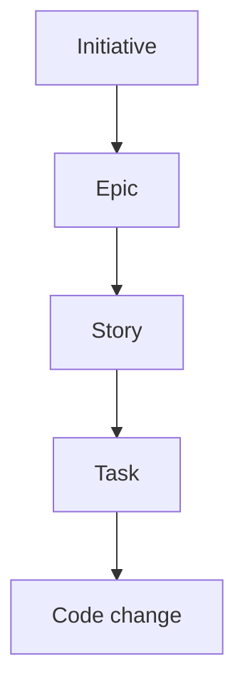
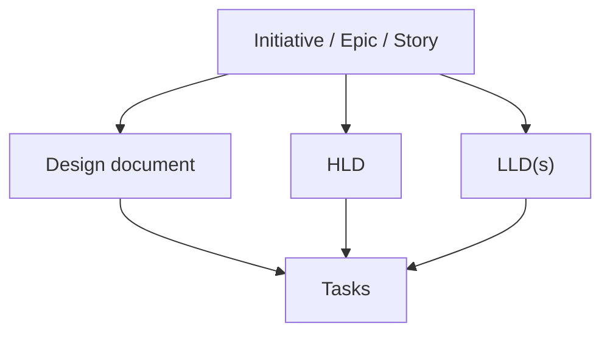
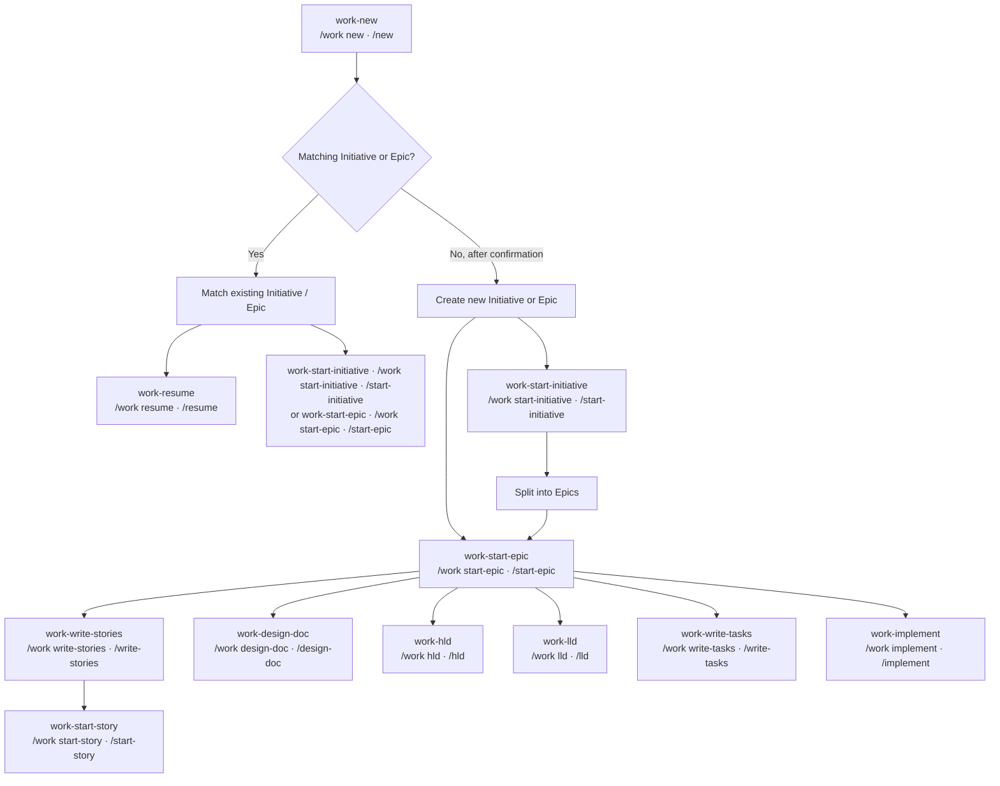
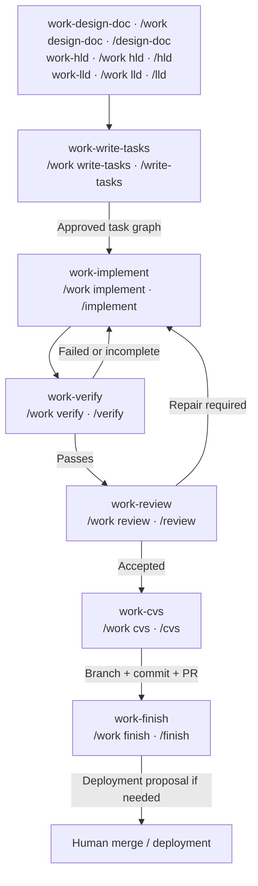
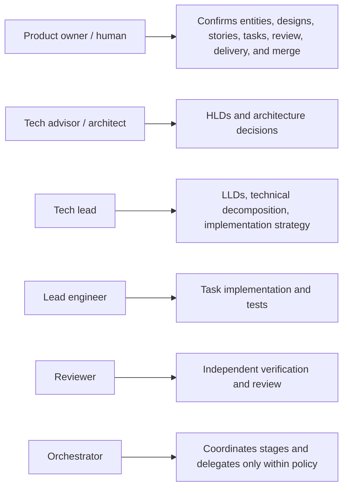

# harnessctl SDLC Flows

This document describes the intended entity-first software-development lifecycle for
harnessctl: commands, arguments, outputs, dependencies, artifacts, approval gates,
and current implementation status.

The workflow is not a single mandatory straight line. A user may return days later,
resume an initiative, start an existing epic, continue a story, or work directly on
an approved task. Commands must therefore discover context from written artifacts
and existing issue/design records instead of relying only on the current chat.

## 1. Core model

The SDLC is organized around these entities:



Design documents attach to the entity they describe:



The issue-management tools own IDs, parent/child relationships, dependencies, and
document links. The assistant proposes content and intent; it must not allocate IDs
or manually rewrite issue files.

Filesystem issues use one canonical, versioned YAML document under configurable
`issues.root`, defaulting to `.harnessctl/issues/<id>-<title-slug>.yml`; archived
issues use the same filename under its `archived/` child. The document contains all
managed state, including body and append-only comments. The default ID prefix is
`hrn-`. Safe, semantically valid YAML presentation is accepted and tool writes are
deterministic. Legacy `<issues.root>/<id>/issue.md` and mixed storage are unsupported;
there is no legacy migration in harnessctl.

All local issue and enabled repository-memory operations use one exclusive project
barrier. Reads always come from filesystem YAML. Successful mutations synchronously
write through to the disposable `.harnessctl/cache/harnessctl.sqlite`; missing, stale,
corrupt, or incompatible cache state is rebuilt internally from valid canonical YAML.
There are no application journals, projection sinks, dirty protocols, cache-first
agent reads, or agent cache tools. Remote memory backends bypass this local cache.
Installation does not create the database; first runtime use does.

## 2. Command vocabulary

This document uses **short stage labels** in flow diagrams and command contracts for
readability. For example, `/new` is not necessarily the literal command typed by the
user. It means the harness-neutral `/work new` stage.

The canonical namespace is always `/work`:

```text
short label       canonical harness-neutral command
-----------       -------------------------------
/new              /work new
/resume           /work resume
/start-epic       /work start-epic
/write-stories    /work write-stories
/start-story      /work start-story
/implement        /work implement
```

Each harness may expose the canonical stage differently. The preferred future command
vocabulary, shown below using short labels, is:

```text
/new
/explore
/plan
/resume
/start-initiative <id>
/start-epic <id>
/start-from <initiative|epic|story|task-id>
/write-stories <epic-id>
/start-story <story-id>
/design-doc <entity-id>
/hld <entity-id>
/lld <entity-id>
/write-tasks <design-doc-or-lld>
/implement <task-id|story-id|epic-id>
/verify <task-id|story-id|epic-id>
/review <task-id|story-id|epic-id>
/cvs <task-id|story-id|epic-id>
/finish <task-id|story-id|epic-id>
```

OpenCode may initially expose the canonical commands as hyphenated Markdown commands:

```text
/work-new
/work-explore
/work-plan
/work-resume
/work-start-initiative
/work-start-epic
/work-start-from
/work-write-stories
/work-start-story
/work-design-doc
/work-hld
/work-lld
/work-write-tasks
/work-implement
/work-verify
/work-review
/work-cvs
/work-finish
```

Pi may expose the same operations through a grouped extension command:

```text
/work new
/work explore
/work plan
/work resume
/work start-initiative
/work start-epic
/work start-from
/work write-stories
/work start-story
/work design-doc
/work hld
/work lld
/work write-tasks
/work implement
/work verify
/work review
/work cvs
/work finish
```

The workflow semantics must remain identical regardless of host syntax. Future
adapters may choose another mapping, but the `/work` namespace must remain the
conceptual source of truth.

## 3. Entity lifecycle



The delivery path is:



This lifecycle view is intentionally entity-oriented. See the
[authoritative 18-template command transition graph and accessible edge table](docs/sdlc.md#authoritative-command-transitions)
for every installed prompt, conceptual alias, contextual route, gate, loop, and
terminal outcome.

## 4. `/new` — establish or locate work

**Purpose:** Establish the work contract and place the request in the initiative/epic
hierarchy.

**Arguments:**

```text
/new [initial request]
```

**Behavior:**

1. Understand the user's request through focused questions.
2. Search existing initiatives and epics for a similar or matching effort.
3. Decide whether the request belongs to an existing entity or requires a new one.
4. Propose the entity type: `initiative` or `epic`.
5. Produce the work contract:

   ```text
   Objective
   Motivation
   Context
   Constraints
   Scope
   Acceptance criteria
   Open questions
   Suggested next step
   ```

6. Ask the user to confirm the contract and entity decision.
7. After confirmation, create the Initiative or Epic through the issue tool, or
   identify the existing matching entity.

**Output:**

```text
Entity: Initiative|Epic
ID
Title
Work contract
Existing matches considered
Suggested next command
```

**Must not:** create a duplicate entity without discussing existing matches.

**Current status:** Installed as `work-new`. It creates a conversational work contract
but does not search for or create Initiatives or Epics.

## 5. `/resume` — recover previous work

**Purpose:** Recover context after an interruption, including work from previous days.

**Arguments:**

```text
/resume
/resume <entity-id>
/resume --recent
```

**Behavior:**

1. Search durable project artifacts first:
   - issue files and comments;
   - linked design documents;
   - `.harnessctl/` task artifacts;
   - approvals, decisions, assignments, and verification reports.
2. Search available assistant memory/indexes as a secondary source.
3. Reconcile artifacts and memory.
4. Report the last confirmed state, unresolved decisions, active dependencies, and
   safe next commands.
5. Never silently continue implementation.

**Output:**

```text
Active entity
Current state
Last confirmed decision
Recent evidence
Open questions
Blocked dependencies
Recommended next command
```

Written artifacts are authoritative. Memory is useful for discovery but must not
override a contradictory artifact without human confirmation.

**Current status:** Installed as the theoretical `work-resume` prompt. It reconstructs
user-supplied context but does not perform artifact or tool-based recovery.

## 6. `/start-initiative` — split an initiative into epics

**Purpose:** Understand an Initiative and decompose it into coherent Epics.

**Arguments:**

```text
/start-initiative <initiative-id>
```

**Consumes:** Initiative issue, comments, linked documents, related issues, and prior
decisions.

**Behavior:**

1. Read and summarize the Initiative.
2. Ask the user questions needed to clarify its boundaries.
3. Identify capability, product, technical, or delivery areas.
4. Propose multiple Epics with non-overlapping scope.
5. Show dependencies and sequencing.
6. Ask for approval of the Epic breakdown.
7. Create approved child Epics using issue tools.

**Output:**

```text
Initiative summary
Epic proposals
Scope of each Epic
Dependencies
Open decisions
Suggested next Epic
```

**Gate:** Human approval before creating Epics.

**Current status:** Installed as a theoretical conversation-only prompt. Generic issue
hierarchy tools exist, but this prompt does not create Epics.

## 7. `/start-epic` — understand an Epic and choose the next path

**Purpose:** Establish the working context for an Epic and decide what it needs next.

**Arguments:**

```text
/start-epic <epic-id>
```

**Behavior:**

1. Read the Epic, parent Initiative, children, comments, dependencies, and linked
   documents.
2. Search for existing HLDs, LLDs, design documents, tasks, and related work.
3. Identify what is known, missing, contradictory, or obsolete.
4. Recommend one next command:

   ```text
    /write-stories
    /start-story
    /design-doc
   /hld
   /lld
   /write-tasks
   /implement
   ```

5. Do not create the next artifact until the user chooses or confirms the path.

**Output:**

```text
Epic understanding
Existing documentation
Existing child work
Missing information
Risks
Recommended next command
```

**Current status:** Installed as a theoretical conversation-only prompt. It does not
load artifacts or invoke the recommended next command.

## 8. `/start-from` — select active context

**Purpose:** Set the current working context to an Initiative, Epic, Story, or Task.

**Arguments:**

```text
/start-from <entity-id>
/start-from <entity-id> --next
```

**Behavior:**

- Load the entity and its parents, children, linked documents, dependencies, and
  recent decisions.
- Summarize what has already been completed.
- Identify the next valid commands.
- With `--next`, recommend the next command without executing it.

This is a context-selection command, not a mutation command. It is the bridge between
resuming work and choosing a specific operation.

**Current status:** Installed as a theoretical conversation-only prompt. It does not
load or mutate entity state.

## 9. `/write-stories` — split an Epic into Stories

**Purpose:** Decompose an Epic into user-facing or independently valuable Stories.

**Arguments:**

```text
/write-stories <epic-id>
/write-stories <epic-id> --refresh
```

**Behavior:**

1. Read the Epic and any approved design documents.
2. Propose Stories with independent value and clear boundaries.
3. Identify Story dependencies and sequencing.
4. Ask for human approval.
5. Create approved Stories as children of the Epic.
6. Recommend `/start-story` for the first selected Story.

**Output:** Story proposals, relationships, acceptance criteria, and recommended next
step for the first selected Story.

**Current status:** Installed as a theoretical conversation-only prompt. Generic issue
tools can create Stories, but this prompt does not invoke them.

## 10. `/start-story` — understand a Story and choose its execution path

**Purpose:** Establish the working context for a Story after it has been created
inside an Epic.

**Arguments:**

```text
/start-story <story-id>
```

**Behavior:**

1. Read the Story, parent Epic, sibling Stories, comments, dependencies, and linked
   documents.
2. Check whether a design document, HLD, LLD, or existing Tasks already covers the
   Story.
3. Identify what is clear, missing, contradictory, or obsolete.
4. Recommend the smallest valid next step:

   ```text
   /design-doc
   /hld
   /lld
   /write-tasks
   /implement
   ```

5. Do not create the next artifact until the user chooses or confirms the path.

**Output:** Story understanding, parent Epic context, existing documentation, existing
tasks, missing information, risks, and the recommended next command.

**Current status:** Installed as a theoretical conversation-only prompt. It does not
load Story artifacts or invoke the recommended next command.

## 11. Design-document commands

All design-document commands must link their resulting document to the Initiative,
Epic, Story, or parent design entity they describe. A design document without a
parent link is incomplete.

### `/design-doc`

**Purpose:** Create a general design document when the document does not fit a strict
HLD or LLD classification.

**Arguments:**

```text
/design-doc <entity-id> [topic]
```

**Output:** Proposed design document with scope, decisions, alternatives, risks,
interfaces, acceptance criteria, and open questions.

**After approval:** Write under `.specs/` and link it to the parent entity.

**Next recommendation:** `/lld` if implementation detail is needed; otherwise
`/write-tasks` if the document is actionable.

### `/hld`

**Purpose:** Define architecture, system boundaries, major components, and product or
operational decisions.

**Arguments:**

```text
/hld <entity-id> [topic]
```

**After approval:** Write the HLD under `.specs/` and link it to the parent entity.

**Next recommendation:** `/lld`, potentially producing multiple LLDs for separate
components.

### `/lld`

**Purpose:** Define concrete technical implementation design.

**Arguments:**

```text
/lld <entity-id> [topic]
/lld <hld-path> [component]
```

**After approval:** Write the LLD under `.specs/`, link it to its parent, and preserve
the HLD/PRD dependency.

**Next recommendation:** `/write-tasks`.

**Current status:** All three prompts are installed in theoretical conversation-only
mode. Design files exist in `.specs/`, but these prompts do not write or link them.

## 12. `/write-tasks` — decompose design into executable tasks

**Purpose:** Split an approved design document or LLD into implementation Tasks.

**Arguments:**

```text
/write-tasks <design-doc-path>
/write-tasks <lld-path>
/write-tasks <story-id>
/write-tasks <design-doc-path> --refresh
```

**Behavior:**

1. Read the approved design document and its parent links.
2. Extract atomic implementation tasks.
3. Define task scope, files, acceptance criteria, tests, and dependencies.
4. Identify tasks that can run in parallel.
5. Ask for approval of the task graph.
6. Create approved tasks through the generic issue tools.
7. Link every task to the design document and parent Story/Epic.
8. Recommend `/implement` for the first ready task set.

**Artifacts:**

```text
.harnessctl/issues/<task-id>-<title-slug>.yml
.harnessctl/write-tasks/<task-id>/task.yaml
.harnessctl/write-tasks/<task-id>/links.md
```

**Current status:** Installed as a theoretical conversation-only prompt. Generic issue
tools exist, but this prompt does not extract or create Tasks.

## 13. `/implement` — execute approved work

**Purpose:** Implement one Task or a set of independent Tasks.

**Arguments:**

```text
/implement <task-id>
/implement <story-id>
/implement <epic-id>
/implement <task-id> <task-id> ...
/implement next
```

**Behavior:**

- Resolve a Story/Epic to ready leaf Tasks.
- Check dependencies and approvals.
- Determine whether selected tasks can safely run in parallel.
- Delegate only when policy allows it.
- Pass each worker a bounded assignment and output contract.
- Integrate results only when evidence and scope checks pass.
- Record changed files, tests, deviations, and unresolved risks.

**Parallelism rule:** Tasks may run in parallel only when they have no conflicting
files, state, dependencies, or acceptance criteria. Otherwise execute them
sequentially.

**Next recommendation:** `/verify`.

**Current status:** Installed as a theoretical conversation-only prompt. It does not
edit source files or run implementation tools.

## 14. `/verify` — quality and acceptance verification

**Purpose:** Verify the implementation from every relevant quality perspective.

**Arguments:**

```text
/verify <task-id>
/verify <story-id>
/verify <epic-id>
/verify all
```

**Checks may include:**

- declared unit and integration tests;
- formatting and linting;
- type checking;
- duplication and dead-code checks;
- security checks on new modules and tools;
- dependency and configuration checks;
- acceptance criteria;
- changed-file and scope validation;
- evidence completeness;
- regression risks.

**Output:** Verification report with commands, exit statuses, acceptance mapping,
unverified claims, and remaining risks.

**Next recommendation:**

- `/implement` with repair comments when verification fails;
- `/review` when verification passes.

**Current status:** Installed as a theoretical conversation-only prompt. Repository
quality commands exist, but this prompt does not execute them.

## 15. `/review` — independent review

**Purpose:** Review new code and artifacts independently of implementation claims.

**Arguments:**

```text
/review <task-id>
/review <story-id>
/review <epic-id>
/review all
```

**Review perspectives:**

- correctness and maintainability;
- coding practices and project conventions;
- API and data-contract compatibility;
- security and privacy;
- error handling and failure recovery;
- tests and coverage;
- scope adherence;
- documentation and operational impact.

**Output:**

```text
Findings
Evidence
Severity
Required repairs
Accepted risks
Decision: accept, repair, block, or reject
```

**Next recommendation:**

- `/implement` with findings when repairs are required;
- `/cvs` when accepted.

**Current status:** Installed as a theoretical conversation-only prompt. It does not
inspect code or execute review tools.

## 16. `/cvs` — branch, commit, and pull request

**Purpose:** Prepare and execute approved version-control delivery.

**Arguments:**

```text
/cvs <task-id|story-id|epic-id>
/cvs --commit
/cvs --push
/cvs --pr
```

**Behavior:**

1. Confirm review acceptance and passing verification.
2. Confirm the current branch and intended base branch.
3. Create or select a feature branch.
4. Stage only intended files.
5. Run final checks.
6. Create a commit with a reviewable message.
7. Push only when explicitly permitted.
8. Create a pull request with design, task, test, and risk context.
9. Recommend `/finish`.

**Must not:** merge the pull request. Merge is always human-only.

**Current status:** Installed as a theoretical conversation-only prompt. The configured
CVS skill can guide authorized operations, but this prompt does not execute them.

## 17. `/finish` — delivery/deployment preparation

**Purpose:** Propose final delivery and deployment actions.

**Arguments:**

```text
/finish <task-id|story-id|epic-id>
```

**Behavior:**

- Summarize the completed work and evidence.
- Identify the pull request and outstanding checks.
- Propose deployment commands when deployment is required.
- Identify environment, migration, rollback, and monitoring concerns.
- Ask for human approval before deployment.

**Must not:** merge or deploy automatically without explicit policy and human
approval.

**Current status:** Installed as a theoretical conversation-only prompt. It does not
merge, deploy, or run delivery tools.

## 18. Dependencies and approvals

| Command             | Required context         | Primary output                         | Approval/gate                |
| ------------------- | ------------------------ | -------------------------------------- | ---------------------------- |
| `/new`              | User request             | Initiative or Epic + work contract     | Contract/entity confirmation |
| `/explore`          | Confirmed work contract  | Read-only evidence report              | No mutation                  |
| `/plan`             | Contract + evidence      | Implementation plan                    | Plan approval                |
| `/resume`           | Written artifacts/memory | Current-state summary                  | No automatic continuation    |
| `/start-initiative` | Initiative               | Epic proposals/children                | Epic breakdown approval      |
| `/start-epic`       | Epic                     | Context and next-action recommendation | User chooses next action     |
| `/start-from`       | Any entity               | Active context                         | No mutation                  |
| `/write-stories`    | Epic                     | Story proposals/children               | Story breakdown approval     |
| `/start-story`      | Story                    | Story context and next-action path     | User chooses next action     |
| `/design-doc`       | Initiative/Epic/Story    | Linked design document                 | Document approval            |
| `/hld`              | Entity + evidence        | Linked HLD                             | HLD approval                 |
| `/lld`              | HLD/PRD/entity           | Linked LLD(s)                          | LLD approval                 |
| `/write-tasks`      | Approved design          | Linked task graph                      | Task approval                |
| `/implement`        | Approved ready tasks     | Code + result                          | Prior approvals              |
| `/verify`           | Code + criteria          | Verification report                    | Failure blocks review        |
| `/review`           | Verification + diff      | Review decision                        | Human review                 |
| `/cvs`              | Accepted review          | Branch/commit/PR                       | Explicit delivery permission |
| `/finish`           | Accepted PR/review       | Deployment proposal                    | Deployment approval          |

## 19. Independent and resumable commands

Not every command needs to run in one session or one day. Every command should:

1. load its required entity and artifact context;
2. report missing prerequisites instead of guessing;
3. write or update only its own artifacts after approval;
4. record decisions and next recommendations;
5. be safe to invoke again without duplicating entities or documents.

Examples:

```text
Day 1:  /new
Day 2:  /resume 00001
        /start-initiative 00001
Day 3:  /resume 00002
        /start-epic 00002
Day 4:  /write-stories 00002
Day 5:  /start-story 00003
Day 6:  /hld 00003
Day 7:  /lld 00003
Day 8:  /write-tasks .specs/00004-lld-feature.md
Day 9:  /implement 00007
Day 10: /verify 00007
Day 11: /review 00007
Day 12: /cvs 00007
Day 13: /finish 00007
```

Artifacts are authoritative. Assistant memory can help locate context, but it must
not override contradictory issue, design, approval, or verification artifacts.

## 20. Invalid transitions

The assistant must stop and report `BLOCKED` when:

- no Initiative/Epic can be identified for a new request;
- a duplicate or similar entity exists and the user has not chosen how to proceed;
- a required design document is missing or unapproved;
- a design document is not linked to the entity it describes;
- task dependencies are unresolved;
- implementation is requested without approved Tasks;
- parallel tasks conflict on files, state, or dependencies;
- verification fails or acceptance criteria are unverified;
- review rejects or blocks the work;
- CVS delivery is requested without review acceptance;
- deployment is requested without explicit approval;
- a protected policy or permission change is requested.

## 21. Current implementation map

### Implemented

- Generic filesystem issue tools and relationships.
- Safe permissive canonical YAML reads with deterministic writes.
- Canonical filesystem reads plus synchronous issue and repository-memory
  write-through to one disposable SQLite cache.
- One shared local-operation barrier and internal cache rebuild/repair.
- OpenCode and Pi adapter tools.
- uv/Jinja prompt installer.
- All 18 `work-*` prompt templates and generated OpenCode/Pi prompt files.
- Read-only repository exploration in `work-explore`; the remaining prompts keep
  their documented bounded or theoretical behavior.
- Mise-managed Node, Python, and shell quality workflow.

### Partially implemented

- Initiatives, Epics, Stories, and Tasks can be created manually with generic issue
  tools.
- HLDs and LLDs exist as manually authored `.specs/` documents.
- Document links and issue hierarchy are supported by generic tools.
- OpenCode/Pi integration tests exercise the tools, not the full SDLC prompt flow.
- Prompt distribution is complete, but end-to-end tool-enabled SDLC orchestration is
  partial.

### Not implemented

- Entity-aware execution behind `/new`, including Initiative/Epic search and creation.
- Tool-enabled `/resume` artifact recovery.
- Tool-enabled entity loading and mutation behind `/start-initiative`, `/start-epic`,
  `/start-from`, `/write-stories`, and `/start-story`.
- Automatic entity-linked design creation behind `/design-doc`, `/hld`, and `/lld`.
- Design-to-task extraction behind `/write-tasks`.
- Tool-enabled implementation, verification, review, CVS delivery, and finish flows.
- Pi grouped command extension.
- Orchestrator, workers, model tiers, retry, ensemble, and escalation routing.
- External tracker adapters and self-development mode.
- Legacy issue migration, agent cache tools, and remote-backend local caching.
- Automatic merge.

## 22. Recommended implementation order

1. Redesign `/new` to search existing Initiatives/Epics and create or select one.
2. Implement `/resume` using artifacts first and memory second.
3. Implement `/start-initiative` and `/start-epic`.
4. Implement `/start-from` as the context-selection bridge.
5. Implement `/write-stories` with approved child creation.
6. Implement `/start-story` as the Story context and next-action bridge.
7. Implement `/design-doc`, `/hld`, and `/lld` with linked artifacts and approvals.
8. Implement `/write-tasks` using the generic issue tools.
9. Implement `/implement` for one ready Task, then independent parallel Tasks.
10. Implement `/verify` with full repository quality/security checks.
11. Implement `/review` with independent findings and repair loops.
12. Implement `/cvs` with explicit branch/commit/push/PR permissions.
13. Implement `/finish` with deployment proposals and human approval.
14. Add workers, model tiers, retries, and evidence-based escalation after the
    deterministic flow works.

## 23. Roles



## 24. Returning after a break

```bash
mise run quality
```

Then read:

1. This file.
2. The active Initiative/Epic/Story/Task issue.
3. Linked design documents.
4. Approvals, decisions, assignments, and verification reports.
5. The current branch diff.

Before acting, explicitly identify the active repository and whether the current work
belongs to the personal harnessctl project or another company/personal project.
