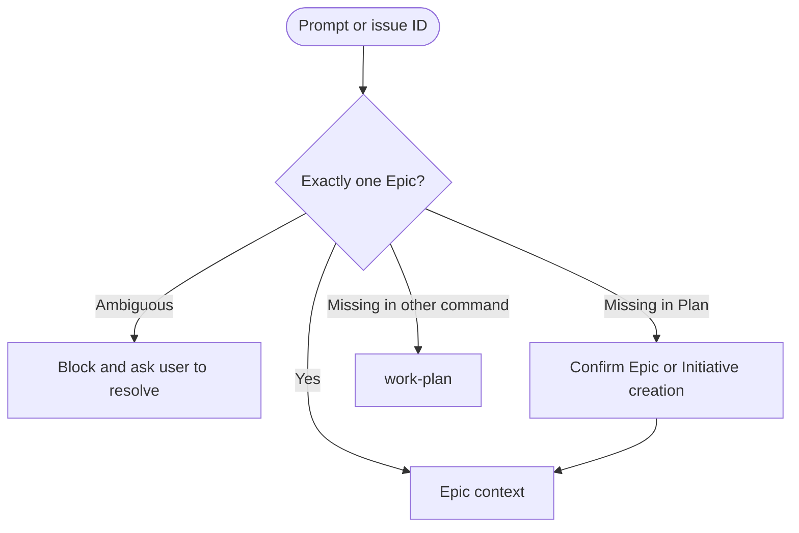
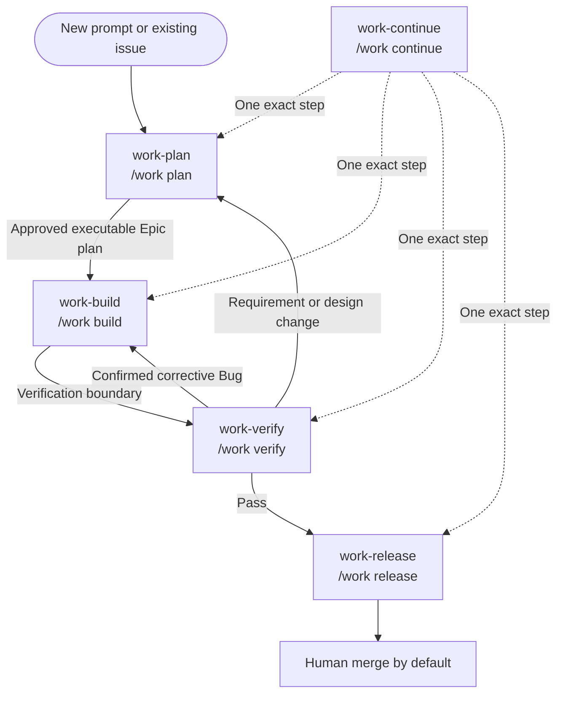
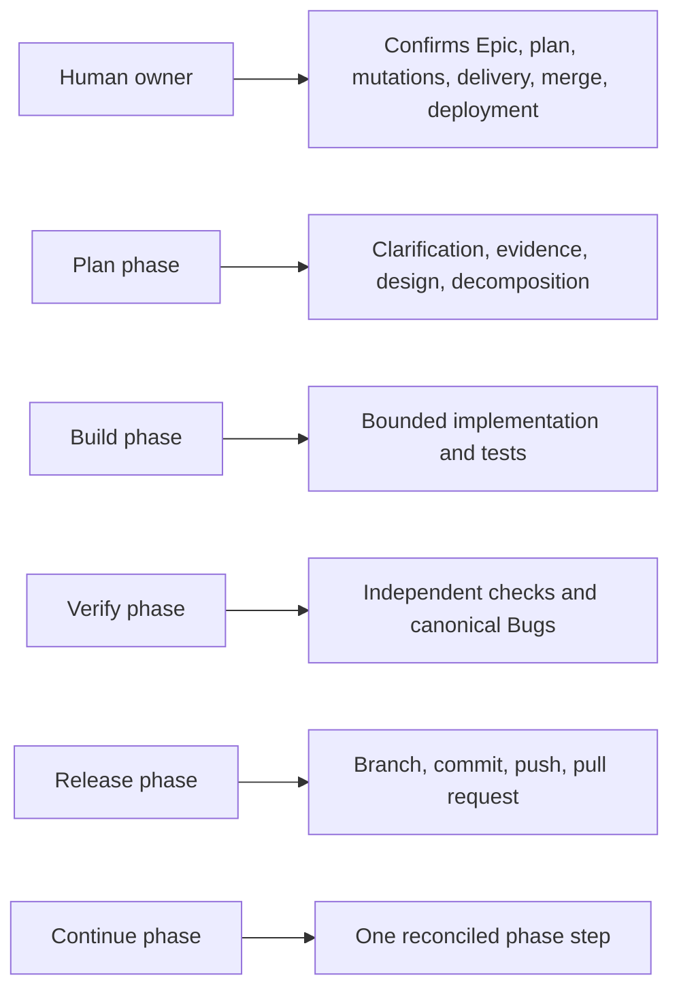

# harnessctl SDLC Flows

This document describes the Epic-first lifecycle implemented by the five public SDLC
commands. It covers command syntax, internal phase behavior, gates, recovery, and
invalid transitions. Filesystem issues, linked specifications, source, Git, tests, and
provider evidence are authoritative; memory is advisory discovery and checkpoint state.

## 1. Epic ownership

Every command resolves exactly one owning Epic before phase work. An Epic resolves
directly. A Story, Task, or Bug resolves through authoritative parent relationships.
An Initiative resolves to its attached Epics and requires selection when more than one
is relevant.



Multiple candidate Epics, broken hierarchy, missing parents, archived-only owners, or
contradictory provider results block mutation. `work-build`, `work-verify`,
`work-release`, and `work-continue` never create a convenience Epic; they redirect to
Plan when ownership is missing.

## 2. Public command vocabulary

The installed names and canonical harness-neutral aliases are:

| Installed name   | Canonical alias  | Public phase |
| ---------------- | ---------------- | ------------ |
| `/work-plan`     | `/work plan`     | Plan         |
| `/work-build`    | `/work build`    | Build        |
| `/work-verify`   | `/work verify`   | Verify       |
| `/work-release`  | `/work release`  | Release      |
| `/work-continue` | `/work continue` | Continue     |

Hosts generate only the hyphenated command files. Canonical grouped forms describe the
shared semantics; they are not extra installed files. Former short names and 18-command
names are not aliases. There is no Maintain command.

## 3. Lifecycle



The [authoritative transition graph and accessible edge table](docs/sdlc.md#authoritative-command-transitions)
define exact public edges. Commands stop at phase boundaries instead of silently
invoking the next phase.

## 4. Shared interaction contract

Every proposed read, action, artifact, or mutation is classified as Required,
Recommended, Optional, or Not needed, with a short reason. The user may add, remove,
reject, or reclassify items. The command presents the revised bounded set and obtains
confirmation before execution. Declined safety requirements require a safe alternative
or a blocked stop.

Each command reports the Epic, phase, authoritative evidence, classified items,
confirmation state, completed step, next permitted step, blockers, and checkpoint
result. It never reports completion from memory alone.

Useful former command behavior remains internal:

- Plan includes intake, clarification, exploration, Initiative/Epic recognition,
  design selection, Story/Task/Bug decomposition, and approval.
- Build includes implementation readiness, dependency checks, scoped execution,
  testing, evidence, issue progress, and bounded YOLO.
- Verify includes acceptance checks, quality checks, independent review, defect
  diagnosis, canonical Bug handling, and release readiness.
- Release includes CVS prechecks, branch, commit, push, pull request, merge,
  deployment, closure, rollback, and delivery evidence.
- Continue includes artifact-first resume and exact phase/step reconciliation.

## 5. Plan

**Inputs:** a natural-language prompt, Initiative ID, Epic ID, child issue ID, or text
mentioning one of those IDs.

### Prompt mode

Plan searches configured issue authority for related Initiatives and Epics, presents
duplicates and boundaries, and confirms whether to reuse existing work or create new
work. It clarifies objective, constraints, acceptance criteria, risks, dependencies,
compatibility, migration, estimates, and non-goals.

### Initiative mode

Plan proposes one Initiative boundary plus multiple non-overlapping attached Epics,
their dependencies, and creation order. After confirmation it creates the Initiative
and Epics, then stops. Each Epic receives a separate later Plan invocation; several
Epic plans are never designed in one run.

### Epic mode

Plan resolves or creates one Epic, gathers confirmed repository and artifact evidence,
and recommends one proportionate design level: none, lightweight, design document,
HLD, LLD, HLD plus LLD, or GDD for game-domain work. Approved artifacts are linked,
not copied into issues or memory.

Plan creates only confirmed Stories, Tasks, or pre-existing Bugs with explicit
parentage, dependencies, acceptance criteria, and artifact links. Small Epics may use
direct Tasks or Bugs. Final approval covers one displayed executable Epic plan and is
checkpointed. Plan stops and recommends Build.

## 6. Build

Build reconciles issue state, linked plan/design artifacts, source, Git, tests, and the
current checkpoint. If work started, it offers the exact unfinished slice. Otherwise
it offers the next ready Story, Task, or Bug, a user-selected ready item, or one-time
YOLO mode.

Readiness requires approved scope, satisfied dependencies, sufficient design,
unambiguous Epic ownership, and no unresolved safety blocker. Each slice states the
item, objective, expected files or component boundary, tests, and stop condition.
Scope expansion returns to confirmation.

YOLO consent names one Epic and eligible item set. It permits continuous ready-slice
selection only until a blocker, scope change, verification boundary, user stop,
ambiguous result, or exhausted work. It never authorizes remote/destructive work,
closure, merge, deployment, safety relaxation, or another Epic. Every slice receives a
checkpoint before another begins.

Build may close detailed work only when current evidence maps acceptance criteria and
the user confirms the transition. Epic closure belongs to Release. Build stops at the
verification boundary and recommends Verify.

## 7. Verify

Verify confirms the check set and evaluates applicable acceptance, unit/integration
tests, formatting, linting, typing, security, privacy, dependencies, configuration,
duplication, dead code, changed scope, documentation, operations, and release checks.
Not-applicable checks are explicitly classified Not needed.

Failures are grouped by distinct defect occurrence. Verify discusses evidence, impact,
uncertainty, and options before mutation. For each confirmed occurrence it searches all
provider-discoverable, non-archived Bugs owned by the Epic:

- matching open/in-progress Bug: reuse and confirm evidence update;
- matching done/closed unresolved occurrence: block duplicate creation and offer a
  supported confirmed reopen/transition;
- verified resolution followed by regression/new occurrence: confirm one new Bug that
  references prior history without inventing a relationship type;
- no match: confirm one new canonical Bug parented to the Epic.

An optional supported `relates_to` may identify an affected Story or Task, but never
replaces the Epic parent. Archived Bugs are not enumerated, restored, or mutated.

A failed verification checkpoints current evidence and recommends Build for confirmed
corrective Bugs. Requirement, acceptance-boundary, architecture, or design-scope
changes return to Plan. A pass checkpoints current evidence and recommends Release.

## 8. Release

Release requires successful current verification. It confirms or authoritatively
validates this mandatory sequence:

1. Feature branch.
2. Commit containing only intended Epic scope.
3. Push to the selected remote route.
4. Pull request targeting the correct base.

Already-satisfied steps are not repeated when current evidence proves validity. Branch
and commit use mutation confirmation. Push, pull-request creation/update, merge,
deployment, remote issue closure, and destructive actions each require fresh explicit
consent immediately before invocation.

Human merge is the default. Model merge is allowed only after fresh consent naming the
exact pull request and merge action, with current checks and permissions verified.
Auto-merge is never enabled implicitly. Deployment is Not needed unless explicitly
requested and must use a verified repository workflow with environment, migration,
rollback, monitoring, and authorization evidence.

Detailed issues and the Epic close only with current delivery/acceptance evidence and
confirmed status changes. A merged pull request alone does not prove deployment or all
acceptance criteria.

## 9. Continue

With an issue ID, Continue resolves its owning Epic and narrowly searches that Epic's
checkpoint. Without an ID, it searches once, presents no more than five unfinished
Epic candidates, and waits for selection. It never chooses by recency.

Checkpoint claims are validated against current issue hierarchy/status, linked
specifications, source, Git, tests, verification reports, and provider evidence. Stale
or duplicate records block until authority-backed reconciliation is confirmed. If an
Epic exists without a valid checkpoint, Continue presents only supported candidate
phases and waits for selection.

Continue resumes one confirmed step in exactly one Plan, Build, Verify, or Release
phase. It checkpoints the verified result and stops with a same-phase recommendation
or a recommendation to invoke the next command. It never combines phases or executes
the recommended next step.

## 10. Checkpoints and interruptions

When memory is enabled and available, compact checkpoints follow confirmed steps,
artifact revisions, issue status changes, implementation slices, test batches, phase
transitions, blockers, stops, handoffs, and delivery actions. A checkpoint contains
IDs and authoritative pointers, not copied artifact bodies, raw logs, diffs, secrets,
or unconfirmed proposals.

If checkpoint persistence fails, the command discloses the failure. The user may
confirm a safe non-mutating continuation, but remote or destructive work blocks until
the safety checkpoint succeeds or the user chooses a safe stop/handoff.

Example interrupted flow:

```text
Day 1: /work-plan "add payment retry policy"
Day 2: /work-plan hrn-00123
Day 3: /work-build hrn-00123
Day 4: /work-continue hrn-00123
Day 5: /work-verify hrn-00123
Day 6: /work-build hrn-00123   # confirmed corrective Bug
Day 7: /work-verify hrn-00123
Day 8: /work-release hrn-00123
```

## 11. Invalid transitions

The command blocks or stops without silent transition when:

- no authoritative Epic resolves, with non-Plan commands redirecting to Plan;
- ownership, provider result, or checkpoint is ambiguous;
- a Required safety item is declined without a safe alternative;
- scope, requirements, acceptance boundaries, or design change unexpectedly;
- Build work lacks approval, readiness, or satisfied dependencies;
- verification evidence is missing, stale, failed, or unconfirmed;
- a defect interpretation or Bug mutation is unconfirmed;
- Release lacks successful current verification;
- a remote/destructive action lacks fresh action-specific consent;
- merge or deployment authorization is absent;
- the selected provider capability is unsupported or mutation result is ambiguous.

## 12. Roles and boundaries



Commands use only configured issue, specification, CVS, memory, and host capabilities.
They do not add a scheduler, workflow runtime, alternate provider, autonomous merge
policy, or automatic deployment.
