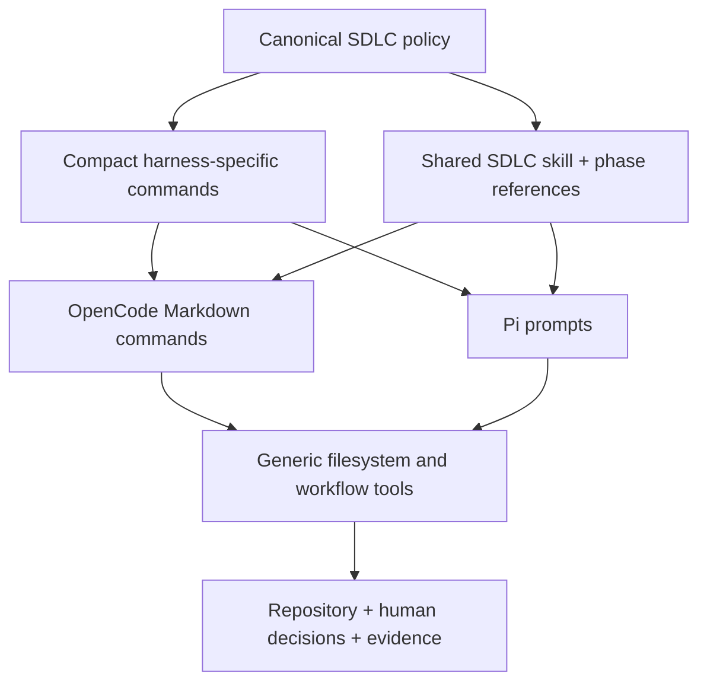
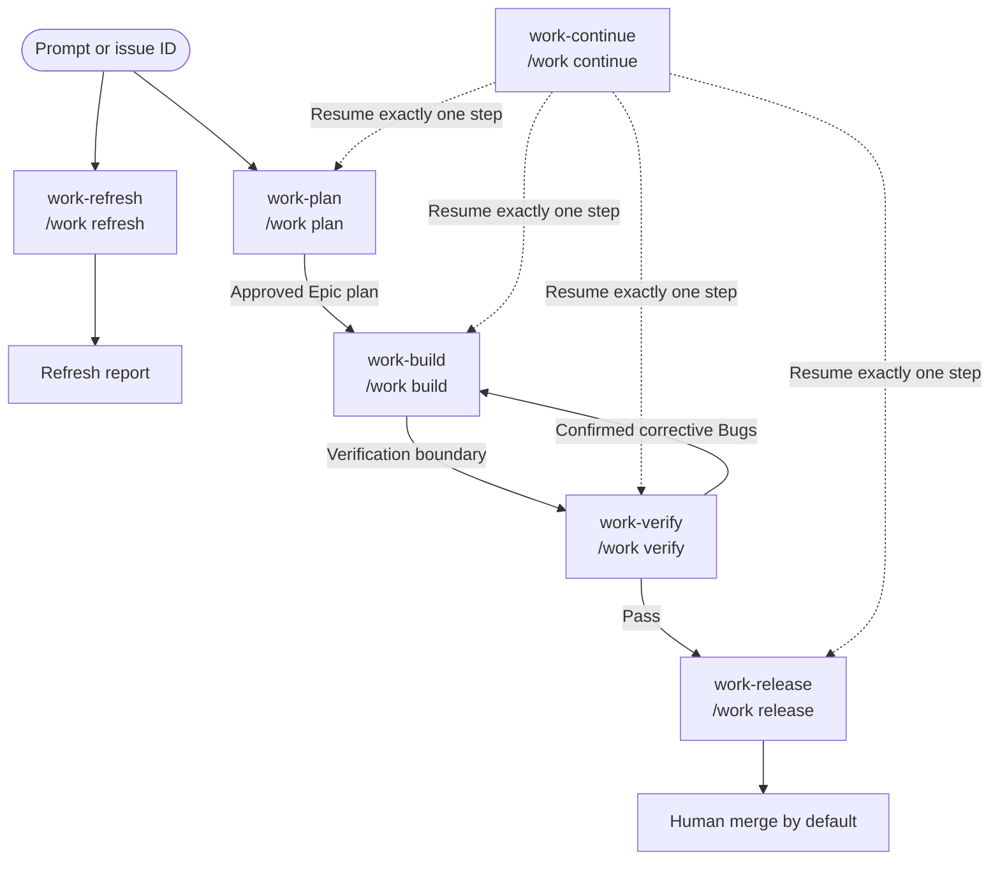

# harnessctl

Harness-neutral SDLC prompts and tooling for existing coding harnesses.

`harnessctl` is not another coding harness, agent runtime, scheduler, issue tracker,
or autonomous software-delivery platform. It distributes workflow instructions and
supporting tools into coding harnesses such as OpenCode and Pi.

The project exists to make development work:

- clearer to resume after interruptions;
- safer through explicit human approval boundaries;
- more inspectable through evidence and structured outputs;
- more economical through staged model usage and local-model support;
- portable across coding harnesses instead of being coupled to one runtime.

## Documentation

Start with the [documentation index](docs/README.md), then use the focused guides:

- [SDLC commands and approval boundaries](docs/sdlc.md)
- [Generated skills and host boundaries](docs/skills.md)
- [Configuration and tool settings](docs/configuration.md)
- [Repository memory and disposable cache](docs/memory.md)
- [Filesystem issues and configured provider routing](docs/issues.md)
- [Repository-local design documents](docs/documents.md)
- [Version control and MCP provider setup](docs/cvs.md)
- [Code-intelligence retrieval and provider boundaries](docs/code-intelligence.md)
- [External code-intelligence provider comparison](docs/code-intelligence-providers.md)

The detailed intended lifecycle remains in [FLOWS.md](FLOWS.md). Topic guides label
implemented behavior separately from plans so roadmap material is not mistaken for a
current capability.

## Product model

The product has four layers:



### harnessctl owns

- Harness-neutral workflow vocabulary.
- Prompt contracts and stage boundaries.
- Output structures and evidence requirements.
- Approval and autonomy rules.
- Installation and distribution of prompts.
- Generic filesystem issue and document tooling.
- Future model-tier, retry, escalation, and worker policies.

### The harness owns

- Model sessions and context windows.
- Tool execution and host permissions.
- User interaction and approval UI.
- Agent/extension loading.
- Provider authentication and model connectivity.
- Runtime-specific command dispatch.

Prompts describe a protocol. They are not a security boundary or transactional
workflow engine. Human review, host permissions, and later artifact validation remain
necessary.

## Intended SDLC flow

The public interface has five Epic-first lifecycle commands plus one standalone refresh
command:



Every lifecycle command first resolves exactly one owning Epic. `work-build`, `work-verify`,
`work-release`, and `work-continue` stop and redirect to `work-plan` when no Epic can
be resolved. `work-refresh` requires no Epic and does not enter or resume the lifecycle.
The [authoritative six-command transition graph and accessible edge
table](docs/sdlc.md#authoritative-command-transitions) cover every gate, loop, and
terminal outcome.

OpenCode and Pi install these exact hyphenated names:

```text
/work-plan
/work-build
/work-verify
/work-release
/work-continue
/work-refresh
```

The canonical harness-neutral aliases are:

```text
/work plan
/work build
/work verify
/work release
/work continue
/work refresh
```

Grouped aliases describe canonical semantics; they are not additional generated command
files. The former 18-command vocabulary is not installed as aliases. Useful intake,
exploration, Initiative/Epic creation, design, decomposition, implementation, review,
CVS, finish, and resume behavior remains behind the lifecycle commands as progressively
disclosed SDLC skill references.

## Stage contracts

Each command stops at its public phase boundary. `work-plan` accepts a prompt,
Initiative ID, Epic ID, or text mentioning one. It searches for matches and, after
confirmation, either creates one Epic or creates an Initiative with attached Epics.
Initiative mode then stops; Epic mode clarifies, explores, selects proportionate design,
decomposes confirmed work, and obtains approval for one executable Epic plan.

`work-build` selects or resumes ready Story, Task, or Bug work inside that Epic. Each
slice has bounded scope, evidence, tests, and a stop condition. One-time YOLO consent is
limited to the confirmed Epic and ready item set; it ends on a blocker, scope change,
verification boundary, user stop, ambiguity, or exhausted work and never authorizes
remote or destructive actions.

`work-verify` maps current evidence to acceptance and quality requirements. A pass
recommends Release. A distinct defect occurrence becomes exactly one confirmed,
provider-discoverable, non-archived canonical Bug parented to the Epic and routes back
to Build. Requirement or design-scope changes route to Plan instead.

`work-release` requires current successful verification. It completes or validates the
mandatory feature branch, commit, push, and pull-request sequence. Push, pull-request
mutation, merge, deployment, remote closure, and destructive actions require fresh
action-specific consent. Merge is human by default; deployment is Not needed unless
explicitly requested and supported by a verified workflow.

`work-continue` resolves one Epic and its exact authoritative phase and candidate step.
Without an ID it presents at most five unfinished candidates and waits for selection.
It resumes exactly one confirmed step in Plan, Build, Verify, or Release, checkpoints
that result, and stops without advancing phases.

`work-refresh` performs bounded repository familiarization and reconciliation without an
Epic or lifecycle transition. It validates enabled repository memory, preserves immutable
history, reconciles stale active current-state meaning, and proposes each memory correction
separately. For an enabled code index it first loads `sdlc-code-index` and uses only that
skill's compiled configured server and boundaries. Projection mutation is gated by exact
live-schema support, fresh evidence, current-repository scope, and fresh consent naming the
provider, operation, and repository. Unsupported capabilities are reported rather than
guessed; provider lifecycle, remote, destructive, credential, model, and database actions
remain forbidden.

## What is implemented today

### Command and skill distribution

Implemented in `src/harnessctl/`:

- Jinja2 command and skill-resource rendering with strict undefined-variable handling.
- Atomic nested-tree installation with exact rollback on multi-file failure.
- Conflict detection that reports all existing targets.
- Explicit `--force` overwrite behavior.
- OpenCode and Pi target generation.
- Configurable direct Git or Jujutsu guidance and provider-specific CVS routing.
- Fixed-ID GitHub, GitLab, Gitea, and Forgejo MCP projection into OpenCode and Pi host
  files, with independently configured CVS and Issues policies.
- Packaged command, skill, and reference templates included in built wheels.
- Nine repository-local Documents tools for HLD, LLD, design-overview, and GDD
  lifecycles under the fixed `.harnessctl/documents` authority.
- Opt-in, provider-neutral `sdlc-code-index` retrieval guidance with local source
  verification and Glob/Grep fallback when index evidence is unavailable or unsuitable.
- Always-installed `sdlc-code` Build guidance with generic clean-code policy and 26
  lazily selected language, framework, shell, artifact, and IaC references.

The current registry installs six compact command shells, the SDLC core with 14
progressively disclosed references, and a byte-equivalent `sdlc-code` tree under both
OpenCode and Pi. Build loads `sdlc-code`; Plan, Verify, Release, and non-Build Continue
do not. See the
[SDLC guide](docs/sdlc.md) for the exact command set, budgets, and host boundaries.

Enabled code intelligence installs the same generated `sdlc-code-index` skill for selected
OpenCode and Pi hosts. The user separately owns the configured external MCP registration,
runtime, credentials, index, and data; harnessctl never projects or manages them. The
generated `work-refresh` policy may invoke only an exact live-schema-supported,
repository-scoped refresh operation after fresh consent; this transfers no provider
ownership. See the
[code-intelligence guide](docs/code-intelligence.md).

### Generic issue tooling

Implemented in `extensions/generic-tools/`:

- One versioned, canonical YAML document per issue under configurable
  `issues.root` (default `.harnessctl/issues`), or its `archived/` child after
  archival.
- Complete issue-managed state in that document, including the Markdown body,
  relationships, metadata, document links, and append-only comments.
- Prefix-based issue ID allocation, defaulting to `hrn-` (`hrn-00001`).
- Multi-ID prompt extraction.
- Structured issue creation and listing.
- Issue retrieval and updates.
- Mandatory revision-aware updates and one shared project-local operation barrier.
- Status transitions.
- Append-only comments.
- Parent/child hierarchy.
- Relationships including directional `supersedes`.
- Document links.
- Validation reports.
- Recursive archive with rollback and archived-descendant handling.

Issue YAML uses a safe, permissive reader: semantically valid formatting, quoting,
and field ordering are accepted, while aliases, merge keys, explicit tags, duplicate
keys, multiple documents, unsafe paths, and invalid schema values are rejected. Tool
writes are deterministic. Parent, child, blocking, and symmetric relationship views
are derived from a single persisted direction rather than duplicated across files.

### Generic document tooling

The generic runtime exposes exactly `document_id`, `document_create`, `document_list`,
`document_get`, `document_update`, `document_version`, `document_validate`,
`document_archive`, and `document_restore`. Canonical Markdown is fixed beneath
`.harnessctl/documents`; valid kinds are `hld`, `lld`, `design-overview`, and `gdd`.
OpenCode and Pi register equivalent thin adapters. Plan owns the design lifecycle through
its existing SDLC reference; no Documents agent or generated `sdlc-documents` skill is
installed.

No `.specs` or `.ai.tmp` migration command or link compatibility ships. `.specs-v1` is
inert repository history, not a live authority or compatibility source.

### Simplified local persistence

Filesystem issues, repository Documents, and enabled repository memory are canonical
local state. Every read and validation operation reads canonical files; SQLite never
supplies an agent result or repairs canonical authority.

Participating local issue and repository-memory operations share one exclusive,
non-reentrant barrier at `.harnessctl/cache/local-operations.lock`. Canonical writes
use same-directory replacement and bounded in-process rollback for ordinary failures.
Issues and Memory have no application transaction journals or agent-facing cache tools.
Documents use private journaled publication for multi-file lineage operations.

After each successful issue or repository-memory mutation, harnessctl synchronously
refreshes the disposable cache at `.harnessctl/cache/harnessctl.sqlite`. Missing,
stale, corrupt, incompatible, or failed direct synchronization is repaired internally
by rebuilding the complete cache from valid canonical YAML. A failed repair returns an
error even though canonical data may already be committed. The cache uses lazily
loaded runtime-specific SQLite support: `bun:sqlite` on supported Bun and
`node:sqlite` on supported Node. Remote memory backends bypass this local barrier and
cache; only the repository backend is currently implemented by generic-tools.

Installation does not create or initialize the SQLite file. It only ignores the
cache directory when repository memory is installed; the first participating runtime
operation creates or repairs the cache.

#### Canonical issue storage compatibility

Canonical YAML storage operates on an empty configured `issues.root` or a root that
already contains canonical issue files. Legacy `<issues.root>/<id>/issue.md` and mixed
layouts are unsupported and fail closed. Harnessctl provides no legacy migration;
repositories must be converted outside these tools before canonical operations begin.

### Harness adapters

OpenCode and Pi adapters currently register the generic configuration, issue, Documents,
and repository-memory tools. Adapter tests cover equivalent Documents registration and
delegation on both hosts.

Automatic memory installation supports OpenCode and Pi. Pi receives all six commands,
its configured skills under `.pi/skills/`, and project-local `@harnessctl/pi-tools` at
the packaged tools version; stale managed `.pi/settings.json` entries are bumped. Its
`pi.extensions` package manifest loads the tool extension. Pi also receives the pinned
MIT-licensed `@juicesharp/rpiv-ask-user-question` extension, which provides the
`ask_user_question` option picker in interactive Pi sessions.

OpenCode and Pi receive generated CVS and Issues skills. Pi MCP host configuration uses
the consent-gated, pinned `npm:pi-mcp-adapter@2.26.0` prerequisite.
Generated guidance enumerates valid CLI and MCP capabilities and lets the agent choose
per operation. It must choose before mutation and never switch routes after mutation
begins.
See the [CVS and MCP guide](docs/cvs.md) for exact formats, per-operation capability
selection, external license boundaries, and residual installation effects.

Both adapters also have model-backed integration coverage for eight workflows:

- configuration creation;
- configuration lookup;
- issue ID extraction;
- issue creation;
- issue listing;
- lifecycle operations;
- relationships/archive;
- document linking.

### Developer tooling

The repository now uses:

- npm workspaces for TypeScript packages;
- uv for all Python dependencies and execution;
- mise as the root cross-language task manager;
- Ruff for Python formatting/linting;
- Pytest for Python tests;
- Vulture for Python dead-code detection;
- ESLint, Prettier, Vitest, Fallow, and jscpd for existing Node workflows;
- ShellCheck for repository Bash scripts;
- Husky hooks invoking root mise tasks.

## What is not implemented yet

The following are intentionally not part of the current slice:

- runtime dispatch for grouped `/work *` aliases;
- a primary Orchestrator agent definition;
- anonymous worker assignment and result contracts in prompts;
- durable `.harnessctl/tasks/` workflow artifacts;
- plan approval artifacts and revision/hash coupling;
- automatic retry, ensemble, or escalation behavior;
- model-tier routing and cost-aware model selection;
- direct provider API clients and provider CLI installation/authentication;
- worktrees and autonomous merge;
- self-development mode;
- game-development-specific workflows.

The six prompts coordinate only configured capabilities and retain explicit proposal,
confirmation, authority, checkpoint, and host-permission boundaries. They do not add a
workflow runtime or make prompts a security boundary.

## Next implementation steps

Current roadmap areas include durable approval artifacts, grouped Pi command
dispatch, model-tier and retry policy, remote provider adapters, and protected
self-development. These remain separate from the installed six-command prompt set.
See [FLOWS.md](FLOWS.md) for intended sequencing and the
[topic documentation](docs/README.md) for current-versus-planned boundaries.

## Installing prompts

The Python side is uv-only. Use mise as the project-level task runner.

From this repository:

```bash
mise run setup
mise run install-prompts
```

Or invoke the installer directly through uv:

```bash
uv run python -m harnessctl.install --cwd /path/to/project --harness all
```

Supported targets:

```bash
uv run python -m harnessctl.install --cwd . --harness opencode
uv run python -m harnessctl.install --cwd . --harness pi
uv run python -m harnessctl.install --cwd . --harness pi --allow-pi-package-install
uv run python -m harnessctl.install --cwd . --harness all
uv run python -m harnessctl.install --cwd . --harness all --force
uv run python -m harnessctl.install --cwd . --harness all --replace-sdlc-skill-set
```

Pi installs require per-package interactive consent. Noninteractive automation must use
`--allow-pi-package-install`; the legacy adapter-only flag remains an alias.

Harnessctl-generated skills use the `sdlc-` namespace. Five support skills are renamed:
`caveman` to `sdlc-caveman`, `cvs` to `sdlc-cvs`, `develop-tdd` to
`sdlc-develop-tdd`, `issue-tracking` to `sdlc-issue-tracking`, and `memory` to
`sdlc-memory`. The existing `sdlc`, `sdlc-code`, and `sdlc-code-index` IDs remain
unchanged, as does the functional configuration key `skills.sdlc-code-index`.

The installer writes `sdlc-code` to
`.opencode/skills/sdlc-code/`, `.pi/skills/sdlc-code/`, or both.
Reinstall with `--force` to replace generated files, then restart or reload the selected
host so it discovers the updated skill. To roll back, install the prior harnessctl version
or revision with `--force`, then remove any renamed support-skill directories that version
does not manage. Harnessctl does not read, modify, or own global skills under
`~/.config/opencode`.

Normal upgrades preserve the five legacy support-skill directories byte-for-byte and warn
with their exact paths; `--force` never authorizes their deletion. After reviewing the
disclosure, pass `--replace-sdlc-skill-set` to remove only selected-host legacy support
trees transactionally. Symlinks or special entries abort explicit migration before
mutation, and any later failure restores file bytes, file existence, and directory
topology.

## Development commands

```bash
mise run format
mise run format-fix
mise run lint
mise run lint-fix
mise run test
mise run quality
mise run node-build
mise run integration
```

For a Pi-only local-model integration run:

```bash
PI_TEST_MODEL=my-provider/my-model \
PI_TEST_BASE_URL=http://127.0.0.1:8000/v1 \
npm run test:integration --workspace @harnessctl/pi-tools
```

`mise run integration` runs both OpenCode and Pi integration suites. Use it only
when both the OpenCode model configuration and the Pi provider environment are
available.

## Node package releases

Published packages:

- `@harnessctl/generic-tools`
- `@harnessctl/opencode-tools`
- `@harnessctl/pi-tools`

Packages version independently through Changesets. Any pull request that changes a
published package must add a changeset:

```bash
npm run changeset
```

Select affected packages and the smallest correct semantic-version bump. Tests,
documentation, and repository-only automation do not need a changeset.

After changes reach `main`, the release workflow creates or updates a version pull
request. Merging that pull request triggers publication of changed packages, npm tags,
and GitHub releases. Do not edit package versions manually.

Repository maintainers must configure:

1. A GitHub environment named `npm`, preferably with required reviewers.
2. An environment secret named `NPM_TOKEN` containing an npm automation/granular token
   allowed to publish the `@harnessctl` scope.
3. Branch protection requiring the cross-platform `CI` checks before merge.

The npm token is exposed only to the protected publish job. Regular CI, version pull
requests, forks, and local development do not receive it. Model-backed integration
tests remain manual and are not part of package publication.

Useful local checks:

```bash
npm run packages:check
npx changeset status --since=main
mise run quality
```

If publication fails, do not republish by manually changing versions. Correct the
token, package metadata, or registry state; then rerun the failed workflow. Changesets
skips package versions already present in npm.

## Returning after a break

When returning after days away:

```bash
git status --short --branch
mise run quality
```

Then read, in order:

1. This README.
2. The relevant current LLD.
3. The active issue or task file, if one exists.
4. The current branch diff.

Before changing product direction, check whether the decision already exists in the
PRD, LLD, issue files, or recent commits. If company work and personal work are being
discussed in the same session, explicitly state which repository/project is active
before taking action.

## Important documents

| Document                 | Purpose                                       |
| ------------------------ | --------------------------------------------- |
| `.harnessctl/documents/` | Canonical repository-local design authority   |
| `.harnessctl/issues/`    | Canonical issue authority                     |
| `mise.toml`              | Root tool versions and cross-language tasks   |
| `pyproject.toml`         | Python dependencies and quality configuration |

## Human-only boundaries

The following remain human-only unless a future approved design changes them:

- approving implementation plans;
- approving delivery actions;
- merging pull requests;
- weakening policy, permission, or escalation controls.

The goal is not maximum automation. The goal is a workflow that remains clear,
recoverable, evidence-oriented, and under human control.
