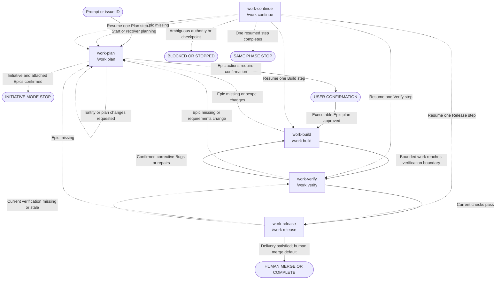

# SDLC commands

## Current implementation

The registry in
[`src/harnessctl/templates.py`](../src/harnessctl/templates.py) contains exactly five
public command templates. OpenCode and Pi installation renders these files:

| Installed name  | Canonical alias  | Responsibility                                                                 |
| --------------- | ---------------- | ------------------------------------------------------------------------------ |
| `work-plan`     | `/work plan`     | Resolve or create the owning Epic and obtain approval for one executable plan. |
| `work-build`    | `/work build`    | Select or resume ready Epic work and implement bounded slices.                 |
| `work-verify`   | `/work verify`   | Verify the Epic and route passes or confirmed defects.                         |
| `work-release`  | `/work release`  | Complete verified branch, commit, push, and pull-request delivery.             |
| `work-continue` | `/work continue` | Resume exactly one authoritative step in one current phase.                    |

OpenCode files are installed under `.opencode/commands/`; Pi files are installed under
`.pi/prompts/`. The grouped `/work *` forms are canonical harness-neutral aliases, not
additional installed files. Short aliases and the former 18 commands are not generated.
There is no `work-maintain`; maintenance starts in Plan, and verification defects return
to Build as confirmed Bugs.

The former intake, exploration, Initiative/Epic start, Story and Task decomposition,
design document, HLD, LLD, implementation, review, CVS, finish, and resume behavior is
preserved in progressively disclosed SDLC skill references. It is not a public command
surface.

### Progressive-disclosure layout

Each installed command is a compact dispatch shell: load the `sdlc` skill, load one
normal phase reference, apply user arguments, and stop at that phase boundary. The
shared skill tree is installed byte-for-byte identically at
`.opencode/skills/sdlc/` and `.pi/skills/sdlc/`:

- `SKILL.md` contains cross-phase authority, consent, safety, result, and loading rules;
- `references/{plan,build,verify,release,continue}.md` contain normal phase behavior;
- eight conditional references cover Initiative planning, design, decomposition, YOLO,
  defects, deployment, reconciliation, and compiled checkpoint policy.

Agents load conditional references only when the matching condition occurs and never
preload the full tree. Disabled memory compiles an unavailable-checkpoint policy;
enabled memory compiles bounded retrieval and persistence guidance. OpenCode and Pi
therefore receive equivalent workflow instructions without an added runtime or MCP.

Enforced source-template budgets are: each command body at most 140 words/900 bytes,
core skill at most 400 words/2,800 bytes, normal phase reference at most 550 words/4,000
bytes, conditional reference at most 350 words/2,600 bytes, and shell + core + normal
phase at most 1,050 words/7,500 bytes. Every command is also tested to remain at least
80% smaller by bytes than its former memory-enabled inline baseline.

Every command proposes and explains classified actions, allows revision, and obtains
confirmation before reads or mutations. It resolves exactly one authoritative owning
Epic before phase work. Story, Task, and Bug inputs resolve through their parent
hierarchy. Ambiguous or contradictory ownership blocks. When no Epic resolves,
Build, Verify, Release, and Continue stop and redirect to Plan rather than creating one.

Enabled repository memory adds compact resumable checkpoints, but memory remains
advisory and never proves completion. Issue hierarchy, linked specifications, source,
Git, tests, and provider evidence remain authoritative. Prompts are protocols, not a
workflow runtime or security boundary.

## Phase behavior

### Plan

Plan accepts a natural-language prompt, Initiative ID, Epic ID, or text mentioning
either. It searches configured issue authority for relevant Initiative and Epic
candidates and presents duplicate and scope boundaries before confirmed creation.

- **Prompt mode:** clarify the request, gather confirmed evidence, and choose a valid
  entity mode.
- **Initiative mode:** present one Initiative boundary and a separated, ordered set of
  attached Epics. After confirmation, create them and stop, recommending a separate
  Plan invocation for each Epic.
- **Epic mode:** resolve or create one Epic, then adaptively clarify, explore, assess
  dependencies and risks, select proportionate design, link approved artifacts,
  decompose confirmed Stories, Tasks, or existing Bugs, and define verification and
  release requirements.

The user may revise proposed requirements, design level, decomposition, and scope.
Plan requires explicit confirmation before creating entities or artifacts and explicit
approval of the final executable Epic plan. Implementation begins only through a later
Build invocation.

### Build

Build reconciles the approved plan, issue state, linked artifacts, source, Git, tests,
and checkpoint. It resumes the exact unfinished slice when work has started; otherwise
it selects a confirmed ready Story, Task, or Bug. Each slice declares its objective,
scope, expected files or component boundary, tests, and stop condition.

YOLO is one-time, Epic-scoped, bounded consent for the displayed eligible ready items.
It ends on the first blocker, scope change, verification boundary, user stop, ambiguous
result, or exhausted work. It never authorizes remote or destructive actions, closure,
merge, deployment, safety relaxation, or work outside the Epic. Build checkpoints each
slice and stops at Verify.

### Verify

Verify confirms a check set and evaluates applicable acceptance, test, integration,
formatting, lint, typing, security, privacy, dependency, configuration, duplication,
dead-code, scope, documentation, operational, and release evidence. It preserves the
former independent review perspectives inside this phase.

A pass recommends Release. Failures are discussed and grouped by distinct defect
occurrence, not repeated symptom. After confirmation, each occurrence has exactly one
provider-discoverable, non-archived canonical Bug parented to the Epic. A matching open
or in-progress Bug is reused; a matching done or closed unresolved occurrence blocks
duplication until a supported confirmed transition or a proven regression/new
occurrence is selected. Confirmed corrective Bugs route to Build. Requirement,
acceptance-boundary, architecture, or design-scope changes route to Plan.

### Release

Release requires current successful verification. Its mandatory sequence is feature
branch, commit, push, and pull request. Current evidence may satisfy an already-complete
action only when it belongs to the Epic, contains intended scope, targets the correct
base, and has no contradictory state.

Each unsatisfied action is confirmed separately. Push, pull-request creation or update,
merge, deployment, remote issue closure, and destructive actions require fresh explicit
consent immediately before invocation. Merge remains a human action by default; model
merge requires fresh consent naming the exact pull request and action. Deployment is
Not needed unless explicitly requested and proceeds only through a verified repository
workflow with environment, migration, rollback, monitoring, and authorization evidence.

### Continue

Continue resolves the owning Epic and exact authoritative current phase. With no ID it
searches once, presents at most five unfinished Epic candidates, and waits for selection;
it never chooses the newest automatically. It reconciles checkpoint claims with current
issue, specification, source, Git, test, and provider evidence.

Continue resumes exactly one user-confirmed step in Plan, Build, Verify, or Release,
records that result, and stops. It does not combine phases or enter the next phase when
the step completes. If no valid checkpoint exists but an Epic does, it presents only
authority-supported phase candidates for user selection.

## Authoritative command transitions

This graph is derived from all five installed templates. Each command node shows the
installed `work-*` name and canonical `/work *` alias. Solid edges are public phase
recommendations; dashed edges are gates, redirects, same-phase resumption, or terminal
outcomes. A recommended destination is not silently invoked.

The following table is the accessible edge-equivalent of the graph. Rows use the same
source, condition, and destination, including gates and outcomes.

| Source                             | Condition or gate                          | Destination                      |
| ---------------------------------- | ------------------------------------------ | -------------------------------- |
| Prompt or issue ID                 | Start or recover planning                  | `work-plan` / `/work plan`       |
| `work-plan` / `/work plan`         | Entity or plan changes requested           | Same command (revision loop)     |
| `work-plan` / `/work plan`         | Initiative and attached Epics confirmed    | `INITIATIVE MODE STOP`           |
| `work-plan` / `/work plan`         | Epic actions require confirmation          | `USER CONFIRMATION`              |
| `USER CONFIRMATION`                | Executable Epic plan approved              | `work-build` / `/work build`     |
| `work-build` / `/work build`       | Epic missing or scope changes              | `work-plan` / `/work plan`       |
| `work-build` / `/work build`       | Bounded work reaches verification boundary | `work-verify` / `/work verify`   |
| `work-verify` / `/work verify`     | Epic missing or requirements change        | `work-plan` / `/work plan`       |
| `work-verify` / `/work verify`     | Confirmed corrective Bugs or repairs       | `work-build` / `/work build`     |
| `work-verify` / `/work verify`     | Current checks pass                        | `work-release` / `/work release` |
| `work-release` / `/work release`   | Epic missing                               | `work-plan` / `/work plan`       |
| `work-release` / `/work release`   | Current verification missing or stale      | `work-verify` / `/work verify`   |
| `work-release` / `/work release`   | Delivery satisfied; human merge default    | `HUMAN MERGE OR COMPLETE`        |
| `work-continue` / `/work continue` | Epic missing                               | `work-plan` / `/work plan`       |
| `work-continue` / `/work continue` | Resume one Plan step                       | `work-plan` / `/work plan`       |
| `work-continue` / `/work continue` | Resume one Build step                      | `work-build` / `/work build`     |
| `work-continue` / `/work continue` | Resume one Verify step                     | `work-verify` / `/work verify`   |
| `work-continue` / `/work continue` | Resume one Release step                    | `work-release` / `/work release` |
| `work-continue` / `/work continue` | Ambiguous authority or checkpoint          | `BLOCKED OR STOPPED`             |
| `work-continue` / `/work continue` | One resumed step completes                 | `SAME PHASE STOP`                |

## Migration from 18 commands

No deprecated alias files are installed. Existing generated outputs are replaced only
through the installer's explicit `--replace-sdlc-command-set` migration consent.

| Deprecated command family                                                                                                                                                       | Replacement     |
| ------------------------------------------------------------------------------------------------------------------------------------------------------------------------------- | --------------- |
| `work-new`, `work-explore`, `work-start-initiative`, `work-start-epic`, `work-write-stories`, `work-start-story`, `work-design-doc`, `work-hld`, `work-lld`, `work-write-tasks` | `work-plan`     |
| `work-implement`                                                                                                                                                                | `work-build`    |
| `work-review`                                                                                                                                                                   | `work-verify`   |
| `work-cvs`, `work-finish`                                                                                                                                                       | `work-release`  |
| `work-resume`, `work-start-from`                                                                                                                                                | `work-continue` |

Without the replacement flag, selected-harness legacy outputs block installation before
mutation. `--force` alone does not delete retired files. See [configuration](configuration.md)
for installer settings and [skills](skills.md) for prompt/skill boundaries.
