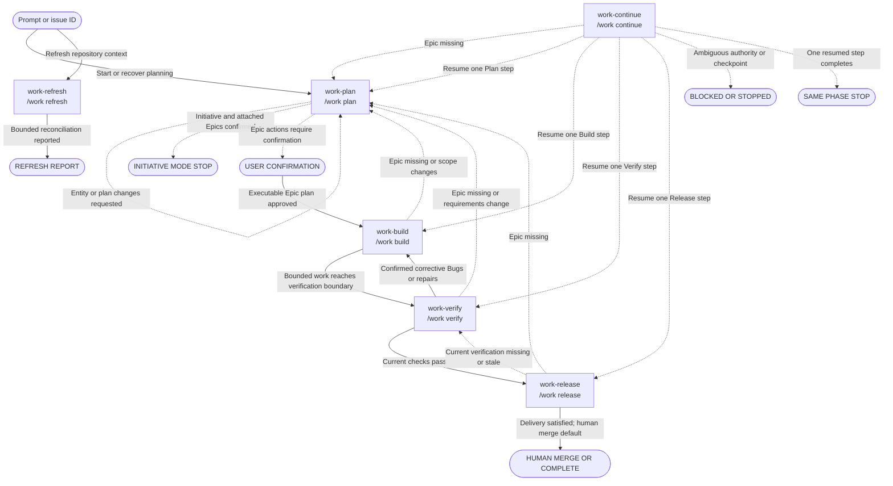

# Software development lifecycle

A software development lifecycle (SDLC) is a repeatable way to move work from an idea to
a delivered change. Harnessctl organizes that journey into Plan, Build, Verify, and
Release, with explicit evidence and approval boundaries between phases.

The workflow keeps one Epic as the authority for each change. You can see what will happen
before an action runs, revise the proposed scope, resume interrupted work, and stop before
local, remote, or destructive mutations. Harnessctl guides the work; you remain in control
of every consequential decision.

## Commands

Harnessctl provides six commands:

| Installed name  | Canonical alias  | Responsibility                                                                 |
| --------------- | ---------------- | ------------------------------------------------------------------------------ |
| `work-plan`     | `/work plan`     | Resolve or create the owning Epic and obtain approval for one executable plan. |
| `work-build`    | `/work build`    | Select or resume ready Epic work and implement bounded slices.                 |
| `work-verify`   | `/work verify`   | Verify the Epic and route passes or confirmed defects.                         |
| `work-release`  | `/work release`  | Complete verified branch, commit, push, and pull-request delivery.             |
| `work-continue` | `/work continue` | Resume exactly one authoritative step in one current phase.                    |
| `work-refresh`  | `/work refresh`  | Reconcile repository context, memory, and supported local projections.         |

The `/work *` forms are harness-neutral aliases. See [Harnesses](harnesses.md) for host
support and installation locations. Refresh is separate from the four delivery phases;
it updates repository context without starting or advancing delivery work.

## Before you start

Plan, Build, Verify, Release, and Continue work under one authoritative Epic. You may
start with an Epic, Story, Task, or Bug ID; child issues resolve to their owning Epic. If
ownership is missing or contradictory, the command stops instead of guessing.

Before reading, changing, or operating anything, the command presents a bounded action
set. Required actions protect correctness or safety. Recommended and optional actions can
be revised. Remote and destructive operations always need fresh, action-specific consent.

When repository memory is enabled, checkpoints can help resume work. Checkpoints are
advisory: current issues, approved documents, repository state, and current evidence win
when they disagree.

## Phase behavior

### Plan

Use Plan to turn a request into one approved, executable Epic plan. You can start with a
natural-language goal, Initiative ID, Epic ID, or text that mentions one.

- **Prompt mode:** clarify the outcome and decide whether it needs one Epic or an
  Initiative with several Epics.
- **Initiative mode:** present one Initiative boundary and a separated, ordered set of
  attached Epics. After confirmation, create them and stop, recommending a separate
  Plan invocation for each Epic.
- **Epic mode:** resolve or create one Epic, clarify scope, assess dependencies and risks,
  link any approved design, identify executable work, and define acceptance and release
  expectations.

The user may revise proposed requirements, design level, decomposition, and scope.
Plan requires explicit confirmation before creating entities or artifacts and explicit
approval of the final executable Epic plan. Work begins only through a later
Build invocation.

### Build

Use Build after the Epic plan is approved. Build resumes unfinished work or selects one
ready Story, Task, or Bug, then states the objective, bounded scope, expected checks, and
stop condition before making changes.

When `skills.tdd.enabled` is true, Build uses Red, Green, and Refactor for each slice. The
default is `false`. Disabling TDD leaves any previously installed TDD skill dormant and
does not change Plan, Verify, Release, or merge behavior.

YOLO is one-time, Epic-scoped, bounded consent for the displayed eligible ready items.
It ends on the first blocker, scope change, verification boundary, user stop, ambiguous
result, or exhausted work. It never authorizes remote or destructive actions, closure,
merge, deployment, safety relaxation, or work outside the Epic. Build checkpoints each
slice and stops at Verify.

### Verify

Use Verify when Build reaches its verification boundary. Verify first presents the
applicable checks, then evaluates acceptance, behavior, integration, formatting, security,
privacy, dependencies, configuration, scope, documentation, operations, and release
evidence.

A pass recommends Release. Failures are discussed and grouped by distinct defect
occurrence, not repeated symptom. After confirmation, each occurrence has exactly one
provider-discoverable, non-archived canonical Bug parented to the Epic. A matching open
or in-progress Bug is reused; a matching done or closed unresolved occurrence blocks
duplication until a supported confirmed transition or a proven regression/new
occurrence is selected. Confirmed corrective Bugs route to Build. Requirement,
acceptance-boundary, architecture, or design-scope changes route to Plan.

### Release

Use Release only after current successful verification. Its delivery sequence is feature
branch, commit, push, and pull request. Existing work counts only when it belongs to the
Epic, contains the intended scope, targets the correct base, and has no contradictory
state.

Each unsatisfied action is confirmed separately. Push, pull-request creation or update,
merge, deployment, remote issue closure, and destructive actions require fresh explicit
consent immediately before invocation. Merge remains a human action by default; model
merge requires fresh consent naming the exact pull request and action. Deployment is
Not needed unless explicitly requested and proceeds only through a verified repository
workflow with environment, migration, rollback, monitoring, and authorization evidence.

### Continue

Use Continue to resume one unfinished step in the Epic's current phase. With no ID, it
presents at most five unfinished Epic candidates and waits for your selection; it never
chooses the newest automatically.

Continue resumes exactly one user-confirmed step in Plan, Build, Verify, or Release,
records that result, and stops. It does not combine phases or enter the next phase when
the step completes. If no valid checkpoint exists but an Epic does, it presents only
authority-supported phase candidates for user selection.

### Refresh

Use Refresh for standalone repository familiarization and reconciliation. It does not
require an Epic, enter a delivery phase, create a phase checkpoint, or become resumable
through Continue.

Refresh proposes any memory or code-index operation before it runs. Provider capability,
freshness, repository scope, and consent must all be clear; unsupported operations stop
instead of switching to an unapproved route. Results are reported as `refreshed`,
`skipped`, `unsupported`, `stale`, or `blocked`, with evidence.

## Authoritative command transitions

Each command node shows the installed `work-*` name and canonical `/work *` alias. Solid
edges are recommended next commands; dashed edges are gates, redirects, same-phase
resumption, or terminal outcomes. A recommended destination is not silently invoked.

The following table is the accessible edge-equivalent of the graph. Rows use the same
source, condition, and destination, including gates and outcomes.

| Source                             | Condition or gate                          | Destination                      |
| ---------------------------------- | ------------------------------------------ | -------------------------------- |
| Prompt or issue ID                 | Start or recover planning                  | `work-plan` / `/work plan`       |
| Prompt or issue ID                 | Refresh repository context                 | `work-refresh` / `/work refresh` |
| `work-refresh` / `/work refresh`   | Bounded reconciliation reported            | `REFRESH REPORT`                 |
| `work-plan` / `/work plan`         | Entity or plan changes requested           | Same command (revision loop)     |
| `work-plan` / `/work plan`         | Initiative and attached Epics confirmed    | `INITIATIVE MODE STOP`           |
| `work-plan` / `/work plan`         | Epic actions require confirmation          | `USER CONFIRMATION`              |
| `USER CONFIRMATION`                | Executable Epic plan approved              | `work-build` / `/work build`     |
| `work-build` / `/work build`       | Epic missing or scope changes              | `work-plan` / `/work plan`       |
| `work-build` / `/work build`       | Bounded work reaches verification boundary | `work-verify` / `/work verify`   |
| `work-verify` / `/work verify`     | Epic missing or requirements change        | `work-plan` / `/work plan`       |
| `work-verify` / `/work verify`     | Confirmed corrective Bugs or repairs       | `work-build` / `/work build`     |
| `work-verify` / `/work verify`     | Current checks pass                        | `work-release` / `/work release` |
| `work-release` / `/work release`   | Epic missing                               | `work-plan` / `/work plan`       |
| `work-release` / `/work release`   | Current verification missing or stale      | `work-verify` / `/work verify`   |
| `work-release` / `/work release`   | Delivery satisfied; human merge default    | `HUMAN MERGE OR COMPLETE`        |
| `work-continue` / `/work continue` | Epic missing                               | `work-plan` / `/work plan`       |
| `work-continue` / `/work continue` | Resume one Plan step                       | `work-plan` / `/work plan`       |
| `work-continue` / `/work continue` | Resume one Build step                      | `work-build` / `/work build`     |
| `work-continue` / `/work continue` | Resume one Verify step                     | `work-verify` / `/work verify`   |
| `work-continue` / `/work continue` | Resume one Release step                    | `work-release` / `/work release` |
| `work-continue` / `/work continue` | Ambiguous authority or checkpoint          | `BLOCKED OR STOPPED`             |
| `work-continue` / `/work continue` | One resumed step completes                 | `SAME PHASE STOP`                |

## Migration from 18 commands

No deprecated alias files are installed. Existing generated outputs are replaced only
through the installer's explicit `--replace-sdlc-command-set` migration consent.

| Deprecated command family                                                                                                                                                       | Replacement     |
| ------------------------------------------------------------------------------------------------------------------------------------------------------------------------------- | --------------- |
| `work-new`, `work-explore`, `work-start-initiative`, `work-start-epic`, `work-write-stories`, `work-start-story`, `work-design-doc`, `work-hld`, `work-lld`, `work-write-tasks` | `work-plan`     |
| `work-implement`                                                                                                                                                                | `work-build`    |
| `work-review`                                                                                                                                                                   | `work-verify`   |
| `work-cvs`, `work-finish`                                                                                                                                                       | `work-release`  |
| `work-resume`, `work-start-from`                                                                                                                                                | `work-continue` |

Without the replacement flag, selected-harness legacy outputs block installation before
mutation. `--force` alone does not delete retired files. See [configuration](configuration.md)
for installer settings and [skills](skills.md) for prompt/skill boundaries.
