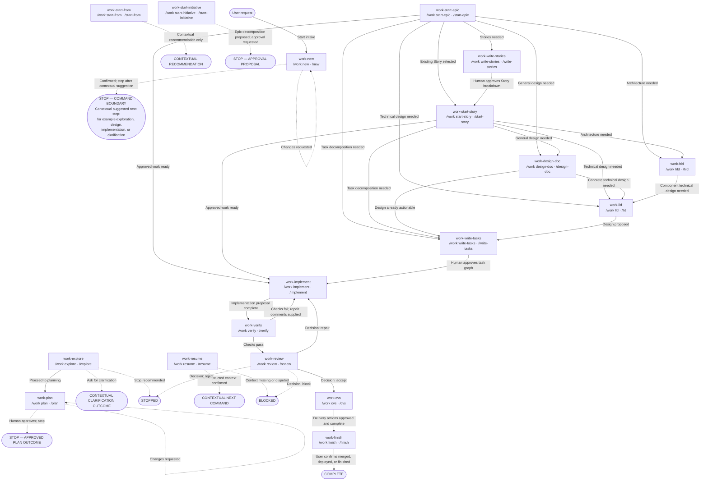

# SDLC commands

## Current implementation

The registry in
[`src/harnessctl/templates.py`](../src/harnessctl/templates.py) contains 18 canonical
templates. Installation renders every template as a hyphenated Markdown command for
OpenCode and Pi. `work-explore` may inspect and read relevant repository areas and run
safe read-only diagnostics. Artifact creation, code edits, mutating checks, and
delivery remain theoretical conversation-only actions, and every other prompt remains
bounded by its template. When repository memory is enabled, OpenCode and Pi prompts
may perform their explicitly bounded memory retrieval or persistence hook; that does
not prove any SDLC work occurred. Command names describe the stage being proposed, not
automation already performed.

| Installed command       | Stage responsibility                                | Boundary or gate                                       |
| ----------------------- | --------------------------------------------------- | ------------------------------------------------------ |
| `work-new`              | Establish a work contract                           | Confirm scope; stop before exploration                 |
| `work-explore`          | Gather repository evidence                          | Read-only diagnostics; stop before planning            |
| `work-plan`             | Propose an implementation plan                      | Explicit human approval; no implementation             |
| `work-resume`           | Recover interrupted context                         | Report state; never continue silently                  |
| `work-start-initiative` | Propose an initiative decomposition                 | Human approval; do not claim Epics were created        |
| `work-start-epic`       | Establish Epic context                              | User chooses the next stage                            |
| `work-start-from`       | Select an existing active entity                    | Context selection only                                 |
| `work-write-stories`    | Propose an Epic’s Stories                           | Human approval; do not claim Story creation            |
| `work-start-story`      | Establish Story context                             | User chooses the next stage                            |
| `work-design-doc`       | Propose a general design                            | Do not claim the document was written or linked        |
| `work-hld`              | Propose high-level architecture                     | Do not claim the HLD was written or approved           |
| `work-lld`              | Propose low-level design                            | Do not claim the LLD was written or approved           |
| `work-write-tasks`      | Propose atomic implementation tasks                 | Human approval of the task graph                       |
| `work-implement`        | Propose how approved work should be implemented     | Do not edit or claim completion                        |
| `work-verify`           | Define acceptance and quality checks                | Do not run or claim verification                       |
| `work-review`           | Propose an independent review                       | Human accepts, repairs, blocks, or rejects             |
| `work-cvs`              | Propose branch, commit, push, and pull request work | Perform no delivery action; never merge                |
| `work-finish`           | Propose final delivery or deployment                | Perform no deployment; human approval remains required |

OpenCode files are installed under `.opencode/commands/`; Pi files are installed under
`.pi/prompts/`. Rendering is harness-specific, but stage intent is shared. Enabled
repository memory adds bounded entry or exit guidance to both harnesses; it does not
establish approval, completion, verification, merge, or deployment.

A complete example enabling those memory hooks is:

```yaml
communication:
  caveman:
    enabled: true
    mode: strict
memory:
  enabled: true
  backend: repository
  namespace:
    organization_id: local
    project_id: project
    default_topic: general
  retrieval:
    limit: 8
    max_chars: 12000
    include_superseded: false
  repository:
    root: .harnessctl/memory
```

Stage contracts frame expected inputs and bounded outputs. A command must report a
missing prerequisite rather than infer it, and must not silently cross into the next
stage. Plans, decompositions, designs, delivery actions, deployment, and merge retain
their stated human gates. See [FLOWS.md](../FLOWS.md) for the intended tool-enabled
lifecycle, arguments, artifacts, dependencies, resumability, and invalid transitions.

## Authoritative command transitions

This graph is derived from all 18 installed templates. Each command node shows the
installed `work-*` name, canonical conceptual `/work *` name, and short conceptual
alias. Solid edges are recommended later command invocations; they do not silently
execute the destination. Dashed edges are revision, gate, context, or terminal
outcomes. Contextual outcomes mean the next step depends on the current conversation;
they do not enumerate or invoke a destination. `BLOCKED`, `STOPPED`, and `COMPLETE`
are outcomes, not commands.



The following table is the accessible edge-equivalent of the graph. Rows use the same
source, condition, and destination, including non-command routing and outcome nodes.

| Source                                                                   | Condition or gate                               | Destination                                                                                                                  |
| ------------------------------------------------------------------------ | ----------------------------------------------- | ---------------------------------------------------------------------------------------------------------------------------- |
| User request                                                             | Start intake                                    | `work-new` / `/work new` / `/new`                                                                                            |
| `work-new` / `/work new` / `/new`                                        | Changes requested                               | Same command (revision loop)                                                                                                 |
| `work-new` / `/work new` / `/new`                                        | Confirmed; stop after contextual suggestion     | `STOP — COMMAND BOUNDARY`: contextual suggested next step, for example exploration, design, implementation, or clarification |
| `work-explore` / `/work explore` / `/explore`                            | Proceed to planning                             | `work-plan` / `/work plan` / `/plan`                                                                                         |
| `work-explore` / `/work explore` / `/explore`                            | Ask for clarification                           | `CONTEXTUAL CLARIFICATION OUTCOME`                                                                                           |
| `work-explore` / `/work explore` / `/explore`                            | Stop recommended                                | `STOPPED`                                                                                                                    |
| `work-plan` / `/work plan` / `/plan`                                     | Changes requested                               | Same command (revision loop)                                                                                                 |
| `work-plan` / `/work plan` / `/plan`                                     | Human approves; stop                            | `STOP — APPROVED PLAN OUTCOME`                                                                                               |
| `work-resume` / `/work resume` / `/resume`                               | Reconstructed context confirmed                 | `CONTEXTUAL NEXT COMMAND`                                                                                                    |
| `work-resume` / `/work resume` / `/resume`                               | Context missing or disputed                     | `BLOCKED`                                                                                                                    |
| `work-start-from` / `/work start-from` / `/start-from`                   | Contextual recommendation only                  | `CONTEXTUAL RECOMMENDATION`                                                                                                  |
| `work-start-initiative` / `/work start-initiative` / `/start-initiative` | Epic decomposition proposed; approval requested | `STOP — APPROVAL PROPOSAL`                                                                                                   |
| `work-start-epic` / `/work start-epic` / `/start-epic`                   | Stories needed                                  | `work-write-stories` / `/work write-stories` / `/write-stories`                                                              |
| `work-start-epic` / `/work start-epic` / `/start-epic`                   | Existing Story selected                         | `work-start-story` / `/work start-story` / `/start-story`                                                                    |
| `work-start-epic` / `/work start-epic` / `/start-epic`                   | General design needed                           | `work-design-doc` / `/work design-doc` / `/design-doc`                                                                       |
| `work-start-epic` / `/work start-epic` / `/start-epic`                   | Architecture needed                             | `work-hld` / `/work hld` / `/hld`                                                                                            |
| `work-start-epic` / `/work start-epic` / `/start-epic`                   | Technical design needed                         | `work-lld` / `/work lld` / `/lld`                                                                                            |
| `work-start-epic` / `/work start-epic` / `/start-epic`                   | Task decomposition needed                       | `work-write-tasks` / `/work write-tasks` / `/write-tasks`                                                                    |
| `work-start-epic` / `/work start-epic` / `/start-epic`                   | Approved work ready                             | `work-implement` / `/work implement` / `/implement`                                                                          |
| `work-write-stories` / `/work write-stories` / `/write-stories`          | Human approves Story breakdown                  | `work-start-story` / `/work start-story` / `/start-story`                                                                    |
| `work-start-story` / `/work start-story` / `/start-story`                | General design needed                           | `work-design-doc` / `/work design-doc` / `/design-doc`                                                                       |
| `work-start-story` / `/work start-story` / `/start-story`                | Architecture needed                             | `work-hld` / `/work hld` / `/hld`                                                                                            |
| `work-start-story` / `/work start-story` / `/start-story`                | Technical design needed                         | `work-lld` / `/work lld` / `/lld`                                                                                            |
| `work-start-story` / `/work start-story` / `/start-story`                | Task decomposition needed                       | `work-write-tasks` / `/work write-tasks` / `/write-tasks`                                                                    |
| `work-start-story` / `/work start-story` / `/start-story`                | Approved work ready                             | `work-implement` / `/work implement` / `/implement`                                                                          |
| `work-design-doc` / `/work design-doc` / `/design-doc`                   | Concrete technical design needed                | `work-lld` / `/work lld` / `/lld`                                                                                            |
| `work-design-doc` / `/work design-doc` / `/design-doc`                   | Design already actionable                       | `work-write-tasks` / `/work write-tasks` / `/write-tasks`                                                                    |
| `work-hld` / `/work hld` / `/hld`                                        | Component technical design needed               | `work-lld` / `/work lld` / `/lld`                                                                                            |
| `work-lld` / `/work lld` / `/lld`                                        | Design proposed                                 | `work-write-tasks` / `/work write-tasks` / `/write-tasks`                                                                    |
| `work-write-tasks` / `/work write-tasks` / `/write-tasks`                | Human approves task graph                       | `work-implement` / `/work implement` / `/implement`                                                                          |
| `work-implement` / `/work implement` / `/implement`                      | Implementation proposal complete                | `work-verify` / `/work verify` / `/verify`                                                                                   |
| `work-verify` / `/work verify` / `/verify`                               | Checks fail; repair comments supplied           | `work-implement` / `/work implement` / `/implement`                                                                          |
| `work-verify` / `/work verify` / `/verify`                               | Checks pass                                     | `work-review` / `/work review` / `/review`                                                                                   |
| `work-review` / `/work review` / `/review`                               | Decision: `repair`                              | `work-implement` / `/work implement` / `/implement`                                                                          |
| `work-review` / `/work review` / `/review`                               | Decision: `accept`                              | `work-cvs` / `/work cvs` / `/cvs`                                                                                            |
| `work-review` / `/work review` / `/review`                               | Decision: `block`                               | `BLOCKED`                                                                                                                    |
| `work-review` / `/work review` / `/review`                               | Decision: `reject`                              | `STOPPED`                                                                                                                    |
| `work-cvs` / `/work cvs` / `/cvs`                                        | Delivery actions approved and complete          | `work-finish` / `/work finish` / `/finish`                                                                                   |
| `work-finish` / `/work finish` / `/finish`                               | User confirms merged, deployed, or finished     | `COMPLETE`                                                                                                                   |

## Planned or future — not implemented

Grouped Pi commands such as `/work plan` are not installed. Short aliases such as
`/plan`, and any other host alias not represented by an installed file, are not
guaranteed. Tool-enabled execution of the lifecycle, automatic orchestration,
model-tier routing, retries, autonomous merge, and automatic deployment are also
outside the current command installer.

See [skills](skills.md) for prompt/skill distinctions and
[configuration](configuration.md) for installer settings.
